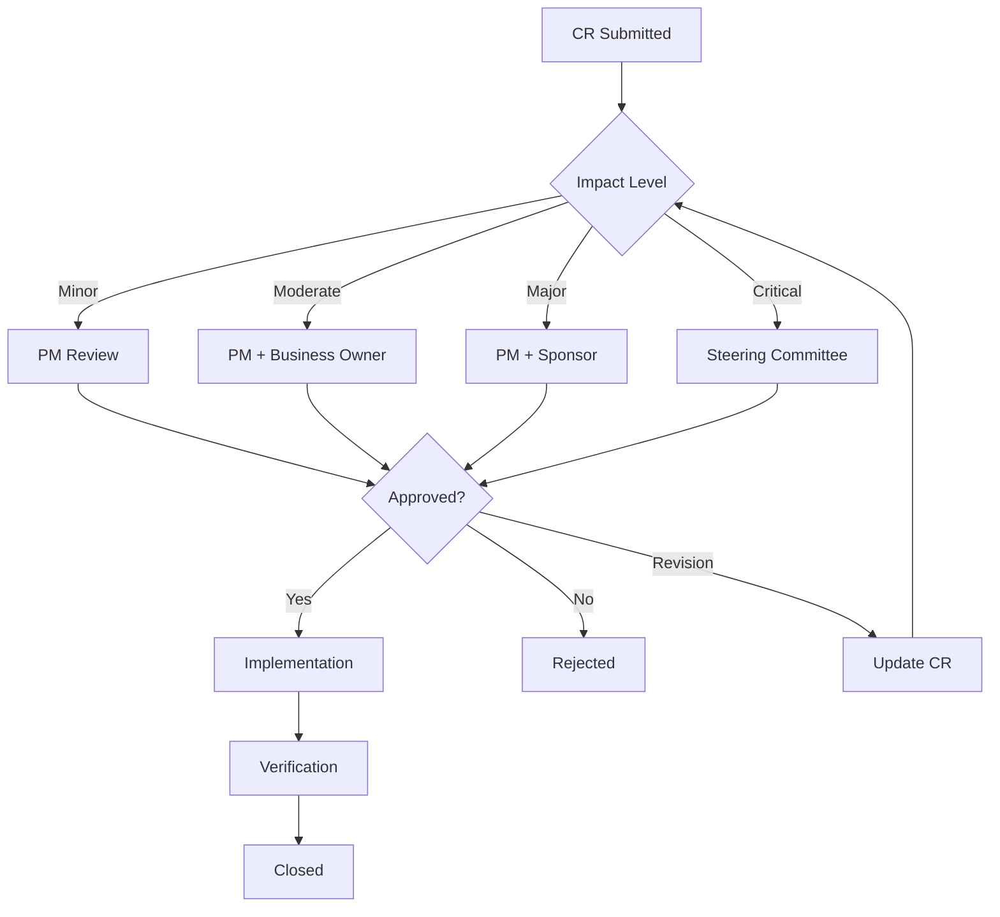

# Change Request Management

> **Meta:** v1.0.0 | 22-02-2026

## Назначение

Навык для формализованного управления изменениями в проекте на протяжении всего жизненного цикла. Обеспечивает контроль scope, прозрачность влияния изменений, своевременное согласование и документирование всех модификаций проекта.

## Когда использовать

- При получении запроса на изменение требований
- При необходимости модификации scope проекта
- При оценке влияния изменений на сроки и бюджет
- При согласовании изменений со стейкхолдерами
- При ведении журнала изменений

## Функции

### Change Request Forms (Формы запросов на изменения)

Структурированные формы для инициации изменений.

**Стандартная форма Change Request:**
```markdown
## Change Request Form

**CR ID:** CR-[YYYY]-[NNN]
**Дата создания:** [Дата]
**Инициатор:** [Имя, Роль, Отдел]
**Статус:** Draft / Submitted / Under Review / Approved / Rejected / Implemented

---

### 1. Описание изменения

**Название:**
[Краткое название изменения]

**Категория:**
- [ ] New Feature (Новая функциональность)
- [ ] Enhancement (Улучшение существующей функции)
- [ ] Defect Fix (Исправление дефекта)
- [ ] Technical Change (Техническое изменение)
- [ ] Documentation (Документация)
- [ ] Process Change (Изменение процесса)

**Приоритет:**
- [ ] Critical (Блокирует проект)
- [ ] High (Значительное влияние)
- [ ] Medium (Умеренное влияние)
- [ ] Low (Минимальное влияние)

**Описание текущего состояния:**
[Как работает сейчас]

**Описание желаемого состояния:**
[Как должно работать]

**Обоснование:**
[Почему необходимо это изменение]

---

### 2. Бизнес-обоснование

**Бизнес-цель:**
[Какую бизнес-цель достигает изменение]

**Выгода:**
| Тип выгоды | Описание | Оценка |
|------------|----------|--------|
| Финансовая | | X руб. |
| Операционная | | X% эффективности |
| Клиентская | | X пользователей |
| Стратегическая | | |

**Последствия НЕ внедрения:**
[Что произойдёт, если изменение не будет внедрено]

---

### 3. Влияние на проект

**Влияние на сроки:**
| Этап | Текущий план | С изменением | Δ |
|------|--------------|--------------|---|
| Development | X дней | Y дней | +Z дней |
| Testing | X дней | Y дней | +Z дней |
| **Итого** | X дней | Y дней | +Z дней |

**Влияние на бюджет:**
| Категория | Текущий бюджет | С изменением | Δ |
|-----------|----------------|--------------|---|
| Персонал | X руб. | Y руб. | +Z руб. |
| Технологии | X руб. | Y руб. | +Z руб. |
| **Итого** | X руб. | Y руб. | +Z руб. |

**Влияние на ресурсы:**
| Роль | Текущий план | С изменением | Δ |
|------|--------------|--------------|---|
| Developer | X FTE | Y FTE | +Z FTE |
| QA | X FTE | Y FTE | +Z FTE |

**Влияние на качество:**
[Описание влияния на качество продукта]

**Влияние на риски:**
| Новые риски | Вероятность | Влияние | Митигация |
|-------------|-------------|---------|-----------|
| | | | |

---

### 4. Альтернативы

| # | Альтернатива | Плюсы | Минусы | Рекомендация |
|---|--------------|-------|--------|--------------|
| 1 | [Описание] | | | |
| 2 | Не внедрять | Экономия ресурсов | Не достигнута цель | |
| 3 | Отложить | | | |

---

### 5. Оценка трудозатрат

| Задача | Оценка (часы) | Ответственный |
|--------|---------------|---------------|
| Анализ | X ч | [Роль] |
| Разработка | X ч | [Роль] |
| Тестирование | X ч | [Роль] |
| Документация | X ч | [Роль] |
| Deployment | X ч | [Роль] |
| **Итого** | **X ч** | |

---

### 6. Согласование

| Роль | Имя | Решение | Дата | Комментарий |
|------|-----|---------|------|-------------|
| PM | | ☐ Approved / ☐ Rejected | | |
| Tech Lead | | ☐ Approved / ☐ Rejected | | |
| Business Owner | | ☐ Approved / ☐ Rejected | | |
| Sponsor | | ☐ Approved / ☐ Rejected | | |

---

### 7. Реализация

**План реализации:**
| Этап | Дата начала | Дата окончания | Ответственный |
|------|-------------|----------------|---------------|
| | | | |

**Критерии приёмки:**
- [ ] Критерий 1
- [ ] Критерий 2

---

### 8. Результат

**Дата реализации:** [Дата]
**Статус реализации:** ☐ Успешно / ☐ С отклонениями
**Фактические затраты:** X часов / Y руб.
**Комментарии:**
[Комментарии по результатам реализации]
```

### Impact Assessment (Оценка влияния)

Систематический анализ влияния изменений.

**Матрица оценки влияния:**
```markdown
## Impact Assessment Matrix

### Оценка по категориям

| Категория | Критерий | Вес | Оценка (1-5) | Взвешенная |
|-----------|----------|-----|--------------|------------|
| **Сроки** | Влияние на критический путь | 3 | | |
| | Задержка ключевых вех | 2 | | |
| | Дополнительные итерации | 1 | | |
| **Бюджет** | Дополнительные затраты | 3 | | |
| | ROI изменение | 2 | | |
| | Перераспределение бюджета | 1 | | |
| **Качество** | Влияние на архитектуру | 3 | | |
| | Новые технические долги | 2 | | |
| | Тестирование | 1 | | |
| **Ресурсы** | Нагрузка на команду | 2 | | |
| | Новые компетенции | 1 | | |
| | Внешние ресурсы | 1 | | |
| **Стейкхолдеры** | Удовлетворённость | 2 | | |
| | Риски конфликта | 1 | | |
| | Коммуникация | 1 | | |

**Итого:** X / 45 баллов

### Интерпретация

| Сумма | Уровень влияния | Процесс согласования |
|-------|-----------------|---------------------|
| 0-15 | Low | PM + Tech Lead |
| 16-30 | Medium | + Business Owner |
| 31-45 | High | + Sponsor / Steering Committee |
```

**Детальный анализ влияния:**
```markdown
## Detailed Impact Analysis

### Техническое влияние

| Компонент | Изменение | Сложность | Риск |
|-----------|-----------|-----------|------|
| Database | New tables | Medium | Data migration |
| API | New endpoints | Low | Backward compatibility |
| UI | New screens | Medium | UX consistency |
| Integration | New vendor API | High | Dependencies |

### Влияние на расписание

```
Original Timeline:
[Мнение]----[Разработка]----[Тестирование]----[Release]
    2w           8w              3w            1w

With Change:
[Мнение]----[Разработка]----[Тестирование]----[Release]
    2w           10w (+2w)       4w (+1w)      1w

Total Impact: +3 weeks
```

### Влияние на бюджет

| Категория | Было | Стало | Δ |
|-----------|------|-------|---|
| CAPEX | X руб. | Y руб. | +Z руб. |
| OPEX | X руб. | Y руб. | +Z руб. |
| Contingency | X руб. | Y руб. | +Z руб. |
| **Total** | **X руб.** | **Y руб.** | **+Z руб.** |

### Влияние на команду

| Участник | Текущая загрузка | С изменением | Δ |
|----------|------------------|--------------|---|
| Developer 1 | 100% | 120% | +20% |
| Developer 2 | 80% | 100% | +20% |
| QA | 90% | 110% | +20% |

**Решение:** Требуется дополнительный ресурс или перераспределение задач
```

### Approval Workflows (Процессы согласования)

Определение маршрутов согласования.

**Матрица согласования:**
```markdown
## Approval Matrix

### По уровню влияния

| Уровень влияния | Критерии | Согласующие | Срок |
|-----------------|----------|-------------|------|
| **Minor** | < 5% бюджета, < 1 недели | PM + Tech Lead | 1 день |
| **Moderate** | 5-15% бюджета, 1-2 недели | + Business Owner | 3 дня |
| **Major** | 15-30% бюджета, 2-4 недели | + Sponsor | 5 дней |
| **Critical** | > 30% бюджета, > 4 недели | + Steering Committee | 10 дней |

### По типу изменения

| Тип изменения | Обязательные согласования | Дополнительно |
|---------------|---------------------------|---------------|
| New Feature | PM, Tech Lead, Business Owner | Sponsor (если > 40h) |
| Architecture Change | PM, Tech Lead, Architect | CTO (если критично) |
| Budget Change | PM, Finance, Sponsor | Steering Committee (если > 15%) |
| Timeline Change | PM, Sponsor | Steering Committee (если > 2 недель) |
| Resource Change | PM, HR, Dept Head | Sponsor (если > 1 FTE) |
| Scope Reduction | PM, Business Owner, Sponsor | Steering Committee |
```

**Процесс согласования:**


### Change Log (Журнал изменений)

Отслеживание всех изменений в проекте.

**Change Log Template:**
```markdown
## Change Log

**Проект:** [Название]
**Период:** [Начало] — [Окончание]

---

### Summary

| Метрика | Значение |
|---------|----------|
| Всего CR | X |
| Approved | X |
| Rejected | X |
| Pending | X |
| Implemented | X |
| Общее влияние на бюджет | +X руб. |
| Общее влияние на сроки | +X дней |

---

### Детальный журнал

| CR ID | Дата | Название | Категория | Приоритет | Влияние | Статус |
|-------|------|----------|-----------|-----------|---------|--------|
| CR-001 | 01.02 | New login flow | Feature | High | +2w, +500k | ✅ Approved |
| CR-002 | 05.02 | API optimization | Technical | Medium | +3d, +0 | ✅ Approved |
| CR-003 | 10.02 | Remove reports | Scope | Low | -1w, -200k | ❌ Rejected |
| CR-004 | 15.02 | Add analytics | Feature | Medium | +1w, +300k | 🔄 Pending |

---

### Анализ по категориям

| Категория | Количество | % | Влияние на бюджет | Влияние на сроки |
|-----------|------------|---|-------------------|------------------|
| New Feature | X | X% | +X руб. | +X дней |
| Enhancement | X | X% | +X руб. | +X дней |
| Technical | X | X% | +X руб. | +X дней |
| Scope Reduction | X | X% | -X руб. | -X дней |

---

### Тренд изменений

| Месяц | Новых CR | Approved | Rejected | Влияние |
|-------|----------|----------|----------|---------|
| M1 | X | X | X | +X руб. |
| M2 | X | X | X | +X руб. |
| M3 | X | X | X | +X руб. |

---

### Scope Baseline vs Actual

| Показатель | Baseline | С изменениями | Δ |
|------------|----------|---------------|---|
| Требования | X | Y | +Z |
| Story Points | X | Y | +Z |
| Бюджет | X руб. | Y руб. | +Z% |
| Сроки | X дней | Y дней | +Z% |
```

## Интеграция с System Analyst

### Входные данные от System Analyst

**Данные о требованиях:**
- Текущий baseline требований
- Зависимости между требованиями
- История изменений требований

**Данные о технической части:**
- Архитектурные ограничения
- Технические зависимости
- Оценки трудозатрат

**Данные о стейкхолдерах:**
- Матрица полномочий
- Контактная информация
- Интересы и приоритеты

### Выходные артефакты для System Analyst

- Обновлённые требования
- Изменённая архитектура
- Обновлённые оценки
- Change Log

## Примеры использования

### Пример 1: Добавление новой функциональности

**Контекст:** Заказчик просит добавить новый модуль отчётности

**Процесс:**
1. Заполнение CR Form
2. Оценка влияния: +3 недели, +800,000 руб.
3. Классификация: Major change
4. Согласование: PM → Tech Lead → Business Owner → Sponsor
5. Решение: Approved с условиями (сокращение другой функциональности)
6. Реализация: 3 недели
7. Верификация: UAT пройден

**Результат:** Модуль добавлен, бюджет пересмотрен, сроки скорректированы

### Пример 2: Изменение технического решения

**Контекст:** Необходимо сменить vendor API из-за прекращения поддержки

**Процесс:**
1. CR Form: Technical Change, Critical
2. Impact Assessment: +1 неделя, минимальное влияние на бюджет
3. Согласование: PM → Tech Lead → Architect → CTO
4. Решение: Approved (urgent)
5. Реализация: параллельно с текущей работой

**Результат:** Миграция выполнена без влияния на сроки проекта

## Метрики управления изменениями

| Метрика | Целевое значение |
|---------|------------------|
| Время согласования CR | < 5 дней для Major |
| % CR одобренных | 60-80% |
| Scope creep | < 15% от baseline |
| Бюджетные отклонения | < 10% от baseline |
| Своевременность реализации | 90% в срок |

## Инструменты

### Для управления CR
- Jira (Change Management)
- ServiceNow
- Azure DevOps
- Monday.com

### Для документирования
- Confluence
- SharePoint
- Google Docs

### Для согласования
- DocuSign
- Adobe Sign
- Внутренние системы согласования

## Лучшие практики

1. **Формализовать процесс** — все изменения через CR Form
2. **Оценивать влияние** — систематический анализ всех аспектов
3. **Согласовывать на правильном уровне** — по матрице согласования
4. **Документировать** — каждое решение с обоснованием
5. **Отслеживать тренды** — анализировать паттерны изменений
6. **Управлять ожиданиями** — стейкхолдеры должны понимать процесс

## Связанные навыки

- [`srs-specification`](../srs-specification/SKILL.md) — управление требованиями
- [`project-budget-planning`](../project-budget-planning/SKILL.md) — влияние на бюджет
- [`escalation-management`](../escalation-management/SKILL.md) — эскалация сложных изменений
- [`stakeholder-reporting`](../stakeholder-reporting/SKILL.md) — коммуникация изменений

---

*Part of Project Manager SDLC Skills — Universal Skills*
