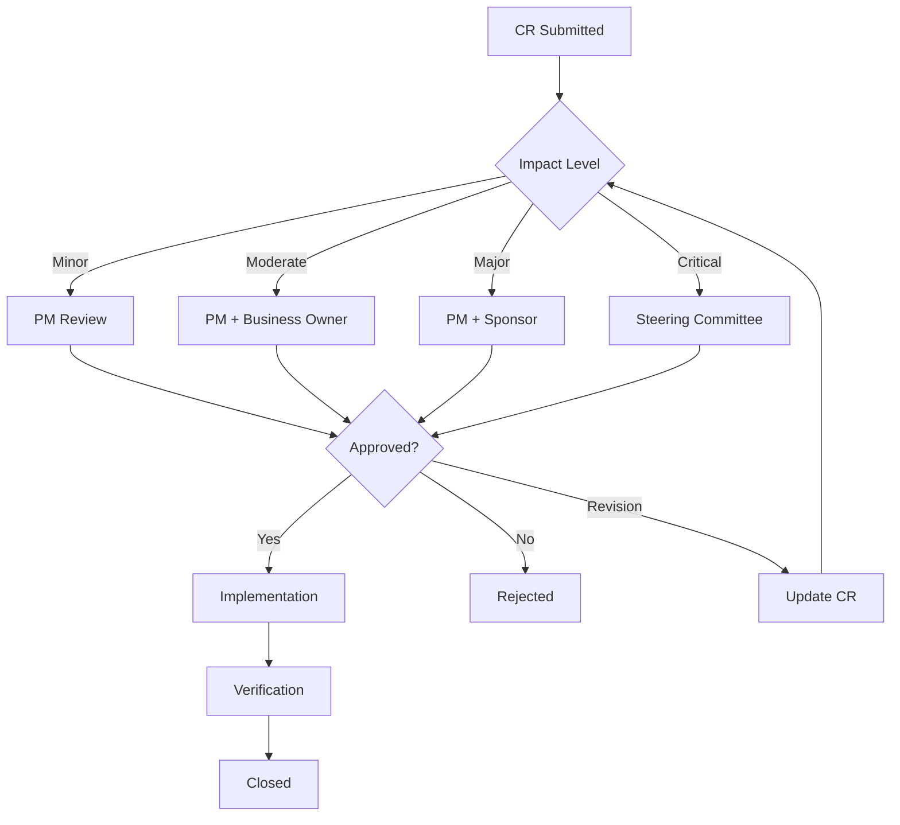

# Change Request Management

> **Meta:** v1.0.0 | 22-02-2026

## Purpose

Skill for formalized change management in a project throughout its entire lifecycle. Provides scope control, transparency of change impact, timely approval, and documentation of all project modifications.

## When to Use

- When receiving a request to change requirements
- When project scope modification is needed
- When assessing the impact of changes on timelines and budget
- When obtaining stakeholder approvals for changes
- When maintaining a change log

## Functions

### Change Request Forms

Structured forms for initiating changes.

**Standard Change Request Form:**
```markdown
## Change Request Form

**CR ID:** CR-[YYYY]-[NNN]
**Creation Date:** [Date]
**Initiator:** [Name, Role, Department]
**Status:** Draft / Submitted / Under Review / Approved / Rejected / Implemented

---

### 1. Change Description

**Title:**
[Short title of the change]

**Category:**
- [ ] New Feature
- [ ] Enhancement
- [ ] Defect Fix
- [ ] Technical Change
- [ ] Documentation
- [ ] Process Change

**Priority:**
- [ ] Critical (Blocks project)
- [ ] High (Significant impact)
- [ ] Medium (Moderate impact)
- [ ] Low (Minimal impact)

**Current State Description:**
[How it currently works]

**Desired State Description:**
[How it should work]

**Rationale:**
[Why this change is necessary]

---

### 2. Business Justification

**Business Goal:**
[What business goal the change achieves]

**Benefits:**
| Benefit Type | Description | Estimate |
|--------------|-------------|----------|
| Financial | | X rubles |
| Operational | | X% efficiency |
| Customer | | X users |
| Strategic | | |

**Consequences of NOT Implementing:**
[What will happen if the change is not implemented]

---

### 3. Project Impact

**Timeline Impact:**
| Stage | Current Plan | With Change | Δ |
|-------|--------------|-------------|---|
| Development | X days | Y days | +Z days |
| Testing | X days | Y days | +Z days |
| **Total** | X days | Y days | +Z days |

**Budget Impact:**
| Category | Current Budget | With Change | Δ |
|----------|----------------|-------------|---|
| Personnel | X rubles | Y rubles | +Z rubles |
| Technologies | X rubles | Y rubles | +Z rubles |
| **Total** | X rubles | Y rubles | +Z rubles |

**Resource Impact:**
| Role | Current Plan | With Change | Δ |
|------|--------------|-------------|---|
| Developer | X FTE | Y FTE | +Z FTE |
| QA | X FTE | Y FTE | +Z FTE |

**Quality Impact:**
[Description of impact on product quality]

**Risk Impact:**
| New Risks | Probability | Impact | Mitigation |
|-----------|-------------|--------|------------|
| | | | |

---

### 4. Alternatives

| # | Alternative | Pros | Cons | Recommendation |
|---|-------------|------|------|----------------|
| 1 | [Description] | | | |
| 2 | Do not implement | Resource savings | Goal not achieved | |
| 3 | Defer | | | |

---

### 5. Effort Estimation

| Task | Estimate (hours) | Responsible |
|------|-----------------|-------------|
| Analysis | X hours | [Role] |
| Development | X hours | [Role] |
| Testing | X hours | [Role] |
| Documentation | X hours | [Role] |
| Deployment | X hours | [Role] |
| **Total** | **X hours** | |

---

### 6. Approval

| Role | Name | Decision | Date | Comment |
|------|-----|----------|------|---------|
| PM | | ☐ Approved / ☐ Rejected | | |
| Tech Lead | | ☐ Approved / ☐ Rejected | | |
| Business Owner | | ☐ Approved / ☐ Rejected | | |
| Sponsor | | ☐ Approved / ☐ Rejected | | |

---

### 7. Implementation

**Implementation Plan:**
| Stage | Start Date | End Date | Responsible |
|-------|------------|----------|-------------|
| | | | |

**Acceptance Criteria:**
- [ ] Criterion 1
- [ ] Criterion 2

---

### 8. Result

**Implementation Date:** [Date]
**Implementation Status:** ☐ Successful / ☐ With deviations
**Actual Costs:** X hours / Y rubles
**Comments:**
[Comments on implementation results]
```

### Impact Assessment

Systematic analysis of change impact.

**Impact Assessment Matrix:**
```markdown
## Impact Assessment Matrix

### Assessment by Category

| Category | Criterion | Weight | Score (1-5) | Weighted |
|----------|-----------|--------|-------------|----------|
| **Timeline** | Critical path impact | 3 | | |
| | Key milestone delays | 2 | | |
| | Additional iterations | 1 | | |
| **Budget** | Additional costs | 3 | | |
| | ROI change | 2 | | |
| | Budget reallocation | 1 | | |
| **Quality** | Architecture impact | 3 | | |
| | New technical debt | 2 | | |
| | Testing | 1 | | |
| **Resources** | Team workload | 2 | | |
| | New competencies | 1 | | |
| | External resources | 1 | | |
| **Stakeholders** | Satisfaction | 2 | | |
| | Conflict risks | 1 | | |
| | Communication | 1 | | |

**Total:** X / 45 points

### Interpretation

| Sum | Impact Level | Approval Process |
|-----|--------------|-----------------|
| 0-15 | Low | PM + Tech Lead |
| 16-30 | Medium | + Business Owner |
| 31-45 | High | + Sponsor / Steering Committee |
```

**Detailed Impact Analysis:**
```markdown
## Detailed Impact Analysis

### Technical Impact

| Component | Change | Complexity | Risk |
|-----------|--------|------------|------|
| Database | New tables | Medium | Data migration |
| API | New endpoints | Low | Backward compatibility |
| UI | New screens | Medium | UX consistency |
| Integration | New vendor API | High | Dependencies |

### Schedule Impact

```
Original Timeline:
[Opinion]----[Development]----[Testing]----[Release]
    2w           8w              3w            1w

With Change:
[Opinion]----[Development]----[Testing]----[Release]
    2w           10w (+2w)       4w (+1w)      1w

Total Impact: +3 weeks
```

### Budget Impact

| Category | Before | After | Δ |
|----------|--------|-------|---|
| CAPEX | X rubles | Y rubles | +Z rubles |
| OPEX | X rubles | Y rubles | +Z rubles |
| Contingency | X rubles | Y rubles | +Z rubles |
| **Total** | **X rubles** | **Y rubles** | **+Z rubles** |

### Team Impact

| Member | Current Workload | With Change | Δ |
|--------|------------------|-------------|---|
| Developer 1 | 100% | 120% | +20% |
| Developer 2 | 80% | 100% | +20% |
| QA | 90% | 110% | +20% |

**Decision:** Additional resource or task redistribution required
```

### Approval Workflows

Defining approval routes.

**Approval Matrix:**
```markdown
## Approval Matrix

### By Impact Level

| Impact Level | Criteria | Approvers | Timeline |
|--------------|----------|-----------|----------|
| **Minor** | < 5% budget, < 1 week | PM + Tech Lead | 1 day |
| **Moderate** | 5-15% budget, 1-2 weeks | + Business Owner | 3 days |
| **Major** | 15-30% budget, 2-4 weeks | + Sponsor | 5 days |
| **Critical** | > 30% budget, > 4 weeks | + Steering Committee | 10 days |

### By Change Type

| Change Type | Required Approvals | Additional |
|-------------|-------------------|------------|
| New Feature | PM, Tech Lead, Business Owner | Sponsor (if > 40h) |
| Architecture Change | PM, Tech Lead, Architect | CTO (if critical) |
| Budget Change | PM, Finance, Sponsor | Steering Committee (if > 15%) |
| Timeline Change | PM, Sponsor | Steering Committee (if > 2 weeks) |
| Resource Change | PM, HR, Dept Head | Sponsor (if > 1 FTE) |
| Scope Reduction | PM, Business Owner, Sponsor | Steering Committee |
```

**Approval Process:**

```mermaid
graph TD
    A[CR Submitted] --> B{Impact Level}
    B -->|Minor| C[PM Review]
    B -->|Moderate| D[PM + Business Owner]
    B -->|Major| E[PM + Sponsor]
    B -->|Critical| F[Steering Committee]
    
    C --> G{Approved?}
    D --> G
    E --> G
    F --> G
    
    G -->|Yes| H[Implementation]
    G -->|No| I[Rejected]
    G -->|Revision| J[Update CR]
    J --> B
    
    H --> K[Verification]
    K --> L[Closed]
```

### Change Log

Tracking all changes in the project.

**Change Log Template:**
```markdown
## Change Log

**Project:** [Name]
**Period:** [Start] — [End]

---

### Summary

| Metric | Value |
|--------|-------|
| Total CR | X |
| Approved | X |
| Rejected | X |
| Pending | X |
| Implemented | X |
| Total budget impact | +X rubles |
| Total timeline impact | +X days |

---

### Detailed Log

| CR ID | Date | Title | Category | Priority | Impact | Status |
|-------|------|-------|----------|----------|--------|--------|
| CR-001 | 01.02 | New login flow | Feature | High | +2w, +500k | ✅ Approved |
| CR-002 | 05.02 | API optimization | Technical | Medium | +3d, +0 | ✅ Approved |
| CR-003 | 10.02 | Remove reports | Scope | Low | -1w, -200k | ❌ Rejected |
| CR-004 | 15.02 | Add analytics | Feature | Medium | +1w, +300k | 🔄 Pending |

---

### Analysis by Category

| Category | Count | % | Budget Impact | Timeline Impact |
|----------|-------|---|---------------|------------------|
| New Feature | X | X% | +X rubles | +X days |
| Enhancement | X | X% | +X rubles | +X days |
| Technical | X | X% | +X rubles | +X days |
| Scope Reduction | X | X% | -X rubles | -X days |

---

### Change Trend

| Month | New CR | Approved | Rejected | Impact |
|-------|--------|----------|----------|--------|
| M1 | X | X | X | +X rubles |
| M2 | X | X | X | +X rubles |
| M3 | X | X | X | +X rubles |

---

### Scope Baseline vs Actual

| Metric | Baseline | With Changes | Δ |
|--------|----------|---------------|---|
| Requirements | X | Y | +Z |
| Story Points | X | Y | +Z |
| Budget | X rubles | Y rubles | +Z% |
| Timeline | X days | Y days | +Z% |
```

## Integration with System Analyst

### Input from System Analyst

**Requirements Data:**
- Current requirements baseline
- Requirements dependencies
- Requirements change history

**Technical Data:**
- Architectural constraints
- Technical dependencies
- Effort estimates

**Stakeholder Data:**
- Authority matrix
- Contact information
- Interests and priorities

### Output Artifacts for System Analyst

- Updated requirements
- Modified architecture
- Updated estimates
- Change Log

## Usage Examples

### Example 1: Adding New Functionality

**Context:** Customer requests adding a new reporting module

**Process:**
1. Fill out CR Form
2. Impact Assessment: +3 weeks, +800,000 rubles
3. Classification: Major change
4. Approval: PM → Tech Lead → Business Owner → Sponsor
5. Decision: Approved with conditions (reduce other functionality)
6. Implementation: 3 weeks
7. Verification: UAT passed

**Result:** Module added, budget revised, timeline adjusted

### Example 2: Changing Technical Solution

**Context:** Need to switch vendor API due to discontinued support

**Process:**
1. CR Form: Technical Change, Critical
2. Impact Assessment: +1 week, minimal budget impact
3. Approval: PM → Tech Lead → Architect → CTO
4. Decision: Approved (urgent)
5. Implementation: parallel to current work

**Result:** Migration completed without impact on project timeline

## Change Management Metrics

| Metric | Target Value |
|--------|--------------|
| CR approval time | < 5 days for Major |
| % CR approved | 60-80% |
| Scope creep | < 15% from baseline |
| Budget deviations | < 10% from baseline |
| Implementation timeliness | 90% on time |

## Tools

### For CR Management
- Jira (Change Management)
- ServiceNow
- Azure DevOps
- Monday.com

### For Documentation
- Confluence
- SharePoint
- Google Docs

### For Approval
- DocuSign
- Adobe Sign
- Internal approval systems

## Best Practices

1. **Formalize the process** — all changes through CR Form
2. **Assess impact** — systematic analysis of all aspects
3. **Approve at the right level** — according to approval matrix
4. **Document** — each decision with rationale
5. **Track trends** — analyze change patterns
6. **Manage expectations** — stakeholders should understand the process

## Related Skills

- [`srs-specification`](../srs-specification/SKILL.md) — requirements management
- [`project-budget-planning`](../project-budget-planning/SKILL.md) — budget impact
- [`escalation-management`](../escalation-management/SKILL.md) — escalating complex changes
- [`stakeholder-reporting`](../stakeholder-reporting/SKILL.md) — change communication

---

*Part of Project Manager SDLC Skills — Universal Skills*
