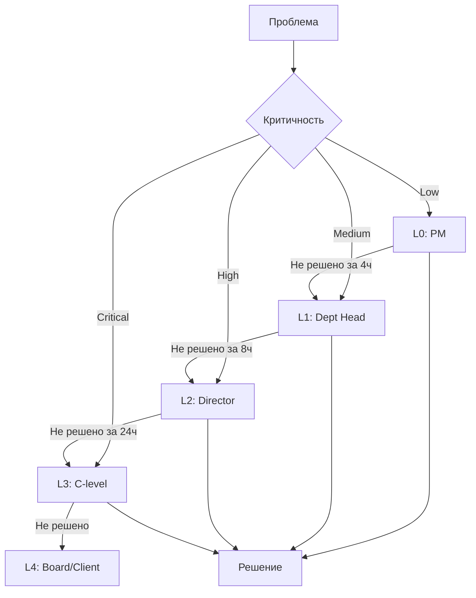

# Escalation Management

> **Meta:** v1.0.0 | 22-02-2026

## Назначение

Навык для организации эффективного процесса эскалации вопросов и проблем на всех уровнях проекта. Обеспечивает своевременное решение критических вопросов, чёткие линии ответственности и прозрачность процесса принятия решений.

## Когда использовать

- При определении процедур эскалации в проекте
- При возникновении проблем, требующих решения вышестоящего руководства
- при конфликтах между стейкхолдерами
- При блокерах, влияющих на критический путь
- При пересмотре процессов эскалации

## Функции

### Escalation Matrix (Матрица эскалации)

Определение уровней и маршрутов эскалации.

**Типовая матрица эскалации:**
```markdown
## Escalation Matrix

### Уровни эскалации

| Уровень | Описание | Решение | Время реакции |
|---------|----------|---------|---------------|
| L0 | Команда проекта | PM / Team Lead | Немедленно |
| L1 | Руководители направлений | Department Head | 2 часа |
| L2 | Руководство организации | Director / VP | 4 часа |
| L3 | Топ-менеджмент | C-level / Steering Committee | 8 часов |
| L4 | Совет директоров / Заказчик | Board / Client Executive | 24 часа |

---

### Матрица по типам проблем

| Тип проблемы | L0 | L1 | L2 | L3 | L4 |
|--------------|----|----|----|----|----|
| Технический блокер | PM | Tech Lead | IT Director | CTO | — |
| Ресурсный конфликт | PM | Dept Head | HR Director | CEO | — |
| Бюджетное отклонение >10% | PM | Finance | CFO | CEO | Board |
| Изменение scope >20% | PM | Sponsor | Steering Committee | — | — |
| Конфликт стейкхолдеров | PM | Sponsor | Steering Committee | — | — |
| Риск срыва сроков | PM | Sponsor | Steering Committee | CEO | Client |
| Критический инцидент | PM | Ops Lead | IT Director | CTO | CEO |

---

### Контакты эскалации

| Уровень | Роль | Имя | Контакты | Заместитель |
|---------|------|-----|----------|-------------|
| L0 | Project Manager | [Имя] | [Email/Телефон] | [Имя зама] |
| L1 | Department Head | [Имя] | [Email/Телефон] | [Имя зама] |
| L2 | Director | [Имя] | [Email/Телефон] | [Имя зама] |
| L3 | VP / C-level | [Имя] | [Email/Телефон] | [Имя зама] |
| L4 | Executive | [Имя] | [Email/Телефон] | [Имя зама] |
```

**Визуализация маршрутов эскалации:**


### SLA for Escalations (SLA для эскалаций)

Определение сроков реакции и решения.

**SLA Matrix:**
```markdown
## Escalation SLA

### По приоритету проблемы

| Приоритет | Определение | Время реакции | Время решения | Эскалация |
|-----------|-------------|---------------|---------------|-----------|
| **P1 Critical** | Полная остановка проекта/продакшена | 15 мин | 4 часа | Немедленно на L2 |
| **P2 High** | Значительное влияние на сроки/бюджет | 1 час | 8 часов | Через 2ч на L1 |
| **P3 Medium** | Умеренное влияние | 4 часа | 24 часа | Через 8ч на L1 |
| **P4 Low** | Минимальное влияние | 24 часа | 5 дней | По необходимости |

---

### По типу решения

| Тип решения | Уровень | Срок | Кворум |
|-------------|---------|------|--------|
| Оперативное (в рамках проекта) | L0 | 4 часа | PM |
| Тактическое (в рамках департамента) | L1 | 8 часов | Dept Head + PM |
| Стратегическое (организация) | L2 | 24 часа | Director + Stakeholders |
| Критическое (топ-менеджмент) | L3 | 48 часов | C-level + Steering Committee |
| Экстраординарное | L4 | 72 часа | Board / Client Executive |

---

### Режимы работы

| Режим | Описание | Время реакции | Каналы |
|-------|----------|---------------|--------|
| **Standard** | Обычный режим | По SLA | Email, Ticket |
| **Urgent** | Срочные вопросы | 50% от SLA | Phone, Messenger |
| **Emergency** | Критические ситуации | 25% от SLA | Phone, War Room |
```

### Escalation Documentation (Документирование эскалаций)

Формализация процесса документирования.

**Шаблон Escalation Record:**
```markdown
## Escalation Record

**ID:** ESC-[YYYY]-[NNN]
**Дата создания:** [Дата/Время]
**Инициатор:** [Имя, Роль]
**Статус:** Open / In Progress / Resolved / Closed

---

### 1. Описание проблемы

**Краткое описание:**
[1-2 предложения о сути проблемы]

**Подробное описание:**
[Полное описание проблемы, контекст, влияние]

**Влияние на проект:**
- [ ] Сроки (оценка влияния: X дней)
- [ ] Бюджет (оценка влияния: X руб.)
- [ ] Качество (описание)
- [ ] Ресурсы (описание)
- [ ] Стейкхолдеры (описание)

---

### 2. Классификация

| Параметр | Значение |
|----------|----------|
| Приоритет | P1 / P2 / P3 / P4 |
| Категория | Техническая / Ресурсная / Финансовая / Организационная |
| Уровень эскалации | L0 / L1 / L2 / L3 / L4 |
| Тип решения | Оперативное / Тактическое / Стратегическое |

---

### 3. История эскалации

| Дата/Время | Уровень | Действие | Ответственный | Комментарий |
|------------|---------|----------|---------------|-------------|
| | L0 | Создание | [Имя] | |
| | L1 | Передача | [Имя] | |
| | L2 | Передача | [Имя] | |

---

### 4. Предлагаемые решения

| # | Решение | Плюсы | Минусы | Ресурсы |
|---|---------|-------|--------|---------|
| 1 | | | | |
| 2 | | | | |

---

### 5. Решение

**Принятое решение:**
[Описание решения]

**Обоснование:**
[Почему выбрано это решение]

**Условия:**
[Условия реализации решения]

---

### 6. Исполнение

| Действие | Ответственный | Срок | Статус |
|----------|---------------|------|--------|
| | | | |

---

### 7. Уроки извлечённые

**Корневая причина:**
[Почему возникла проблема]

**Предотвращение:**
[Как избежать в будущем]

---

### 8. Подписи

| Роль | Имя | Подпись | Дата |
|------|-----|---------|------|
| Инициатор | | | |
| Решающий | | | |
| PM | | | |
```

**Escalation Log Template:**
```markdown
## Escalation Log

**Проект:** [Название]
**Период:** [Начало] — [Окончание]

---

### Summary

| Метрика | Значение |
|---------|----------|
| Всего эскалаций | X |
| P1 | X |
| P2 | X |
| P3 | X |
| P4 | X |
| Среднее время решения | X часов |
| % решённых в SLA | X% |

---

### Детальный лог

| ID | Дата | Описание | Приоритет | Уровень | Решение | Время | Статус |
|----|------|----------|-----------|---------|---------|-------|--------|
| ESC-001 | | | P2 | L1 | | 8ч | ✅ |
| ESC-002 | | | P1 | L2 | | 4ч | ✅ |
| ESC-003 | | | P3 | L1 | | 24ч | ✅ |

---

### Анализ по категориям

| Категория | Количество | % | Среднее время |
|-----------|------------|---|---------------|
| Технические | X | X% | X часов |
| Ресурсные | X | X% | X часов |
| Финансовые | X | X% | X часов |
| Организационные | X | X% | X часов |

---

### Тренды

[Анализ частоты и типов эскалаций за период]
```

### Tracking (Отслеживание)

Мониторинг и контроль эскалаций.

**Escalation Dashboard:**
```markdown
## Escalation Dashboard

### 📊 Текущий статус

| Метрика | Сегодня | Неделя | Месяц |
|---------|---------|--------|-------|
| Открытые | X | X | X |
| В работе | X | X | X |
| Решённые | X | X | X |
| Просроченные | X | X | X |

---

### 🚨 Критические (P1)

| ID | Проблема | Время | Уровень | Ответственный | SLA |
|----|----------|-------|---------|---------------|-----|
| ESC-XXX | [Описание] | 2ч | L2 | [Имя] | 2ч осталось |

---

### ⚠️ Высокие (P2)

| ID | Проблема | Время | Уровень | Ответственный | SLA |
|----|----------|-------|---------|---------------|-----|
| ESC-XXX | [Описание] | 4ч | L1 | [Имя] | 4ч осталось |

---

### 📈 Метрики SLA

| SLA | Цель | Факт | Тренд |
|-----|------|------|-------|
| P1 в срок | 100% | X% | ↑/↓/→ |
| P2 в срок | 95% | X% | ↑/↓/→ |
| P3 в срок | 90% | X% | ↑/↓/→ |
| P4 в срок | 85% | X% | ↑/↓/→ |

---

### 📋 Недавние эскалации

| ID | Дата | Проблема | Приоритет | Решение | Статус |
|----|------|----------|-----------|---------|--------|
| ESC-XXX | | | | | ✅/🔄/⚠️ |
```

## Интеграция с System Analyst

### Входные данные от System Analyst

**Данные о проблемах:**
- Технические блокеры
- Конфликты требований
- Проблемы интеграции
- Риски качества

**Данные о стейкхолдерах:**
- Матрица ответственности
- Контактная информация
- Полномочия на принятие решений

**Данные о проекте:**
- Критический путь
- Зависимости
- Вехи и дедлайны

### Выходные артефакты для System Analyst

- Escalation Matrix
- Escalation Log
- Escalation Reports
- Lessons Learned (по эскалациям)

## Примеры использования

### Пример 1: Эскалация ресурсного конфликта

**Контекст:** Два проекта требуют одного специалиста одновременно

**Процесс:**
1. PM идентифицирует конфликт (L0)
2. Пытается решить на уровне команды — безуспешно
3. Эскалирует на L1 (Dept Head) через 2 часа
4. Dept Head не может выделить ресурс
5. Эскалация на L2 (Director) через 4 часа
6. Director принимает решение о приоритизации проектов

**Результат:** Специалист передан проекту с более высоким приоритетом

### Пример 2: Эскалация технического блокера

**Контекст:** Критический баг блокирует релиз

**Процесс:**
1. Команда обнаруживает блокер
2. Немедленная эскалация на L2 (P1)
3. Созвон War Room через 30 минут
4. Привлечение vendor support
5. Решение через 3 часа

**Результат:** Релиз состоялся вовремя

## Процедуры и практики

### War Room Protocol

```markdown
## War Room Procedure

### Критерии запуска
- P1 проблема не решена более 2 часов
- Блокер на критическом пути
- Риск срыва ключевой вехи

### Участники
- PM (обязательно)
- Технический лидер
- Ответственные за проблемную область
- Представитель L2 (при необходимости)

### Повестка
1. Обзор проблемы (5 мин)
2. Текущий статус (5 мин)
3. Анализ причин (15 мин)
4. Варианты решения (15 мин)
5. План действий (10 мин)
6. Назначение ответственных (5 мин)

### Режим работы
- Синхронизация каждые 30-60 минут
- Обновление статуса в реальном времени
- Документирование всех решений
```

### De-escalation Process

```markdown
## De-escalation Procedure

### Критерии для понижения уровня
- Проблема локализована
- Решение найдено
- Риски под контролем
- Влияние минимизировано

### Процесс
1. Оценка текущего статуса
2. Подтверждение решения
3. Уведомление всех участников
4. Документирование решения
5. Возврат к стандартному режиму
6. Post-incident review
```

## Инструменты

### Для отслеживания
- Jira Service Management
- ServiceNow
- PagerDuty
- Opsgenie

### Для коммуникации
- Slack/Teams каналы
- Email рассылки
- SMS/Phone
- War Room (физический/виртуальный)

### Для документирования
- Confluence
- SharePoint
- Google Docs

## Лучшие практики

1. **Не затягивать эскалацию** — лучше эскалировать раньше, чем позже
2. **Подготовить контекст** — предоставить всю необходимую информацию
3. **Предлагать решения** — не только проблему, но и варианты решения
4. **Документировать** — каждое решение должно быть задокументировано
5. **Анализировать** — проводить post-incident review для предотвращения

## Связанные навыки

- [`risk-assessment`](../risk-assessment/SKILL.md) — идентификация рисков
- [`stakeholder-reporting`](../stakeholder-reporting/SKILL.md) — коммуникация
- [`change-request`](../change-request/SKILL.md) — изменения через эскалацию
- [`maintenance-planning`](../maintenance-planning/SKILL.md) — эскалация инцидентов

---

*Part of Project Manager SDLC Skills — Universal Skills*
