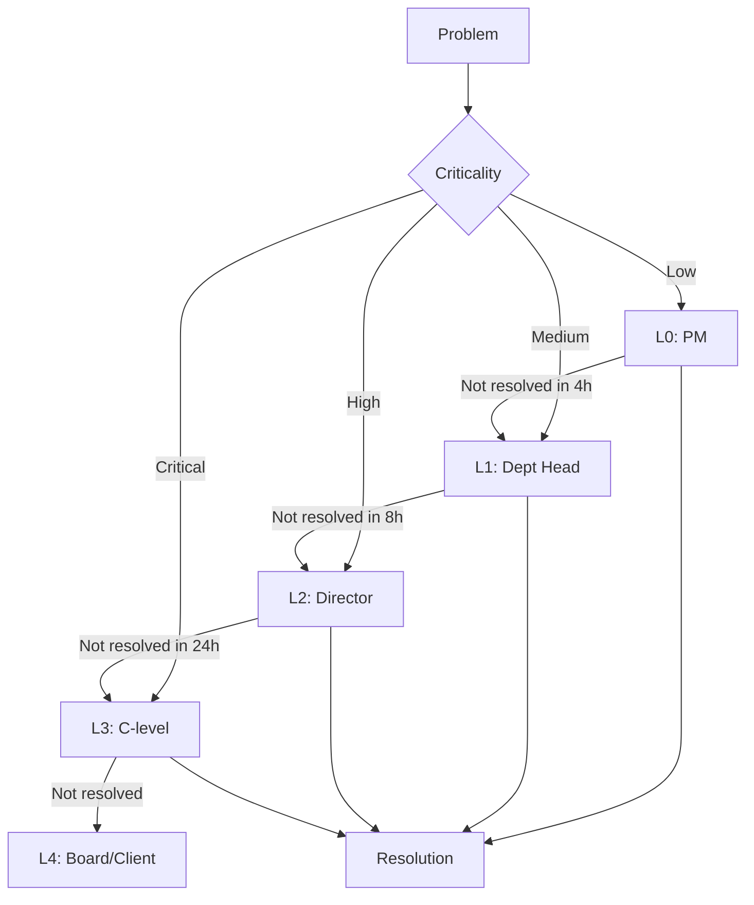

# Escalation Management

> **Meta:** v1.0.0 | 22-02-2026

## Purpose

Skill for organizing effective escalation process for questions and problems at all project levels. Ensures timely resolution of critical issues, clear lines of responsibility, and transparency in decision-making.

## When to Use

- When defining escalation procedures in the project
- When issues arise requiring resolution by senior management
- When conflicts between stakeholders occur
- When blockers affecting the critical path occur
- When revising escalation processes

## Functions

### Escalation Matrix

Defining escalation levels and routes.

**Standard Escalation Matrix:**
```markdown
## Escalation Matrix

### Escalation Levels

| Level | Description | Resolution | Response Time |
|-------|-------------|------------|---------------|
| L0 | Project team | PM / Team Lead | Immediately |
| L1 | Department heads | Department Head | 2 hours |
| L2 | Organization management | Director / VP | 4 hours |
| L3 | Top management | C-level / Steering Committee | 8 hours |
| L4 | Board of Directors / Client | Board / Client Executive | 24 hours |

---

### Matrix by Problem Type

| Problem Type | L0 | L1 | L2 | L3 | L4 |
|--------------|----|----|----|----|-----|
| Technical blocker | PM | Tech Lead | IT Director | CTO | — |
| Resource conflict | PM | Dept Head | HR Director | CEO | — |
| Budget deviation >10% | PM | Finance | CFO | CEO | Board |
| Scope change >20% | PM | Sponsor | Steering Committee | — | — |
| Stakeholder conflict | PM | Sponsor | Steering Committee | — | — |
| Deadline risk | PM | Sponsor | Steering Committee | CEO | Client |
| Critical incident | PM | Ops Lead | IT Director | CTO | CEO |

---

### Escalation Contacts

| Level | Role | Name | Contacts | Deputy |
|-------|------|-----|----------|--------|
| L0 | Project Manager | [Name] | [Email/Phone] | [Deputy name] |
| L1 | Department Head | [Name] | [Email/Phone] | [Deputy name] |
| L2 | Director | [Name] | [Email/Phone] | [Deputy name] |
| L3 | VP / C-level | [Name] | [Email/Phone] | [Deputy name] |
| L4 | Executive | [Name] | [Email/Phone] | [Deputy name] |
```

**Escalation Routes Visualization:**

```mermaid
graph TD
    A[Problem] --> B{Criticality}
    B -->|Low| C[L0: PM]
    B -->|Medium| D[L1: Dept Head]
    B -->|High| E[L2: Director]
    B -->|Critical| F[L3: C-level]
    
    C -->|Not resolved in 4h| D
    D -->|Not resolved in 8h| E
    E -->|Not resolved in 24h| F
    F -->|Not resolved| G[L4: Board/Client]
    
    C --> H[Resolution]
    D --> H
    E --> H
    F --> H
```

### SLA for Escalations

Defining response and resolution times.

**SLA Matrix:**
```markdown
## Escalation SLA

### By Problem Priority

| Priority | Definition | Response Time | Resolution Time | Escalation |
|----------|------------|---------------|-----------------|------------|
| **P1 Critical** | Complete project/production stoppage | 15 min | 4 hours | Immediate to L2 |
| **P2 High** | Significant impact on timeline/budget | 1 hour | 8 hours | After 2h to L1 |
| **P3 Medium** | Moderate impact | 4 hours | 24 hours | After 8h to L1 |
| **P4 Low** | Minimal impact | 24 hours | 5 days | As needed |

---

### By Resolution Type

| Resolution Type | Level | Deadline | Quorum |
|-----------------|-------|----------|--------|
| Operational (within project) | L0 | 4 hours | PM |
| Tactical (within department) | L1 | 8 hours | Dept Head + PM |
| Strategic (organization) | L2 | 24 hours | Director + Stakeholders |
| Critical (top management) | L3 | 48 hours | C-level + Steering Committee |
| Extraordinary | L4 | 72 hours | Board / Client Executive |

---

### Operating Modes

| Mode | Description | Response Time | Channels |
|------|-------------|---------------|----------|
| **Standard** | Normal mode | Per SLA | Email, Ticket |
| **Urgent** | Urgent questions | 50% of SLA | Phone, Messenger |
| **Emergency** | Critical situations | 25% of SLA | Phone, War Room |
```

### Escalation Documentation

Formalizing documentation process.

**Escalation Record Template:**
```markdown
## Escalation Record

**ID:** ESC-[YYYY]-[NNN]
**Creation Date:** [Date/Time]
**Initiator:** [Name, Role]
**Status:** Open / In Progress / Resolved / Closed

---

### 1. Problem Description

**Brief description:**
[1-2 sentences about the problem]

**Detailed description:**
[Full problem description, context, impact]

**Project impact:**
- [ ] Timeline (impact estimate: X days)
- [ ] Budget (impact estimate: X rubles)
- [ ] Quality (description)
- [ ] Resources (description)
- [ ] Stakeholders (description)

---

### 2. Classification

| Parameter | Value |
|-----------|-------|
| Priority | P1 / P2 / P3 / P4 |
| Category | Technical / Resource / Financial / Organizational |
| Escalation level | L0 / L1 / L2 / L3 / L4 |
| Resolution type | Operational / Tactical / Strategic |

---

### 3. Escalation History

| Date/Time | Level | Action | Responsible | Comment |
|-----------|-------|--------|-------------|---------|
| | L0 | Creation | [Name] | |
| | L1 | Transfer | [Name] | |
| | L2 | Transfer | [Name] | |

---

### 4. Proposed Solutions

| # | Solution | Pros | Cons | Resources |
|---|---------|------|------|-----------|
| 1 | | | | |
| 2 | | | | |

---

### 5. Resolution

**Accepted solution:**
[Solution description]

**Rationale:**
[Why this solution was chosen]

**Conditions:**
[Solution implementation conditions]

---

### 6. Execution

| Action | Responsible | Deadline | Status |
|--------|-------------|----------|--------|
| | | | |

---

### 7. Lessons Learned

**Root cause:**
[Why the problem occurred]

**Prevention:**
[How to avoid in the future]

---

### 8. Signatures

| Role | Name | Signature | Date |
|------|-----|-----------|------|
| Initiator | | | |
| Resolver | | | |
| PM | | | |
```

**Escalation Log Template:**
```markdown
## Escalation Log

**Project:** [Name]
**Period:** [Start] — [End]

---

### Summary

| Metric | Value |
|--------|-------|
| Total escalations | X |
| P1 | X |
| P2 | X |
| P3 | X |
| P4 | X |
| Average resolution time | X hours |
| % resolved in SLA | X% |

---

### Detailed Log

| ID | Date | Description | Priority | Level | Resolution | Time | Status |
|----|------|-------------|----------|-------|------------|-------|--------|
| ESC-001 | | | P2 | L1 | | 8h | ✅ |
| ESC-002 | | | P1 | L2 | | 4h | ✅ |
| ESC-003 | | | P3 | L1 | | 24h | ✅ |

---

### Analysis by Category

| Category | Count | % | Average time |
|----------|-------|---|--------------|
| Technical | X | X% | X hours |
| Resource | X | X% | X hours |
| Financial | X | X% | X hours |
| Organizational | X | X% | X hours |

---

### Trends

[Analysis of escalation frequency and types over the period]
```

### Tracking

Monitoring and controlling escalations.

**Escalation Dashboard:**
```markdown
## Escalation Dashboard

### 📊 Current Status

| Metric | Today | Week | Month |
|--------|-------|------|-------|
| Open | X | X | X |
| In progress | X | X | X |
| Resolved | X | X | X |
| Overdue | X | X | X |

---

### 🚨 Critical (P1)

| ID | Problem | Time | Level | Responsible | SLA |
|----|---------|-------|-------|-------------|-----|
| ESC-XXX | [Description] | 2h | L2 | [Name] | 2h left |

---

### ⚠️ High (P2)

| ID | Problem | Time | Level | Responsible | SLA |
|----|---------|-------|-------|-------------|-----|
| ESC-XXX | [Description] | 4h | L1 | [Name] | 4h left |

---

### 📈 SLA Metrics

| SLA | Target | Actual | Trend |
|-----|-------|--------|-------|
| P1 on time | 100% | X% | ↑/↓/→ |
| P2 on time | 95% | X% | ↑/↓/→ |
| P3 on time | 90% | X% | ↑/↓/→ |
| P4 on time | 85% | X% | ↑/↓/→ |

---

### 📋 Recent Escalations

| ID | Date | Problem | Priority | Resolution | Status |
|----|------|---------|----------|------------|--------|
| ESC-XXX | | | | | ✅/🔄/⚠️ |
```

## Integration with System Analyst

### Input from System Analyst

**Problem Data:**
- Technical blockers
- Requirements conflicts
- Integration issues
- Quality risks

**Stakeholder Data:**
- Responsibility matrix
- Contact information
- Decision-making authority

**Project Data:**
- Critical path
- Dependencies
- Milestones and deadlines

### Output Artifacts for System Analyst

- Escalation Matrix
- Escalation Log
- Escalation Reports
- Lessons Learned (on escalations)

## Usage Examples

### Example 1: Resource Conflict Escalation

**Context:** Two projects require the same specialist simultaneously

**Process:**
1. PM identifies conflict (L0)
2. Attempts to resolve at team level — unsuccessful
3. Escalates to L1 (Dept Head) after 2 hours
4. Dept Head cannot allocate resource
5. Escalates to L2 (Director) after 4 hours
6. Director makes decision on project prioritization

**Result:** Specialist assigned to higher priority project

### Example 2: Technical Blocker Escalation

**Context:** Critical bug blocks release

**Process:**
1. Team discovers blocker
2. Immediate escalation to L2 (P1)
3. War Room call after 30 minutes
4. Vendor support engaged
5. Resolution after 3 hours

**Result:** Release completed on time

## Procedures and Practices

### War Room Protocol

```markdown
## War Room Procedure

### Launch Criteria
- P1 problem not resolved for more than 2 hours
- Blocker on critical path
- Risk of missing key milestone

### Participants
- PM (mandatory)
- Technical leader
- Responsible for problematic area
- L2 representative (if needed)

### Agenda
1. Problem overview (5 min)
2. Current status (5 min)
3. Root cause analysis (15 min)
4. Solution options (15 min)
5. Action plan (10 min)
6. Assign responsibilities (5 min)

### Operating Mode
- Sync every 30-60 minutes
- Real-time status updates
- Documenting all decisions
```

### De-escalation Process

```markdown
## De-escalation Procedure

### Criteria for downgrading
- Problem localized
- Solution found
- Risks under control
- Impact minimized

### Process
1. Assess current status
2. Confirm resolution
3. Notify all participants
4. Document resolution
5. Return to standard mode
6. Post-incident review
```

## Tools

### For Tracking
- Jira Service Management
- ServiceNow
- PagerDuty
- Opsgenie

### For Communication
- Slack/Teams channels
- Email distributions
- SMS/Phone
- War Room (physical/virtual)

### For Documentation
- Confluence
- SharePoint
- Google Docs

## Best Practices

1. **Don't delay escalation** — better to escalate earlier than later
2. **Prepare context** — provide all necessary information
3. **Propose solutions** — not just the problem, but also options
4. **Document** — every decision must be documented
5. **Analyze** — conduct post-incident review for prevention

## Related Skills

- [`risk-assessment`](../risk-assessment/SKILL.md) — risk identification
- [`stakeholder-reporting`](../stakeholder-reporting/SKILL.md) — communication
- [`change-request`](../change-request/SKILL.md) — changes through escalation
- [`maintenance-planning`](../maintenance-planning/SKILL.md) — incident escalation

---

*Part of Project Manager SDLC Skills — Universal Skills*
