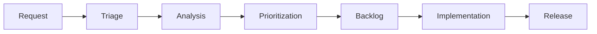

# Maintenance Planning

> **Meta:** v1.0.0 | 22-02-2026

## Назначение

Навык для планирования процесса сопровождения программного продукта после его внедрения. Обеспечивает структурированный подход к организации технической поддержки, управлению SLA и обработке запросов на улучшения.

## Когда использовать

- При переходе проекта в фазу сопровождения
- При определении уровней поддержки и SLA
- При планировании графика регламентных работ
- При организации процесса обработки инцидентов
- При управлении запросами на новые функции

## Функции

### Maintenance Schedule (График сопровождения)

Планирование регулярных работ по сопровождению:

**Типы регламентных работ:**
- Плановые обновления безопасности (ежемесячно)
- Обновления зависимостей (ежеквартально)
- Техническое обслуживание инфраструктуры
- Резервное копирование и восстановление
- Мониторинг и оптимизация производительности

**Структура графика:**
```markdown
## График регламентных работ

| Тип работ | Периодичность | Окно обслуживания | Ответственный |
|-----------|---------------|-------------------|---------------|
| Security patches | Ежемесячно | 1-й вторник, 02:00-04:00 | DevOps |
| Dependency updates | Ежеквартально | 3-я суббота, 00:00-06:00 | Development |
| Backup verification | Еженедельно | Воскресенье, 03:00-04:00 | DevOps |
| Performance review | Ежемесячно | Последняя пятница | Tech Lead |
```

### Support Levels (Уровни поддержки)

Определение уровней технической поддержки:

**Типовая модель уровней:**

| Уровень | Описание | Каналы | Время ответа |
|---------|----------|--------|--------------|
| L1 (First Line) | Первичная обработка, FAQ, базовые проблемы | Email, Chat, Phone | 15 мин |
| L2 (Second Line) | Технические проблемы, диагностика | Ticket system | 2 часа |
| L3 (Third Line) | Сложные технические проблемы, разработка | Internal escalation | 8 часов |
| L4 (Vendor) | Проблемы vendors/external systems | Vendor support | По договору |

**Матрица эскалации:**
```markdown
## Правила эскалации

### Критичность P1 (Critical)
- Время реакции: 15 минут
- Эскалация на L2: через 30 мин без решения
- Эскалация на L3: через 2 часа без решения
- Уведомление менеджмента: немедленно

### Критичность P2 (High)
- Время реакции: 1 час
- Эскалация на L2: через 2 часа без решения
- Эскалация на L3: через 8 часов без решения

### Критичность P3 (Medium)
- Время реакции: 4 часа
- Эскалация на L2: через 8 часов без решения

### Критичность P4 (Low)
- Время реакции: 24 часа
- Решение в рамках SLA: 5 рабочих дней
```

### SLA Management (Управление SLA)

Определение и контроль соглашений об уровне обслуживания:

**Структура SLA:**
```markdown
## Service Level Agreement

### Доступность сервиса
- Целевой показатель: 99.5% uptime
- Плановые работы: не более 4 часов в месяц
- Расчёт доступности: (Общее время - Простой) / Общее время × 100%

### Время отклика
| Приоритет | Время отклика | Время решения |
|-----------|---------------|---------------|
| Critical (P1) | 15 минут | 4 часа |
| High (P2) | 1 час | 8 часов |
| Medium (P3) | 4 часа | 24 часа |
| Low (P4) | 24 часа | 5 дней |

### Компенсации при нарушении SLA
- < 99.5% доступности: 5% возврат стоимости
- < 99.0% доступности: 10% возврат стоимости
- < 98.0% доступности: 20% возврат стоимости
```

**Метрики SLA для отслеживания:**
- MTTR (Mean Time To Resolve) — среднее время решения
- MTBF (Mean Time Between Failures) — среднее время между сбоями
- First Contact Resolution Rate — процент решений при первом обращении
- Customer Satisfaction Score (CSAT) — оценка удовлетворённости

### Feature Requests (Запросы на улучшения)

Управление запросами на новые функции:

**Процесс обработки запросов:**


**Шаблон запроса на функцию:**
```markdown
## Feature Request

### Идентификатор
FR-YYYY-NNN

### Инициатор
- Имя:
- Отдел:
- Дата запроса:

### Описание
- Краткое описание:
- Бизнес-обоснование:
- Ожидаемый эффект:

### Классификация
- Тип: [ ] New feature [ ] Enhancement [ ] Bug fix
- Приоритет: [ ] Critical [ ] High [ ] Medium [ ] Low
- Категория: [ ] Functional [ ] Non-functional [ ] Technical

### Оценка
- Трудозатраты: X story points / Y человеко-часов
- Срок реализации:
- Зависимости:
```

**Матрица приоритизации:**
```markdown
## RICE Score Model

**Reach (Охват)** — количество пользователей, которых затронет изменение (1-10)
**Impact (Влияние)** — степень влияния на бизнес (0.25-3)
**Confidence (Уверенность)** — уверенность в оценках (0.5-1)
**Effort (Усилия)** — трудозатраты в человеко-неделях

RICE Score = (Reach × Impact × Confidence) / Effort

### Пример приоритизации
| Feature | R | I | C | E | RICE |
|---------|---|---|---|---|------|
| Feature A | 8 | 2 | 0.8 | 4 | 3.2 |
| Feature B | 5 | 1 | 0.7 | 2 | 1.75 |
| Feature C | 10 | 3 | 0.9 | 8 | 3.375 |
```

## Интеграция с System Analyst

### Входные данные от System Analyst

**Данные об инцидентах:**
- Статистика инцидентов за период
- Анализ причин сбоев (Root Cause Analysis)
- Тренды по типам проблем
- Рекомендации по улучшению

**Данные о системе:**
- Архитектурные ограничения
- Точки отказа (Single Points of Failure)
- Зависимости от внешних систем
- Требования к мониторингу

**Данные о пользователях:**
- Количество активных пользователей
- Паттерны использования
- Частые вопросы и проблемы
- Уровни доступа и роли

### Выходные артефакты для System Analyst

- План сопровождения (Maintenance Plan)
- SLA документация
- Матрица поддержки (Support Matrix)
- Регламент обработки инцидентов
- Бэклог запросов на улучшения

## Примеры использования

### Пример 1: Определение SLA для новой системы

**Вход:** Новая CRM-система для 500 пользователей

**Процесс:**
1. Определить критичность системы для бизнеса (High)
2. Согласовать целевую доступность (99.5%)
3. Определить окна обслуживания (ночь, выходные)
4. Установить время реакции по приоритетам
5. Определить команду поддержки (L1: 2 FTE, L2: 1 FTE, L3: Development team)

**Результат:** SLA документ, утверждённый стейкхолдерами

### Пример 2: Организация процесса обработки Feature Requests

**Вход:** 50 запросов на улучшения от пользователей

**Процесс:**
1. Провести триадж запросов
2. Классифицировать по типам и приоритетам
3. Оценить каждый запрос (RICE score)
4. Отсортировать по приоритету
5. Сформировать бэклог на следующий квартал

**Результат:** Приоритизированный бэклог с оценкой трудозатрат

## Метрики и KPI

### Операционные метрики
- **Ticket Volume** — количество тикетов за период
- **Resolution Rate** — процент решённых тикетов
- **SLA Compliance** — процент соблюдения SLA
- **Backlog Size** — размер бэклога запросов

### Метрики качества
- **CSAT** — удовлетворённость пользователей
- **NPS** — индекс лояльности
- **First Contact Resolution** — процент решений при первом обращении
- **Reopen Rate** — процент переоткрытых тикетов

### Метрики производительности
- **MTTR** — среднее время решения
- **MTBF** — среднее время между сбоями
- **Uptime** — доступность системы
- **Response Time** — время отклика системы

## Инструменты

### Системы управления тикетами
- Jira Service Management
- ServiceNow
- Zendesk
- Freshdesk

### Мониторинг и алертинг
- Prometheus + Grafana
- Datadog
- New Relic
- PagerDuty

### Управление бэклогом
- Jira
- Azure DevOps
- Trello
- Productboard

## Лучшие практики

1. **Документировать всё** — каждый инцидент должен быть задокументирован
2. **Автоматизировать рутину** — использовать автоматизацию для типовых операций
3. **Постоянно улучшать** — проводить ретроспективы инцидентов
4. **Проактивный мониторинг** — выявлять проблемы до обращения пользователей
5. **Обратная связь** — собирать обратную связь после каждого инцидента

## Связанные навыки

- [`deployment-planning`](../deployment-planning/SKILL.md) — планирование внедрения
- [`release-management`](../release-management/SKILL.md) — управление релизами
- [`project-metrics`](../project-metrics/SKILL.md) — метрики проекта
- [`escalation-management`](../escalation-management/SKILL.md) — управление эскалациями

---

*Part of Project Manager SDLC Skills — Phase 7: Maintenance & Support*
