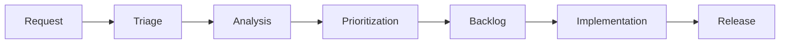

# Maintenance Planning

> **Meta:** v1.0.0 | 22-02-2026

## Purpose

Skill for planning the software product maintenance process after its implementation. Provides a structured approach to organizing technical support, managing SLA, and handling feature requests.

## When to Use

- When project transitions to maintenance phase
- When defining support levels and SLA
- When planning scheduled maintenance schedule
- When organizing incident handling process
- When managing new feature requests

## Functions

### Maintenance Schedule

Planning regular maintenance work:

**Types of scheduled work:**
- Planned security updates (monthly)
- Dependency updates (quarterly)
- Infrastructure maintenance
- Backup and recovery
- Performance monitoring and optimization

**Schedule structure:**
```markdown
## Scheduled Maintenance Schedule

| Work Type | Frequency | Maintenance Window | Responsible |
|-----------|-----------|-------------------|--------------|
| Security patches | Monthly | 1st Tuesday, 02:00-04:00 | DevOps |
| Dependency updates | Quarterly | 3rd Saturday, 00:00-06:00 | Development |
| Backup verification | Weekly | Sunday, 03:00-04:00 | DevOps |
| Performance review | Monthly | Last Friday | Tech Lead |
```

### Support Levels

Defining technical support levels:

**Standard level model:**

| Level | Description | Channels | Response Time |
|-------|-------------|----------|----------------|
| L1 (First Line) | Initial processing, FAQ, basic issues | Email, Chat, Phone | 15 min |
| L2 (Second Line) | Technical issues, diagnostics | Ticket system | 2 hours |
| L3 (Third Line) | Complex technical issues, development | Internal escalation | 8 hours |
| L4 (Vendor) | Vendor issues/external systems | Vendor support | Per contract |

**Escalation matrix:**
```markdown
## Escalation Rules

### Criticality P1 (Critical)
- Response time: 15 minutes
- Escalation to L2: after 30 min without resolution
- Escalation to L3: after 2 hours without resolution
- Management notification: immediate

### Criticality P2 (High)
- Response time: 1 hour
- Escalation to L2: after 2 hours without resolution
- Escalation to L3: after 8 hours without resolution

### Criticality P3 (Medium)
- Response time: 4 hours
- Escalation to L2: after 8 hours without resolution

### Criticality P4 (Low)
- Response time: 24 hours
- Resolution within SLA: 5 business days
```

### SLA Management

Defining and controlling service level agreements:

**SLA structure:**
```markdown
## Service Level Agreement

### Service Availability
- Target: 99.5% uptime
- Planned work: no more than 4 hours per month
- Availability calculation: (Total Time - Downtime) / Total Time × 100%

### Response Time
| Priority | Response Time | Resolution Time |
|----------|---------------|----------------|
| Critical (P1) | 15 minutes | 4 hours |
| High (P2) | 1 hour | 8 hours |
| Medium (P3) | 4 hours | 24 hours |
| Low (P4) | 24 hours | 5 days |

### SLA Violation Compensation
- < 99.5% availability: 5% refund
- < 99.0% availability: 10% refund
- < 98.0% availability: 20% refund
```

**SLA metrics to track:**
- MTTR (Mean Time To Resolve)
- MTBF (Mean Time Between Failures)
- First Contact Resolution Rate
- Customer Satisfaction Score (CSAT)

### Feature Requests

Managing new feature requests:

**Request handling process:**

```mermaid
graph LR
    A[Request] --> B[Triage]
    B --> C[Analysis]
    C --> D[Prioritization]
    D --> E[Backlog]
    E --> F[Implementation]
    F --> G[Release]
```

**Feature request template:**
```markdown
## Feature Request

### Identifier
FR-YYYY-NNN

### Initiator
- Name:
- Department:
- Request date:

### Description
- Brief description:
- Business justification:
- Expected effect:

### Classification
- Type: [ ] New feature [ ] Enhancement [ ] Bug fix
- Priority: [ ] Critical [ ] High [ ] Medium [ ] Low
- Category: [ ] Functional [ ] Non-functional [ ] Technical

### Estimation
- Effort: X story points / Y person-hours
- Implementation timeline:
- Dependencies:
```

**Prioritization matrix:**
```markdown
## RICE Score Model

**Reach** — number of users affected by the change (1-10)
**Impact** — degree of business impact (0.25-3)
**Confidence** — confidence in estimates (0.5-1)
**Effort** — effort in person-weeks

RICE Score = (Reach × Impact × Confidence) / Effort

### Prioritization example
| Feature | R | I | C | E | RICE |
|---------|---|---|---|---|------|
| Feature A | 8 | 2 | 0.8 | 4 | 3.2 |
| Feature B | 5 | 1 | 0.7 | 2 | 1.75 |
| Feature C | 10 | 3 | 0.9 | 8 | 3.375 |
```

## Integration with System Analyst

### Input from System Analyst

**Incident data:**
- Incident statistics for the period
- Root cause analysis
- Problem type trends
- Improvement recommendations

**System data:**
- Architectural constraints
- Single Points of Failure
- External system dependencies
- Monitoring requirements

**User data:**
- Number of active users
- Usage patterns
- Frequent questions and issues
- Access levels and roles

### Output Artifacts for System Analyst

- Maintenance Plan
- SLA documentation
- Support Matrix
- Incident handling procedure
- Feature request backlog

## Usage Examples

### Example 1: Defining SLA for New System

**Input:** New CRM system for 500 users

**Process:**
1. Determine system criticality for business (High)
2. Agree on target availability (99.5%)
3. Define maintenance windows (night, weekends)
4. Set response times by priority
5. Define support team (L1: 2 FTE, L2: 1 FTE, L3: Development team)

**Result:** SLA document approved by stakeholders

### Example 2: Organizing Feature Request Handling

**Input:** 50 feature requests from users

**Process:**
1. Conduct request triage
2. Classify by types and priorities
3. Evaluate each request (RICE score)
4. Sort by priority
5. Form backlog for next quarter

**Result:** Prioritized backlog with effort estimates

## Metrics and KPI

### Operational Metrics
- **Ticket Volume** — number of tickets in period
- **Resolution Rate** — percentage of resolved tickets
- **SLA Compliance** — percentage of SLA compliance
- **Backlog Size** — feature request backlog size

### Quality Metrics
- **CSAT** — user satisfaction
- **NPS** — Net Promoter Score
- **First Contact Resolution** — percentage resolved on first contact
- **Reopen Rate** — percentage of reopened tickets

### Performance Metrics
- **MTTR** — mean time to resolve
- **MTBF** — mean time between failures
- **Uptime** — system availability
- **Response Time** — system response time

## Tools

### Ticket Management Systems
- Jira Service Management
- ServiceNow
- Zendesk
- Freshdesk

### Monitoring and Alerting
- Prometheus + Grafana
- Datadog
- New Relic
- PagerDuty

### Backlog Management
- Jira
- Azure DevOps
- Trello
- Productboard

## Best Practices

1. **Document everything** — every incident must be documented
2. **Automate routine** — use automation for standard operations
3. **Continuously improve** — conduct incident retrospectives
4. **Proactive monitoring** — identify issues before user complaints
5. **Gather feedback** — collect feedback after each incident

## Related Skills

- [`deployment-planning`](../deployment-planning/SKILL.md) — deployment planning
- [`release-management`](../release-management/SKILL.md) — release management
- [`project-metrics`](../project-metrics/SKILL.md) — project metrics
- [`escalation-management`](../escalation-management/SKILL.md) — escalation management

---

*Part of Project Manager SDLC Skills — Phase 7: Maintenance & Support*
