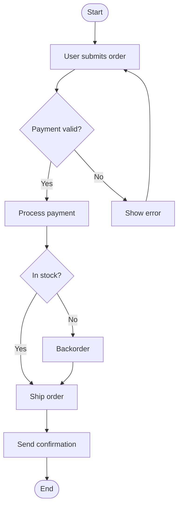
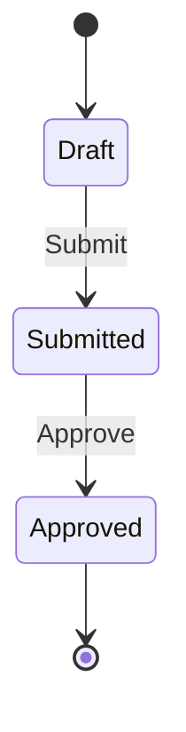
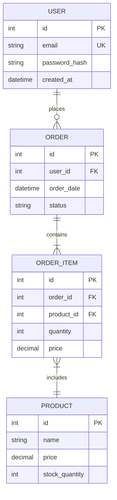
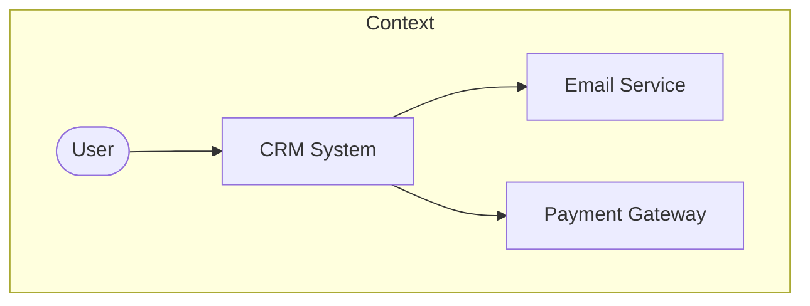
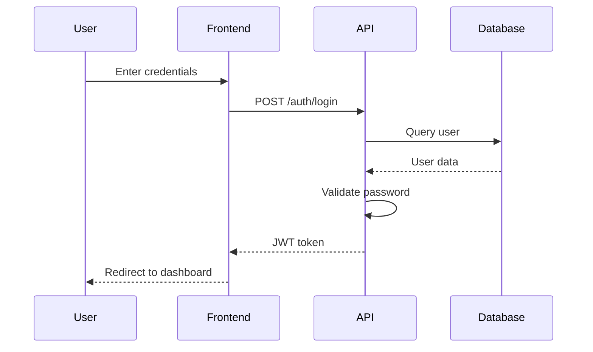

# Skills Plan for System Analyst Mode

> **Meta:** v1.2.0 | 23-02-2026 | Author: Universal Coding Agent

## Обзор

Данный документ содержит план разработки skills (навыков) для режима System Analyst. Skills предназначены для улучшения работы с анализом требований, моделированием бизнес-процессов, проектированием API и архитектуры данных на всех этапах SDLC.

> **Текущий статус:** 14 навыков реализованы, 1 навык запланирован (test-case-design).

---

## SDLC-ориентированная структура навыков

### Фаза 1: Сбор и анализ требований

#### 1.1 requirements-analysis ✅ (Реализован)
| Параметр | Значение |
|----------|----------|
| **Статус** | Реализован |
| **Приоритет** | Высокий |
| **Описание** | Сбор, анализ и документирование требований к системе |
| **Функции** | Requirements Gathering, Categorization (FR/NFR), Prioritization (MoSCoW), Documentation |
| **Интеграция** | Предоставляет данные для Project Manager (оценки, риски) |

#### 1.2 srs-specification ✅ (Реализован)
| Параметр | Значение |
|----------|----------|
| **Статус** | Реализован |
| **Приоритет** | Высокий |
| **Описание** | Создание спецификации требований к ПО (SRS) |
| **Функции** | Functional Requirements, Non-functional Requirements, Constraints, IEEE 830 Structure |
| **Интеграция** | Передаёт SRS документ Project Manager для планирования |

#### 1.3 use-case-modeling ✅ (Реализован)
| Параметр | Значение |
|----------|----------|
| **Статус** | Реализован |
| **Приоритет** | Высокий |
| **Описание** | Создание диаграмм вариантов использования (Use Case) |
| **Функции** | Actor Identification, Use Case Definition, Relationships (include/extend/generalization), Diagram Generation (Mermaid/PlantUML) |
| **Интеграция** | Количество use cases, сложность, зависимости для Project Manager |

#### 1.4 user-stories ✅ (Реализован)
| Параметр | Значение |
|----------|----------|
| **Статус** | Реализован |
| **Приоритет** | Высокий |
| **Описание** | Написание пользовательских историй с критериями приёмки |
| **Функции** | User Story Format, Acceptance Criteria (Gherkin), Story Mapping, INVEST Criteria, Story Points |
| **Интеграция** | Предоставляет User Stories для Project Manager (бэклог), Story Points для планирования |

---

### Фаза 2: Моделирование бизнес-процессов

#### 2.1 bpmn-modeling ✅ (Реализован)
| Параметр | Значение |
|----------|----------|
| **Статус** | Реализован |
| **Приоритет** | Высокий |
| **Описание** | Моделирование бизнес-процессов в нотации BPMN 2.0 |
| **Функции** | Process Mapping, Gateways (XOR/AND/OR), Events (Start/End/Timer/Message/Error), Tasks (User/Service/Script/Business Rule), Pools & Lanes, Message Flows |
| **Интеграция** | Предоставляет модели процессов, метрики, узкие места для Project Manager |

#### 2.2 workflow-design ✅ (Реализован)
| Параметр | Значение |
|----------|----------|
| **Статус** | Реализован |
| **Приоритет** | Средний |
| **Описание** | Проектирование рабочих процессов и автоматизации |
| **Функции** | Workflow Automation, State Machines, Approval Flows, Exception Handling |
| **Интеграция** | Определяет требования к автоматизации для Code mode |

---

### Фаза 3: Проектирование данных

#### 3.1 data-modeling ✅ (Реализован)
| Параметр | Значение |
|----------|----------|
| **Статус** | Реализован |
| **Приоритет** | Высокий |
| **Описание** | Проектирование моделей данных и ER-диаграмм |
| **Функции** | ERD Design, Normalization (1NF-3NF), Denormalization, Indexing Strategy, Constraints |
| **Интеграция** | Предоставляет схемы данных для Code mode и Project Manager |

#### 3.2 sql-development ✅ (Реализован)
| Параметр | Значение |
|----------|----------|
| **Статус** | Реализован |
| **Приоритет** | Высокий |
| **Описание** | Написание сложных SQL-запросов |
| **Функции** | Complex Queries, CTEs, Window Functions, Stored Procedures, Query Optimization |
| **Интеграция** | Предоставляет SQL-запросы для Code mode |

#### 3.3 nosql-design ✅ (Реализован)
| Параметр | Значение |
|----------|----------|
| **Статус** | Реализован |
| **Приоритет** | Средний |
| **Описание** | Проектирование NoSQL схем данных |
| **Функции** | Document Design, Key-Value Patterns, Access Patterns, Consistency Models |
| **Интеграция** | Определяет NoSQL архитектуру для Code mode |

---

### Фаза 4: Проектирование API

#### 4.1 api-design ✅ (Реализован)
| Параметр | Значение |
|----------|----------|
| **Статус** | Реализован |
| **Приоритет** | Высокий |
| **Описание** | Проектирование RESTful API и спецификаций OpenAPI |
| **Функции** | REST Principles, OpenAPI/Swagger Specs, Endpoint Design, Authentication/Authorization |
| **Интеграция** | Предоставляет API спецификации для Code mode |

#### 4.2 integration-patterns ✅ (Реализован)
| Параметр | Значение |
|----------|----------|
| **Статус** | Реализован |
| **Приоритет** | Высокий |
| **Описание** | Проектирование интеграционных паттернов |
| **Функции** | Synchronous vs Asynchronous, Message Brokers, ESB, Event-Driven Architecture, Error Handling |
| **Интеграция** | Определяет интеграционную архитектуру для Code mode |

---

### Фаза 5: Архитектурное проектирование

#### 5.1 c4-architecture ✅ (Реализован)
| Параметр | Значение |
|----------|----------|
| **Статус** | Реализован |
| **Приоритет** | Высокий |
| **Описание** | Моделирование архитектуры по модели C4 |
| **Функции** | Context Diagram, Container Diagram, Component Diagram, Code Diagram |
| **Интеграция** | Предоставляет архитектурные решения для Project Manager |

#### 5.2 uml-modeling ✅ (Реализован)
| Параметр | Значение |
|----------|----------|
| **Статус** | ✅ Реализован |
| **Приоритет** | Высокий |
| **Описание** | Создание UML-диаграмм |
| **Функции** | Class Diagrams, Sequence Diagrams, Activity Diagrams, State Machine Diagrams |
| **Интеграция** | Визуализация системы для Code mode и Project Manager |

---

### Фаза 6: Тестирование и качество

#### 6.1 test-case-design 📋 (Запланирован)
| Параметр | Значение |
|----------|----------|
| **Статус** | Запланирован |
| **Приоритет** | Высокий |
| **Описание** | Создание тест-кейсов и тест-сценариев |
| **Функции** | Test Case Design, Test Scenarios, Edge Cases, Test Data Requirements, Traceability Matrix |
| **Интеграция** | Предоставляет тест-кейсы для Project Manager (QA coordination) |

#### 6.2 gherkin-specifications ✅ (Реализован)
| Параметр | Значение |
|----------|----------|
| **Статус** | Реализован |
| **Приоритет** | Средний |
| **Описание** | Написание спецификаций на языке Gherkin |
| **Функции** | Feature Files, Given-When-Then, Scenario Outlines, Background, Tags, Step Definitions |
| **Интеграция** | Предоставляет Gherkin-файлы для Code mode (BDD-автоматизация) |

---

## Приоритизация по фазам SDLC

### Фаза 1 (Сбор и анализ требований): 4 навыка
1. ✅ **requirements-analysis** — сбор и анализ требований
2. ✅ **srs-specification** — спецификация требований
3. ✅ **use-case-modeling** — диаграммы вариантов использования
4. ✅ **user-stories** — пользовательские истории

### Фаза 2 (Моделирование бизнес-процессов): 2 навыка
1. ✅ **bpmn-modeling** — BPMN-диаграммы
2. ✅ **workflow-design** — проектирование рабочих процессов

### Фаза 3 (Проектирование данных): 3 навыка
1. ✅ **data-modeling** — модели данных и ERD
2. ✅ **sql-development** — SQL-запросы
3. ✅ **nosql-design** — NoSQL схемы

### Фаза 4 (Проектирование API): 2 навыка
1. ✅ **api-design** — REST API и OpenAPI
2. ✅ **integration-patterns** — интеграционные паттерны

### Фаза 5 (Архитектурное проектирование): 2 навыка
1. ✅ **c4-architecture** — модель C4
2. ✅ **uml-modeling** — UML-диаграммы

### Фаза 6 (Тестирование и качество): 2 навыка
1. ✅ **test-case-design** — тест-кейсы
2. ✅ **gherkin-specifications** — Gherkin-спецификации

---

## Детальные спецификации навыков

### 1.3 use-case-modeling

**Описание:** Создание диаграмм вариантов использования (Use Case Diagrams) для визуализации функциональных требований системы.

**Функции:**
- **Actor Identification:** Определение всех актёров системы (пользователи, внешние системы)
- **Use Case Definition:** Описание вариантов использования с шаблоном:
  - Name, ID, Description
  - Actors, Pre-conditions, Post-conditions
  - Basic Flow, Alternative Flows, Exception Flows
- **Relationships:** Include, Extend, Generalization
- **Diagram Generation:** Mermaid.js / PlantUML код

**Данные для Project Manager:**
- Количество use cases для оценки
- Сложность use cases (простые, средние, сложные)
- Зависимости между use cases

**Пример структуры Use Case:**
```markdown
## UC-001: User Authentication

**Actors:** User, Authentication System
**Pre-conditions:** User has valid credentials
**Post-conditions:** User is authenticated

### Basic Flow
1. User enters username and password
2. System validates credentials
3. System creates session
4. User is redirected to dashboard

### Alternative Flows
2a. Invalid credentials
    2a1. System shows error message
    2a2. User can retry (max 3 attempts)

### Exception Flows
3a. Session creation failed
    3a1. System logs error
    3a2. User is asked to try again
```

---

### 1.4 user-stories

**Описание:** Написание пользовательских историй с критериями приёмки по методологии Agile.

**Функции:**
- **User Story Format:** "As a <role>, I want <feature>, so that <benefit>"
- **INVEST Criteria:** Independent, Negotiable, Valuable, Estimable, Small, Testable
- **Acceptance Criteria:** Gherkin format (Given-When-Then)
- **Story Mapping:** Организация историй в карту пользовательского опыта
- **Story Points:** Оценка сложности (Fibonacci: 1, 2, 3, 5, 8, 13, 21)

**Данные для Project Manager:**
- User Stories для бэклога
- Story points для планирования спринтов
- Зависимости между историями

**Пример User Story:**
```markdown
## US-001: User Login

**As a** registered user,
**I want to** log into the system,
**So that** I can access my personal dashboard.

**Acceptance Criteria:**
```gherkin
Scenario: Successful login
  Given I am on the login page
  When I enter valid credentials
  And I click "Login"
  Then I should be redirected to my dashboard
  And I should see my username in the header

Scenario: Invalid credentials
  Given I am on the login page
  When I enter invalid credentials
  And I click "Login"
  Then I should see an error message "Invalid credentials"
  And I should remain on the login page
```

**Story Points:** 3
**Priority:** Must Have
```

---

### 2.1 bpmn-modeling

**Описание:** Моделирование бизнес-процессов в нотации BPMN 2.0 для анализа и оптимизации бизнес-логики.

**Функции:**
- **Process Mapping:** Определение шагов процесса
- **Gateways:** Exclusive (XOR), Parallel (AND), Inclusive (OR)
- **Events:** Start, End, Timer, Message, Signal, Error
- **Tasks:** User Task, Service Task, Script Task, Business Rule Task
- **Pools & Lanes:** Организация участников процесса
- **Message Flows:** Коммуникация между пулами

**Данные для Project Manager:**
- Оптимизация процессов
- Идентификация узких мест
- Оценка времени выполнения процессов

**Пример BPMN (Mermaid):**


---

### 2.2 workflow-design

**Описание:** Проектирование рабочих процессов и систем автоматизации.

**Функции:**
- **Workflow Automation:** Определение триггеров, действий, условий
- **State Machines:** Диаграммы состояний, переходы, события
- **Approval Flows:** Одноуровневые, последовательные, параллельные, условные, эскалация
- **Exception Handling:** Retry логика, компенсирующие транзакции, fallback стратегии

**Данные для Project Manager:**
- Количество workflow для оценки
- Сложность state machines
- Требования к ресурсам workflow engine
- Риски автоматизации

**Пример State Machine (Mermaid):**


---

### 3.1 data-modeling

**Описание:** Проектирование моделей данных и Entity-Relationship Diagrams (ERD) для реляционных и нереляционных баз данных.

**Функции:**
- **ERD Design:** Сущности, атрибуты, связи
- **Normalization:** 1NF, 2NF, 3NF, BCNF
- **Denormalization:** Когда и как денормализовывать
- **Indexing Strategy:** Primary, Unique, Composite, Partial indexes
- **Constraints:** NOT NULL, CHECK, FOREIGN KEY, UNIQUE

**Данные для Project Manager:**
- Количество сущностей для оценки
- Сложность связей
- Требования к миграции данных

**Пример ERD (Mermaid):**


---

### 4.1 api-design

**Описание:** Проектирование RESTful API и создание спецификаций OpenAPI/Swagger.

**Функции:**
- **REST Principles:** Resources, HTTP Methods, Status Codes
- **OpenAPI Specification:** Paths, Schemas, Parameters, Responses
- **Authentication:** OAuth 2.0, JWT, API Keys
- **Versioning:** URL vs Header vs Query Parameter
- **Pagination:** Offset-based vs Cursor-based
- **Error Handling:** Error response format, error codes

**Данные для Project Manager:**
- Количество endpoints для оценки
- Сложность API
- Требования к безопасности

**Пример OpenAPI:**
```yaml
openapi: 3.0.0
info:
  title: User Management API
  version: 1.0.0
paths:
  /users:
    get:
      summary: List all users
      parameters:
        - name: page
          in: query
          schema:
            type: integer
            default: 1
        - name: limit
          in: query
          schema:
            type: integer
            default: 20
      responses:
        '200':
          description: Successful response
          content:
            application/json:
              schema:
                $ref: '#/components/schemas/UserList'
    post:
      summary: Create a new user
      requestBody:
        required: true
        content:
          application/json:
            schema:
              $ref: '#/components/schemas/UserCreate'
      responses:
        '201':
          description: User created
```

---

### 5.1 c4-architecture

**Описание:** Моделирование архитектуры программной системы по модели C4 (Context, Containers, Components, Code).

**Функции:**
- **Context Diagram:** Система в контексте, пользователи, внешние системы
- **Container Diagram:** Приложения, базы данных, микросервисы
- **Component Diagram:** Компоненты внутри контейнеров
- **Code Diagram:** Классы, интерфейсы (опционально)

**Данные для Project Manager:**
- Архитектурные решения для планирования
- Компоненты для оценки
- Технологический стек

**Пример C4 (Mermaid):**


---

### 5.2 uml-modeling

**Описание:** Создание UML-диаграмм для визуализации структуры и поведения системы.

**Функции:**
- **Class Diagrams:** Классы, атрибуты, методы, отношения
- **Sequence Diagrams:** Взаимодействие объектов во времени
- **Activity Diagrams:** Потоки управления
- **State Machine Diagrams:** Состояния объекта

**Данные для Project Manager:**
- Визуализация для команды
- Оценка сложности классов
- Идентификация зависимостей

**Пример Sequence Diagram (Mermaid):**


---

### 6.1 test-case-design

**Описание:** Создание тест-кейсов и тест-сценариев на основе требований.

**Функции:**
- **Test Case Design:** ID, Description, Pre-conditions, Steps, Expected Results
- **Test Scenarios:** Группировка тест-кейсов
- **Edge Cases:** Граничные условия
- **Test Data Requirements:** Данные для тестирования
- **Traceability Matrix:** Связь требований и тест-кейсов

**Данные для Project Manager:**
- Количество тест-кейсов для оценки QA
- Покрытие требований тестами
- Критические тест-кейсы

**Пример Test Case:**
```markdown
## TC-001: Successful User Login

**Requirement:** FR-001 User Authentication
**Priority:** High
**Type:** Functional

### Pre-conditions
- User exists in system
- User is not logged in

### Test Steps
| Step | Action | Expected Result |
|------|--------|-----------------|
| 1 | Navigate to login page | Login form is displayed |
| 2 | Enter valid username | Username is accepted |
| 3 | Enter valid password | Password is masked |
| 4 | Click "Login" button | User is authenticated |
| 5 | Verify redirect | Dashboard is displayed |

### Post-conditions
- User session is created
- User is redirected to dashboard
```

---

## Шаблон SKILL.md

```markdown
---
name: skill-name
description: Краткое описание того, что делает skill и когда его использовать
---

# Skill Name

> **Meta:** vX.X.X | DD-MM-YYYY

## Назначение

Подробное описание назначения skill.

## Когда использовать

Условия активации skill.

## Функции

### Функция 1
Описание функции.

### Функция 2
Описание функции.

## Интеграция с Project Manager

Какие данные предоставляются Project Manager.

## Примеры использования

### Пример 1
Описание примера с кодом.

## Связанные skills

- related-skill-1
- related-skill-2

---
```

---

## Следующие шаги

1. ✅ Создать директорию `skills-system-analyst/`
2. ✅ Реализовать навыки Фазы 1 (requirements-analysis, srs-specification)
3. ✅ Реализовать навык use-case-modeling
4. ✅ Реализовать навык user-stories
5. ✅ Реализовать навык bpmn-modeling (Фаза 2)
6. ✅ Реализовать навык workflow-design (Фаза 2)
7. ✅ Реализовать навыки Фазы 3 (data-modeling, sql-development, nosql-design) - 3 навыка
8. ✅ Реализовать навыки Фазы 4 (api-design, integration-patterns) - 2 навыка
9. ✅ Реализовать навыки Фазы 5 (c4-architecture, uml-modeling) - 2 навыка
10. 📋 Реализовать навыки Фазы 6 (test-case-design, gherkin-specifications) - 2 навыка
11. 📋 Обновить документацию в AGENTS.md
12. 📋 Протестировать интеграцию с режимом

---

## Статистика

| Метрика | Значение |
|---------|----------|
| **Всего навыков** | 15 |
| **Реализовано** | 14 (93%) |
| **Запланировано** | 1 (7%) |
| **Высокий приоритет** | 11 |
| **Средний приоритет** | 4 |

---

## Интеграция с Project Manager

### Данные, предоставляемые SA → PM

| Фаза | Навык | Данные для PM |
|------|-------|---------------|
| 1 | requirements-analysis | Оценки трудозатрат, риски требований, приоритеты |
| 1 | srs-specification | Объём работ, сложность требований, зависимости |
| 1 | use-case-modeling | Количество use cases, сложность, зависимости |
| 1 | user-stories | User stories для бэклога, story points |
| 2 | bpmn-modeling | Модели процессов, оптимизация |
| 2 | workflow-design | Требования к автоматизации, метрики workflow |
| 3 | data-modeling | Количество сущностей, сложность связей |
| 3 | sql-development | Сложность запросов, требования к оптимизации |
| 4 | api-design | Количество endpoints, сложность API |
| 5 | c4-architecture | Архитектурные решения, компоненты |
| 6 | test-case-design | Количество тест-кейсов, покрытие |

### Данные, запрашиваемые SA ← PM

| Фаза | Данные от PM |
|------|--------------|
| 1 | Бюджетные ограничения, сроки |
| 2 | Утверждённые приоритеты требований |
| 3 | Доступные технологии |
| 4 | Требования к интеграциям |
| 5 | Архитектурные стандарты |

---
