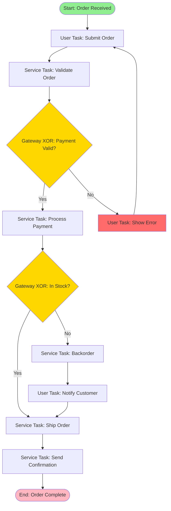
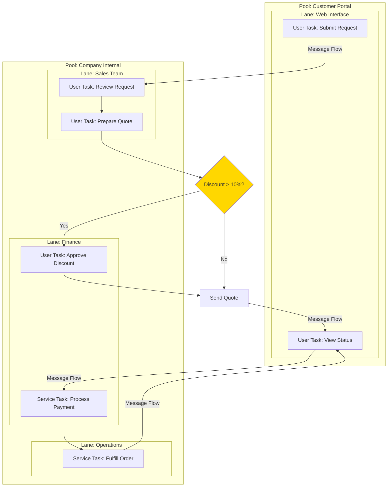
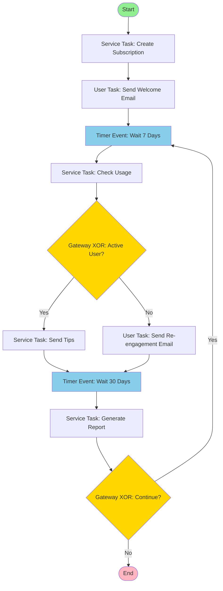
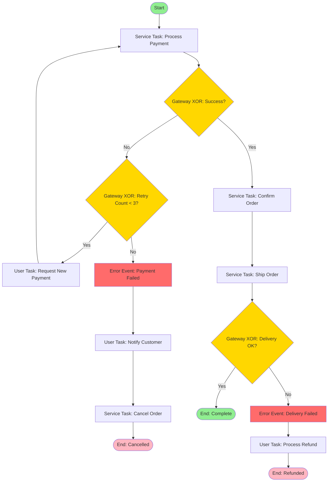
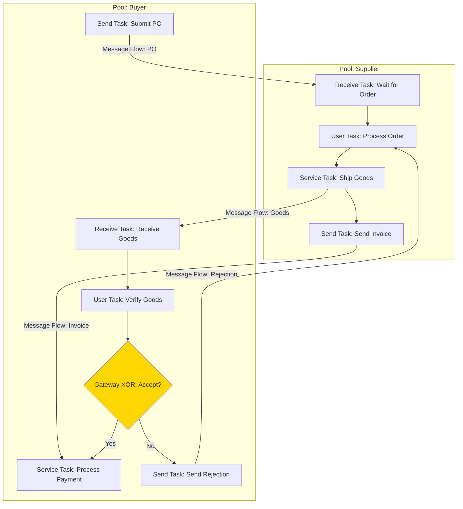
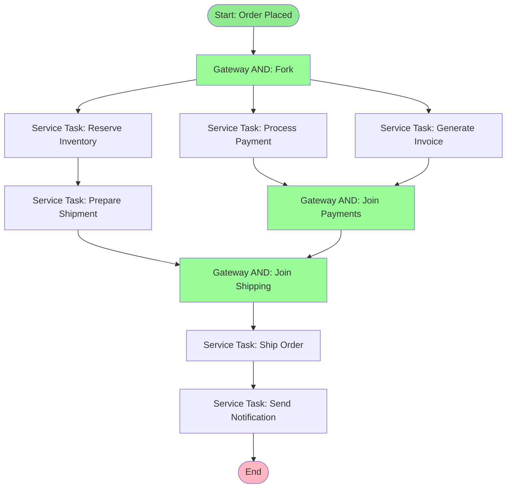

# BPMN Modeling

> **Meta:** v1.0.0 | 23-02-2026

## Назначение

Навык для моделирования бизнес-процессов в нотации BPMN 2.0 (Business Process Model and Notation). Включает создание диаграмм бизнес-процессов, определение потоков выполнения, работу с шлюзами (gateways), событиями (events), задачами (tasks), организацию участников через пулы и дорожки (pools & lanes), а также коммуникацию между процессами через message flows. Предназначен для анализа, документирования и оптимизации бизнес-логики организации.

## Когда использовать

Используйте этот навык:
- При анализе и документировании бизнес-процессов организации
- Для визуализации потоков работ (workflows) и процедур
- При идентификации узких мест и оптимизации процессов
- Для описания взаимодействия между подразделениями и системами
- При проектировании автоматизации бизнес-процессов
- Для подготовки данных для Project Manager (оценки времени, риски процессов)
- На этапе анализа требований и проектирования системы

## Функции

### Process Mapping

Определение и документирование шагов бизнес-процесса:

**Элементы процесса:**
- **Start Event** — точка начала процесса
- **End Event** — точка завершения процесса
- **Activities** — действия, выполняемые в процессе
- **Gateways** — точки принятия решений
- **Sequence Flows** — последовательность выполнения

**Уровни детализации:**
- Level 1: Обзор процесса (SIPOC)
- Level 2: Основные этапы процесса
- Level 3: Детальные шаги с исполнителями
- Level 4: Инструкции для каждого шага

### Gateways

Шлюзы для управления потоками выполнения:

| Тип | Символ | Описание | Применение |
|-----|--------|----------|------------|
| **Exclusive (XOR)** | `X` | Только один путь | Условное ветвление |
| **Parallel (AND)** | `+` | Все пути одновременно | Параллельное выполнение |
| **Inclusive (OR)** | `O` | Один или несколько путей | Множественные условия |
| **Event-based** | `◇` | Событие определяет путь | Реакция на события |
| **Complex** | `*` | Комплексные условия | Сложная логика |

**Правила использования:**
- XOR Gateway: используется для if-then-else логики
- AND Gateway: используется для параллельных задач без условий
- OR Gateway: используется при множественных истинных условиях
- Слияние (merge) должно соответствовать типу разветвления (split)

### Events

События в бизнес-процессе:

| Категория | Типы событий | Описание |
|-----------|--------------|----------|
| **Start Events** | None, Timer, Message, Signal, Conditional | Инициируют начало процесса |
| **Intermediate Events** | Timer, Message, Signal, Error, Escalation, Link | Промежуточные триггеры |
| **End Events** | None, Message, Signal, Error, Escalation, Terminate | Завершение процесса |
| **Boundary Events** | Timer, Error, Signal, Message, Escalation | Обработка событий на активности |

**Детальное описание событий:**

```
Start Events:
- None: Стандартное начало процесса
- Timer: Начало по расписанию (cron, delay)
- Message: Начало при получении сообщения
- Signal: Начало по сигналу от другого процесса
- Conditional: Начало при выполнении условия

Intermediate Events:
- Timer: Задержка или ожидание
- Message: Отправка/получение сообщения
- Signal: Broadcast сигнала
- Error: Обработка ошибки
- Escalation: Эскалация проблемы

End Events:
- None: Нормальное завершение
- Message: Отправка сообщения при завершении
- Error: Завершение с ошибкой
- Terminate: Принудительное завершение всего процесса
```

### Tasks

Типы задач в бизнес-процессе:

| Тип | Обозначение | Описание | Пример |
|-----|-------------|----------|--------|
| **User Task** | Иконка пользователя | Выполняется человеком | Одобрение заявки |
| **Service Task** | Иконка шестерёнки | Выполняется системой | Обработка платежа |
| **Script Task** | Иконка скрипта | Выполняет скрипт | Валидация данных |
| **Business Rule Task** | Иконка таблицы | Применяет бизнес-правила | Расчёт скидки |
| **Manual Task** | Иконка руки | Выполняется вручную | Физическая проверка |
| **Send Task** | Иконка конверта | Отправка сообщения | Отправка уведомления |
| **Receive Task** | Иконка конверта | Получение сообщения | Ожидание ответа |
| **Call Activity** | Иконка плюс | Вызов подпроцесса | Запуск другого процесса |

### Pools & Lanes

Организация участников процесса:

**Pool (Пул):**
- Представляет организацию, департамент или систему
- Может содержать один процесс или несколько
- Message Flow связывает процессы в разных пулах
- Sequence Flow не может пересекать границы пула

**Lane (Дорожка):**
- Подразделение пула для группировки активностей
- Представляет роль, должность или систему
- Помогает определить ответственность
- Sequence Flow может пересекать границы дорожек

**Структура:**
```
┌─────────────────────────────────────────────────┐
│                    Pool: Company A               │
│  ┌──────────────┬──────────────┬──────────────┐ │
│  │ Lane: Sales  │ Lane: Finance│ Lane: Warehouse│
│  │              │              │              │ │
│  │  [Task 1]    │   [Task 2]   │   [Task 3]   │ │
│  │      │       │       │      │       │      │ │
│  │      └───────┼───────┘      │       │      │ │
│  └──────────────┴──────────────┴──────────────┘ │
└─────────────────────────────────────────────────┘
```

### Message Flows

Коммуникация между пулами:

**Характеристики:**
- Связывает процессы в разных пулах
- Представляет обмен сообщениями между участниками
- Не может использоваться внутри одного пула
- Может начинаться/заканчиваться на:
  - Pools
  - Activities (Send/Receive Tasks)
  - Events (Message Events)

**Паттерны коммуникации:**
- **Request-Response:** Запрос и ожидание ответа
- **Fire-and-Forget:** Отправка без ожидания ответа
- **Broadcast:** Отправка сообщения нескольким получателям
- **Correlation:** Связывание сообщений по correlation key

## Интеграция с Project Manager

### Данные для Project Manager

Предоставляет следующие данные для PM:

**Метрики процесса:**
- Количество шагов в процессе
- Количество gateways и их типы
- Количество участников (pools, lanes)
- Количество внешних взаимодействий (message flows)

**Оценка времени выполнения:**

| Элемент процесса | Базовое время | Коэффициент сложности |
|------------------|---------------|----------------------|
| User Task | 15-60 мин | × сложность задачи |
| Service Task | 1-5 мин | × объём данных |
| Gateway XOR | 1-2 мин | × количество веток |
| Gateway AND | 0 мин | параллельное выполнение |
| Message Flow | 5-30 мин | × время ответа |

**Идентификация узких мест:**
- Задачи с наибольшей длительностью
- Gateways с несбалсированными ветками
- Ожидание внешних сообщений (Message Flows)
- Ручные задачи (Manual Tasks)

**Риски процесса:**
- Процессы с множественными шлюзами (высокая сложность)
- Зависимости от внешних систем (Message Flows)
- Процессы без обработки ошибок (Error Events)
- Длинные цепочки последовательных задач

### Взаимодействие

- PM запрашивает модели процессов для оптимизации
- PM получает данные для оценки трудозатрат на автоматизацию
- PM использует метрики процессов для планирования улучшений
- SA валидирует изменения процессов с PM и стейкхолдерами

## Примеры использования

### Пример 1: Процесс обработки заказа (базовый)



**Описание процесса:**
| ID | Элемент | Тип | Исполнитель | Время |
|----|---------|-----|-------------|-------|
| 1 | Start | Start Event | - | - |
| 2 | Submit Order | User Task | Customer | 5 мин |
| 3 | Validate Order | Service Task | System | 2 мин |
| 4 | Payment Valid? | Gateway XOR | System | 1 мин |
| 5 | Process Payment | Service Task | Payment Gateway | 3 мин |
| 6 | In Stock? | Gateway XOR | Inventory System | 1 мин |
| 7 | Ship Order | Service Task | Warehouse | 30 мин |
| 8 | Backorder | Service Task | Warehouse | 10 мин |
| 9 | Notify Customer | User Task | System | 2 мин |
| 10 | Send Confirmation | Service Task | System | 1 мин |
| 11 | End | End Event | - | - |

### Пример 2: Процесс с Pool и Lanes



**Матрица ответственности (RACI):**

| Этап | Customer | Sales | Finance | Operations |
|------|----------|-------|---------|------------|
| Submit Request | R | I | - | - |
| Review Request | I | R | C | - |
| Approve Discount | I | C | R | - |
| Process Payment | I | I | R | I |
| Fulfill Order | I | I | C | R |

### Пример 3: Процесс с Timer Events



**Описание Timer Events:**

| Timer | Тип | Условие | Действие |
|-------|-----|---------|----------|
| Timer 1 | Duration | 7 days after signup | Check user engagement |
| Timer 2 | Duration | 30 days after first check | Generate monthly report |
| Timer 3 | Cycle | Every 30 days | Repeat process |

### Пример 4: Процесс с Error Handling



**Обработка ошибок:**

| Error Event | Триггер | Действие | Ответственный |
|-------------|---------|----------|---------------|
| Payment Failed | 3 failed attempts | Cancel order, notify customer | System |
| Delivery Failed | Carrier error | Process refund | Operations |
| Timeout | No response in 24h | Escalate to manager | System |

### Пример 5: Процесс с Message Flow между пулами



**Спецификация Message Flows:**

| Message | From | To | Data Payload | Trigger |
|---------|------|-----|--------------|---------|
| Purchase Order | Buyer | Supplier | Order items, quantities, delivery date | Submit PO |
| Goods Shipment | Supplier | Buyer | Items, tracking number, ETA | Ship Goods |
| Invoice | Supplier | Buyer | Amount, due date, payment terms | Send Invoice |
| Rejection Notice | Buyer | Supplier | Rejection reason, return instructions | Send Rejection |

### Пример 6: Параллельный процесс с AND Gateway



## Шаблоны документов

### Шаблон описания процесса

```markdown
# Process: {Название процесса}

**Process ID:** PROC-XXX
**Version:** X.X
**Owner:** {Владелец процесса}
**Last Updated:** DD-MM-YYYY

## Цель процесса
{Описание цели}

## Триггеры
- {Триггер 1}
- {Триггер 2}

## Участники (Pools & Lanes)
| Pool | Lane | Роль |
|------|------|------|
| Pool A | Lane 1 | Описание роли |

## Входные данные
| Данные | Источник | Формат |
|--------|----------|--------|
| Data 1 | System A | JSON |

## Выходные данные
| Данные | Получатель | Формат |
|--------|------------|--------|
| Data 1 | System B | XML |

## KPI процесса
- Среднее время выполнения: X часов
- Количество шагов: X
- Уровень автоматизации: X%

## Диаграмма процесса
{Mermaid диаграмма}
```

### Шаблон таблицы анализа процесса

| ID | Элемент | Тип | Исполнитель | Время | Риски | Улучшения |
|----|---------|-----|-------------|-------|-------|-----------|
| 1 | Task 1 | User Task | Role A | 15 мин | Human error | Автоматизация |
| 2 | Task 2 | Service Task | System | 2 мин | API failure | Retry logic |
| 3 | Gateway | XOR | System | 1 мин | - | - |

## Лучшие практики

### Уровень детализации

- **Strategic Level:** Обзор процессов для руководства
- **Operational Level:** Детали для исполнителей
- **Technical Level:** Детали для автоматизации

### Именование элементов

- **Processes:** Глагол + существительное (Process Order)
- **Tasks:** Глагол + объект (Validate Payment)
- **Events:** Существительное + состояние (Order Received)
- **Gateways:** Вопрос (Payment Valid?)

### Типичные ошибки

1. **Слишком сложные диаграммы** — разбивайте на подпроцессы
2. **Отсутствие обработки ошибок** — добавляйте Error Events
3. **Смешивание уровней** — используйте Call Activity для подпроцессов
4. **Неопределённые исполнители** — всегда указывайте Lanes
5. **Отсутствие начала и конца** — каждый процесс должен иметь Start и End Events

### Оптимизация процессов

**Идентификация проблем:**
- Дублирование действий
- Лишние согласования
- Ручные задачи, которые можно автоматизировать
- Узкие места (bottlenecks)

**Методы оптимизации:**
- Параллелизация задач (AND Gateway)
- Автоматизация рутинных операций (Service Tasks)
- Устранение лишних согласований
- Внедрение самообслуживания (User Tasks → Self-service)

## Связанные навыки

- requirements-analysis — сбор и анализ требований
- use-case-modeling — варианты использования системы
- srs-specification — спецификация требований к ПО
- api-design — проектирование API на основе процессов

---
