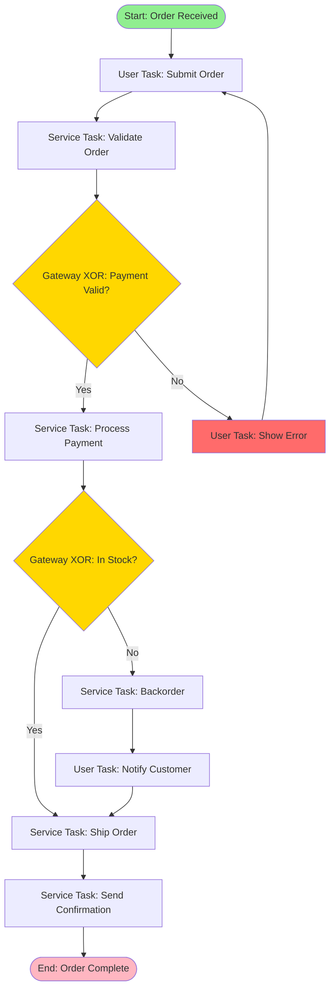
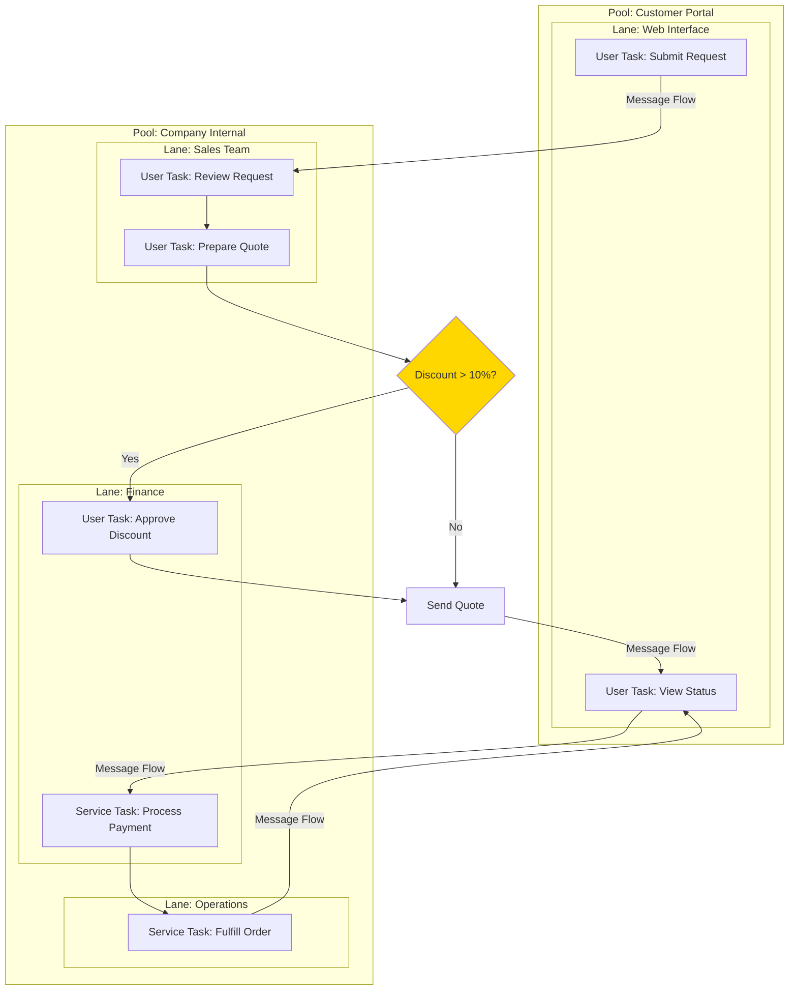
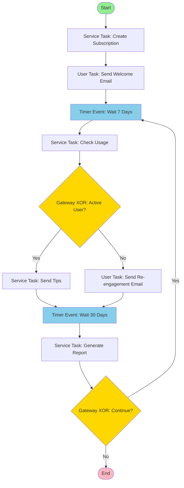
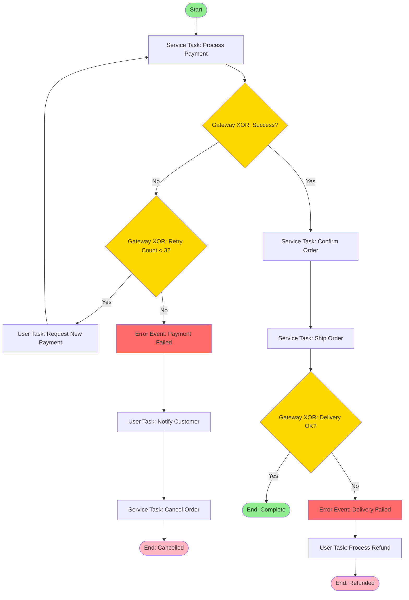
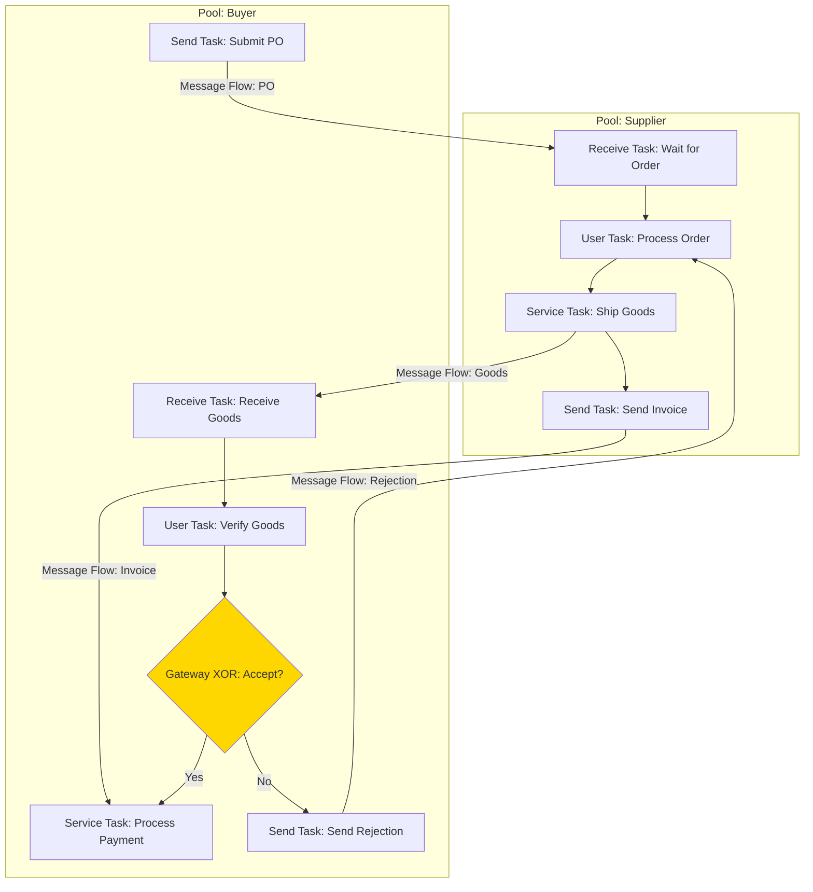
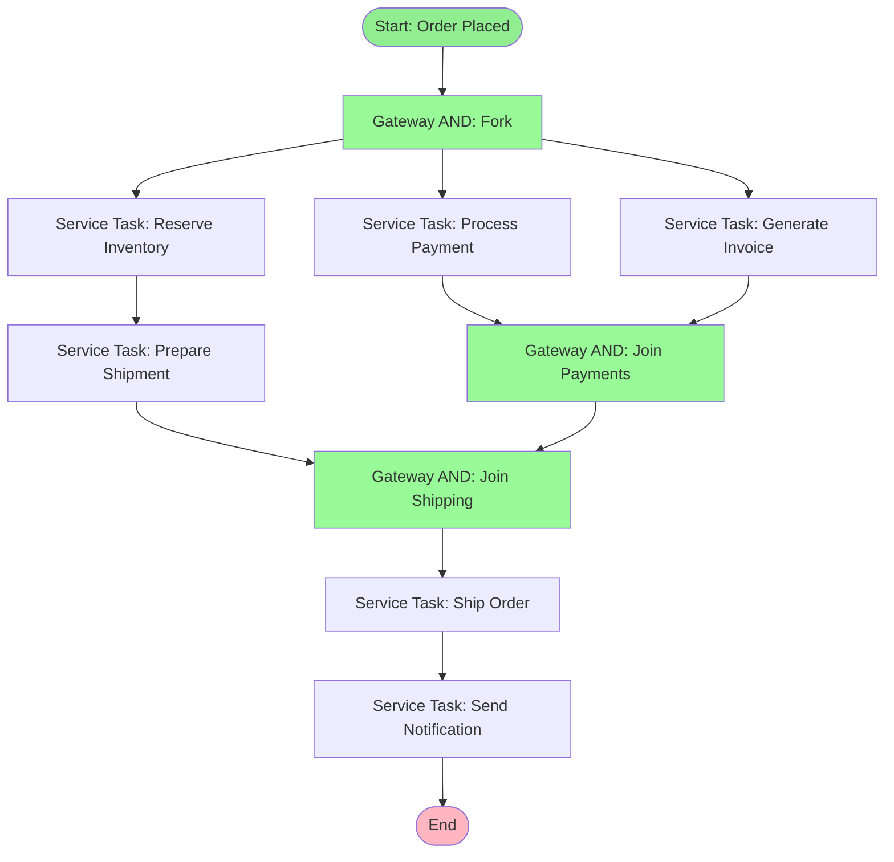

# BPMN Modeling

> **Meta:** v1.0.0 | 23-02-2026

## Purpose

Skill for modeling business processes in BPMN 2.0 notation (Business Process Model and Notation). Includes creating business process diagrams, defining execution flows, working with gateways, events, tasks, organizing participants through pools and lanes, as well as communication between processes via message flows. Designed for analysis, documentation, and optimization of organization's business logic.

## When to Use

Use this skill:
- When analyzing and documenting organization's business processes
- For visualizing workflows and procedures
- When identifying bottlenecks and optimizing processes
- For describing interaction between departments and systems
- When designing business process automation
- For preparing data for Project Manager (time estimates, process risks)
- During requirements analysis and system design phase

## Functions

### Process Mapping

Defining and documenting business process steps:

**Process Elements:**
- **Start Event** — process start point
- **End Event** — process completion point
- **Activities** — actions performed in the process
- **Gateways** — decision points
- **Sequence Flows** — execution sequence

**Detail Levels:**
- Level 1: Process Overview (SIPOC)
- Level 2: Main process stages
- Level 3: Detailed steps with performers
- Level 4: Instructions for each step

### Gateways

Gateways for controlling execution flows:

| Type | Symbol | Description | Application |
|-----|--------|----------|------------|
| **Exclusive (XOR)** | `X` | Only one path | Conditional branching |
| **Parallel (AND)** | `+` | All paths simultaneously | Parallel execution |
| **Inclusive (OR)** | `O` | One or more paths | Multiple conditions |
| **Event-based** | `◇` | Event determines path | Reacting to events |
| **Complex** | `*` | Complex conditions | Complex logic |

**Usage Rules:**
- XOR Gateway: used for if-then-else logic
- AND Gateway: used for parallel tasks without conditions
- OR Gateway: used when multiple conditions are true
- Merge must correspond to split type

### Events

Events in business process:

| Category | Event Types | Description |
|-----------|--------------|----------|
| **Start Events** | None, Timer, Message, Signal, Conditional | Initiate process start |
| **Intermediate Events** | Timer, Message, Signal, Error, Escalation, Link | Intermediate triggers |
| **End Events** | None, Message, Signal, Error, Escalation, Terminate | Process completion |
| **Boundary Events** | Timer, Error, Signal, Message, Escalation | Event handling on activity |

**Detailed Event Descriptions:**

```
Start Events:
- None: Standard process start
- Timer: Scheduled start (cron, delay)
- Message: Start on message receipt
- Signal: Start on signal from another process
- Conditional: Start on condition fulfillment

Intermediate Events:
- Timer: Delay or waiting
- Message: Send/receive message
- Signal: Broadcast signal
- Error: Error handling
- Escalation: Issue escalation

End Events:
- None: Normal completion
- Message: Send message on completion
- Error: Completion with error
- Terminate: Forced termination of entire process
```

### Tasks

Task types in business process:

| Type | Notation | Description | Example |
|-----|-------------|----------|--------|
| **User Task** | User icon | Performed by human | Request approval |
| **Service Task** | Gear icon | Performed by system | Payment processing |
| **Script Task** | Script icon | Executes script | Data validation |
| **Business Rule Task** | Table icon | Applies business rules | Discount calculation |
| **Manual Task** | Hand icon | Performed manually | Physical inspection |
| **Send Task** | Envelope icon | Sending message | Send notification |
| **Receive Task** | Envelope icon | Receiving message | Wait for response |
| **Call Activity** | Plus icon | Subprocess call | Start another process |

### Pools & Lanes

Organizing process participants:

**Pool:**
- Represents organization, department, or system
- Can contain one or multiple processes
- Message Flow links processes in different pools
- Sequence Flow cannot cross pool boundaries

**Lane:**
- Pool subdivision for grouping activities
- Represents role, position, or system
- Helps define responsibility
- Sequence Flow can cross lane boundaries

**Structure:**
```
┌─────────────────────────────────────────────────┐
│                    Pool: Company A               │
│  ┌──────────────┬──────────────┬──────────────┐ │
│  │ Lane: Sales  │ Lane: Finance│ Lane: Warehouse│
│  │              │              │              │ │
│  │  [Task 1]    │   [Task 2]   │   [Task 3]   │ │
│  │      │       │       │      │       │      │ │
│  │      └───────┼───────┘      │       │      │ │
│  └──────────────┴──────────────┴──────────────┘ │
└─────────────────────────────────────────────────┘
```

### Message Flows

Communication between pools:

**Characteristics:**
- Links processes in different pools
- Represents message exchange between participants
- Cannot be used within a single pool
- Can start/end at:
  - Pools
  - Activities (Send/Receive Tasks)
  - Events (Message Events)

**Communication Patterns:**
- **Request-Response:** Request and wait for response
- **Fire-and-Forget:** Send without waiting for response
- **Broadcast:** Send message to multiple recipients
- **Correlation:** Link messages by correlation key

## Integration with Project Manager

### Data for Project Manager

Provides the following data for PM:

**Process Metrics:**
- Number of steps in process
- Number of gateways and their types
- Number of participants (pools, lanes)
- Number of external interactions (message flows)

**Execution Time Estimation:**

| Process Element | Base Time | Complexity Factor |
|------------------|---------------|----------------------|
| User Task | 15-60 min | × task complexity |
| Service Task | 1-5 min | × data volume |
| Gateway XOR | 1-2 min | × number of branches |
| Gateway AND | 0 min | parallel execution |
| Message Flow | 5-30 min | × response time |

**Bottleneck Identification:**
- Tasks with longest duration
- Gateways with unbalanced branches
- Waiting for external messages (Message Flows)
- Manual tasks (Manual Tasks)

**Process Risks:**
- Processes with multiple gateways (high complexity)
- Dependencies on external systems (Message Flows)
- Processes without error handling (Error Events)
- Long chains of sequential tasks

### Interaction

- PM requests process models for optimization
- PM receives data for automation effort estimation
- PM uses process metrics for improvement planning
- SA validates process changes with PM and stakeholders

## Usage Examples

### Example 1: Order Processing Process (Basic)


```mermaid
flowchart TD
    Start([Start: Order Received]) --> A[User Task: Submit Order]
    A --> B[Service Task: Validate Order]
    B --> C{Gateway XOR: Payment Valid?}
    C -->|Yes| D[Service Task: Process Payment]
    C -->|No| E[User Task: Show Error]
    E --> A
    D --> F{Gateway XOR: In Stock?}
    F -->|Yes| G[Service Task: Ship Order]
    F -->|No| H[Service Task: Backorder]
    H --> I[User Task: Notify Customer]
    I --> G
    G --> J[Service Task: Send Confirmation]
    J --> End([End: Order Complete])
    
    style Start fill:#90EE90
    style End fill:#FFB6C1
    style C fill:#FFD700
    style F fill:#FFD700
    style E fill:#FF6B6B
```

**Process Description:**
| ID | Element | Type | Performer | Time |
|----|---------|-----|-------------|-------|
| 1 | Start | Start Event | - | - |
| 2 | Submit Order | User Task | Customer | 5 min |
| 3 | Validate Order | Service Task | System | 2 min |
| 4 | Payment Valid? | Gateway XOR | System | 1 min |
| 5 | Process Payment | Service Task | Payment Gateway | 3 min |
| 6 | In Stock? | Gateway XOR | Inventory System | 1 min |
| 7 | Ship Order | Service Task | Warehouse | 30 min |
| 8 | Backorder | Service Task | Warehouse | 10 min |
| 9 | Notify Customer | User Task | System | 2 min |
| 10 | Send Confirmation | Service Task | System | 1 min |
| 11 | End | End Event | - | - |

### Example 2: Process with Pool and Lanes


```mermaid
flowchart TD
    subgraph Pool_Customer["Pool: Customer Portal"]
        subgraph Lane_Web["Lane: Web Interface"]
            A1[User Task: Submit Request]
            A2[User Task: View Status]
        end
    end
    
    subgraph Pool_Company["Pool: Company Internal"]
        subgraph Lane_Sales["Lane: Sales Team"]
            B1[User Task: Review Request]
            B2[User Task: Prepare Quote]
        end
        subgraph Lane_Finance["Lane: Finance"]
            B3[User Task: Approve Discount]
            B4[Service Task: Process Payment]
        end
        subgraph Lane_Ops["Lane: Operations"]
            B5[Service Task: Fulfill Order]
        end
    end
    
    A1 -->|Message Flow| B1
    B1 --> B2
    B2 --> C{Discount > 10%?}
    C -->|Yes| B3
    C -->|No| D[Send Quote]
    B3 --> D
    D -->|Message Flow| A2
    A2 -->|Message Flow| B4
    B4 --> B5
    B5 -->|Message Flow| A2
    
    style C fill:#FFD700
```

**RACI Matrix:**

| Stage | Customer | Sales | Finance | Operations |
|------|----------|-------|---------|------------|
| Submit Request | R | I | - | - |
| Review Request | I | R | C | - |
| Approve Discount | I | C | R | - |
| Process Payment | I | I | R | I |
| Fulfill Order | I | I | C | R |

### Example 3: Process with Timer Events


```mermaid
flowchart TD
    Start([Start]) --> A[Service Task: Create Subscription]
    A --> B[User Task: Send Welcome Email]
    B --> C[Timer Event: Wait 7 Days]
    C --> D[Service Task: Check Usage]
    D --> E{Gateway XOR: Active User?}
    E -->|Yes| F[Service Task: Send Tips]
    E -->|No| G[User Task: Send Re-engagement Email]
    F --> H[Timer Event: Wait 30 Days]
    G --> H
    H --> I[Service Task: Generate Report]
    I --> J{Gateway XOR: Continue?}
    J -->|Yes| C
    J -->|No| End([End])
    
    style Start fill:#90EE90
    style End fill:#FFB6C1
    style C fill:#87CEEB
    style H fill:#87CEEB
    style E fill:#FFD700
    style J fill:#FFD700
```

**Timer Events Description:**

| Timer | Type | Condition | Action |
|-------|-----|---------|----------|
| Timer 1 | Duration | 7 days after signup | Check user engagement |
| Timer 2 | Duration | 30 days after first check | Generate monthly report |
| Timer 3 | Cycle | Every 30 days | Repeat process |

### Example 4: Process with Error Handling


```mermaid
flowchart TD
    Start([Start]) --> A[Service Task: Process Payment]
    A --> B{Gateway XOR: Success?}
    B -->|Yes| C[Service Task: Confirm Order]
    B -->|No| D{Gateway XOR: Retry Count < 3?}
    D -->|Yes| E[User Task: Request New Payment]
    E --> A
    D -->|No| F[Error Event: Payment Failed]
    F --> G[User Task: Notify Customer]
    G --> H[Service Task: Cancel Order]
    H --> End1([End: Cancelled])
    C --> I[Service Task: Ship Order]
    I --> J{Gateway XOR: Delivery OK?}
    J -->|Yes| End2([End: Complete])
    J -->|No| K[Error Event: Delivery Failed]
    K --> L[User Task: Process Refund]
    L --> End3([End: Refunded])
    
    style Start fill:#90EE90
    style End1 fill:#FFB6C1
    style End2 fill:#90EE90
    style End3 fill:#FFB6C1
    style F fill:#FF6B6B
    style K fill:#FF6B6B
    style B fill:#FFD700
    style D fill:#FFD700
    style J fill:#FFD700
```

**Error Handling:**

| Error Event | Trigger | Action | Responsible |
|-------------|---------|----------|---------------|
| Payment Failed | 3 failed attempts | Cancel order, notify customer | System |
| Delivery Failed | Carrier error | Process refund | Operations |
| Timeout | No response in 24h | Escalate to manager | System |

### Example 5: Process with Message Flow between Pools


```mermaid
flowchart TD
    subgraph Pool_Supplier["Pool: Supplier"]
        S1[Receive Task: Wait for Order]
        S2[User Task: Process Order]
        S3[Service Task: Ship Goods]
        S4[Send Task: Send Invoice]
    end
    
    subgraph Pool_Buyer["Pool: Buyer"]
        B1[Send Task: Submit PO]
        B2[Receive Task: Receive Goods]
        B3[User Task: Verify Goods]
        B4{Gateway XOR: Accept?}
        B5[Service Task: Process Payment]
        B6[Send Task: Send Rejection]
    end
    
    B1 -->|Message Flow: PO| S1
    S1 --> S2
    S2 --> S3
    S3 -->|Message Flow: Goods| B2
    S3 --> S4
    S4 -->|Message Flow: Invoice| B5
    B2 --> B3
    B3 --> B4
    B4 -->|Yes| B5
    B4 -->|No| B6
    B6 -->|Message Flow: Rejection| S2
    
    style B4 fill:#FFD700
```

**Message Flows Specification:**

| Message | From | To | Data Payload | Trigger |
|---------|------|-----|--------------|---------|
| Purchase Order | Buyer | Supplier | Order items, quantities, delivery date | Submit PO |
| Goods Shipment | Supplier | Buyer | Items, tracking number, ETA | Ship Goods |
| Invoice | Supplier | Buyer | Amount, due date, payment terms | Send Invoice |
| Rejection Notice | Buyer | Supplier | Rejection reason, return instructions | Send Rejection |

### Example 6: Parallel Process with AND Gateway


```mermaid
flowchart TD
    Start([Start: Order Placed]) --> A[Gateway AND: Fork]
    A --> B[Service Task: Process Payment]
    A --> C[Service Task: Reserve Inventory]
    A --> D[Service Task: Generate Invoice]
    
    B --> E[Gateway AND: Join Payments]
    C --> F[Service Task: Prepare Shipment]
    D --> E
    
    F --> G[Gateway AND: Join Shipping]
    E --> G
    
    G --> H[Service Task: Ship Order]
    H --> I[Service Task: Send Notification]
    I --> End([End])
    
    style Start fill:#90EE90
    style End fill:#FFB6C1
    style A fill:#98FB98
    style E fill:#98FB98
    style G fill:#98FB98
```

## Document Templates

### Process Description Template

```markdown
# Process: {Process name}

**Process ID:** PROC-XXX
**Version:** X.X
**Owner:** {Process owner}
**Last Updated:** DD-MM-YYYY

## Process Purpose
{Purpose description}

## Triggers
- {Trigger 1}
- {Trigger 2}

## Participants (Pools & Lanes)
| Pool | Lane | Role |
|------|------|------|
| Pool A | Lane 1 | Role description |

## Input Data
| Data | Source | Format |
|--------|----------|--------|
| Data 1 | System A | JSON |

## Output Data
| Data | Recipient | Format |
|--------|------------|--------|
| Data 1 | System B | XML |

## Process KPI
- Average execution time: X hours
- Number of steps: X
- Automation level: X%

## Process Diagram
{Mermaid diagram}
```

### Process Analysis Table Template

| ID | Element | Type | Performer | Time | Risks | Improvements |
|----|---------|-----|-------------|-------|-------|-----------|
| 1 | Task 1 | User Task | Role A | 15 min | Human error | Automation |
| 2 | Task 2 | Service Task | System | 2 min | API failure | Retry logic |
| 3 | Gateway | XOR | System | 1 min | - | - |

## Best Practices

### Level of Detail

- **Strategic Level:** Process overview for management
- **Operational Level:** Details for performers
- **Technical Level:** Details for automation

### Element Naming

- **Processes:** Verb + noun (Process Order)
- **Tasks:** Verb + object (Validate Payment)
- **Events:** Noun + state (Order Received)
- **Gateways:** Question (Payment Valid?)

### Common Mistakes

1. **Too complex diagrams** — break into subprocesses
2. **No error handling** — add Error Events
3. **Mixing levels** — use Call Activity for subprocesses
4. **Unclear performers** — always specify Lanes
5. **No start and end** — each process must have Start and End Events

### Process Optimization

**Problem Identification:**
- Action duplication
- Unnecessary approvals
- Manual tasks that can be automated
- Bottlenecks

**Optimization Methods:**
- Task parallelization (AND Gateway)
- Routine operations automation (Service Tasks)
- Eliminating unnecessary approvals
- Implementing self-service (User Tasks → Self-service)

## Related Skills

- requirements-analysis — requirements gathering and analysis
- use-case-modeling — system use cases
- srs-specification — software requirements specification
- api-design — API design based on processes

---
