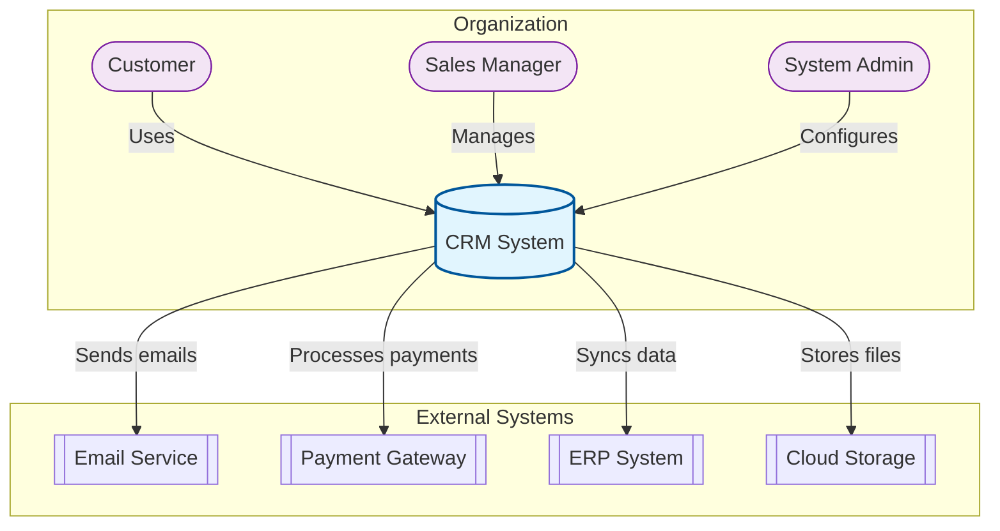
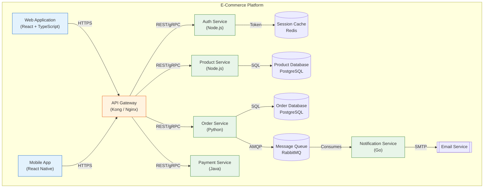
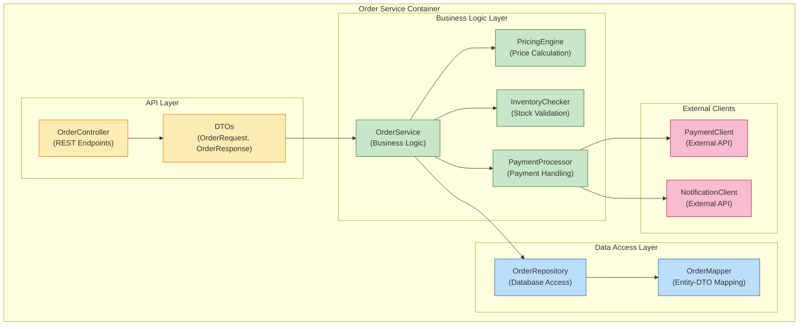
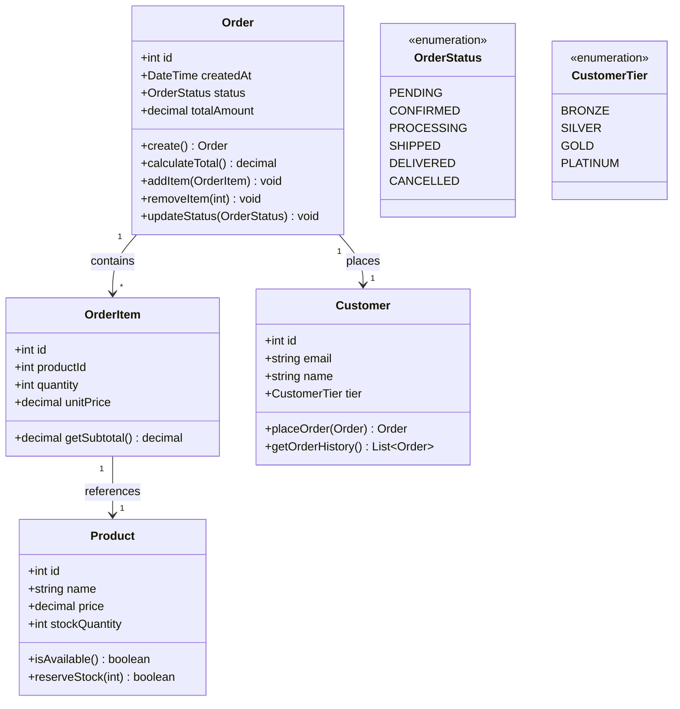
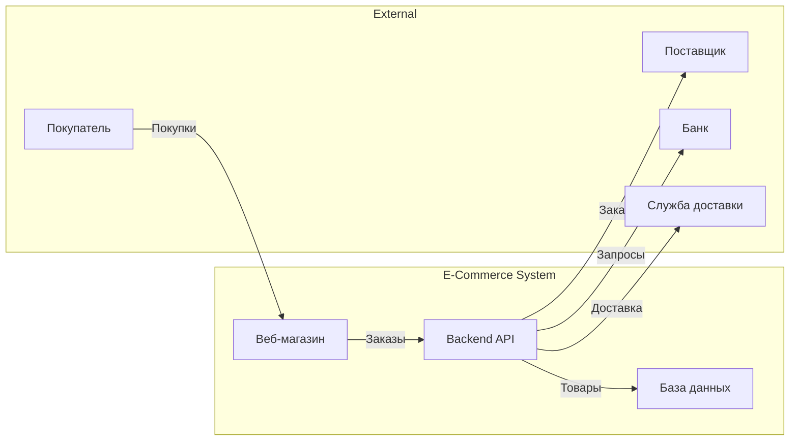
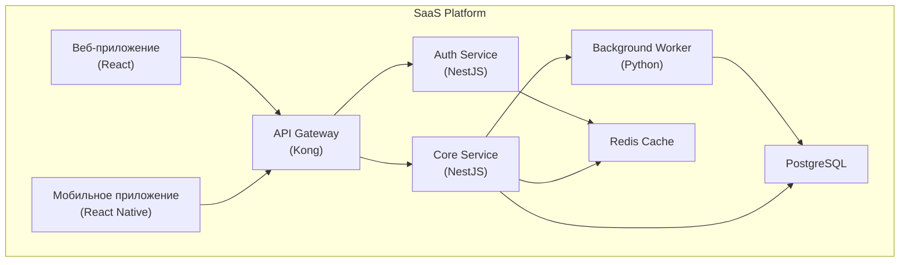
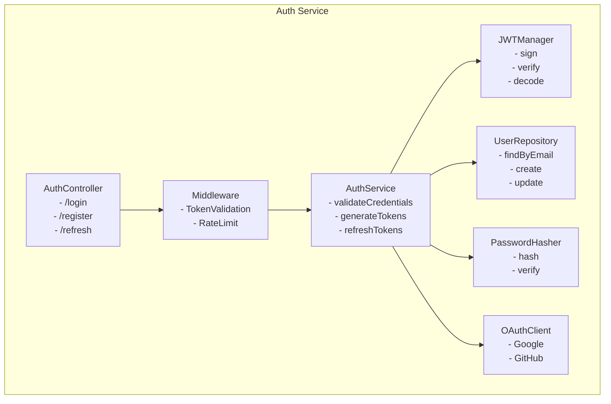

# C4 Architecture

> **Meta:** v1.0.0 | 23-02-2026

## Назначение

Навык для моделирования архитектуры программной системы по модели C4 (Context, Containers, Components, Code). Модель C4 предоставляет иерархический подход к визуализации архитектуры программного обеспечения на четырёх уровнях детализации:

- **Level 1 (Context):** Самое высокоуровневое представление системы
- **Level 2 (Container):** Технологическая архитектура системы
- **Level 3 (Component):** Компоненты внутри контейнеров
- **Level 4 (Code):** Детали реализации (опционально)

Модель C4 была создана Simon Brown для упрощения коммуникации между техническими и нетехническими стейкхолдерами, обеспечивая единообразное понимание архитектуры системы.

## Когда использовать

Используйте этот навык:

- При проектировании новой системы
- Для документирования существующей архитектуры
- При онбординге новых членов команды
- Для коммуникации архитектуры с нетехническими стейкхолдерами
- На этапе архитектурного проектирования (Фаза 5 SDLC)
- При необходимости выбора технологического стека
- Для анализа существующей системы перед рефакторингом
- При подготовке технических спецификаций для Project Manager

## Функции

### Level 1: Context Diagram (Диаграмма контекста)

Диаграмма контекста показывает систему в самом широком масштабе — как она вписывается в окружающий мир. Это самая высокоуровневая диаграмма, которая показывает:

**Элементы диаграммы:**

| Элемент | Описание | Обозначение в Mermaid |
|---------|----------|---------------------|
| Система (System) | Разрабатываемая система | `[Система]` |
| Пользователи (Users) | Люди, взаимодействующие с системой | `([Пользователь])` |
| Внешние системы | Системы, с которыми взаимодействует система | `[[Внешняя система]]` |
| Потоки данных | Отношения между элементами | Стрелки `-->`, `<--` |

**Пример Context Diagram для CRM системы:**

**Рекомендации по Context Diagram:**

1. Включайте только внешние системы, непосредственно связанные с вашей системой
2. Используйте понятные названия для пользователей (роли)
3. Показывайте только основные потоки данных
4. Избегайте технических деталей на этом уровне

---

### Level 2: Container Diagram (Диаграмма контейнеров)

Диаграмма контейнеров показывает технологическую архитектуру системы — из чего она состоит. Контейнер — это автономный выполняемый компонент, который:

- Запускается как отдельный процесс
- Содержит свою бизнес-логику
- Может быть развёрнут независимо

**Типы контейнеров:**

| Тип | Описание | Примеры |
|-----|----------|---------|
| Server-side приложение | Веб-приложение, API | React SPA, Angular, Vue.js |
| Серверное приложение | Backend сервис | Node.js, Python, Java, Go |
| Мобильное приложение | iOS/Android приложение | Swift, Kotlin, React Native |
| Desktop приложение | Десктопное приложение | Electron, WPF |
| База данных | Хранилище данных | PostgreSQL, MongoDB, Redis |
| Message Broker | Асинхронная коммуникация | RabbitMQ, Kafka |
| Файловая система | Хранение файлов | S3, NFS |
| Кэш | Временное хранилище | Redis, Memcached |

**Пример Container Diagram для E-commerce платформы:**

**Рекомендации по Container Diagram:**

1. Выбирайте технологии для каждого контейнера
2. Показывайте протоколы взаимодействия (REST, gRPC, AMQP)
3. Указывайте направление потоков данных
4. Обозначайте асинхронные взаимодействия
5. Показывайте внешние системы как прямоугольники пунктиром

---

### Level 3: Component Diagram (Диаграмма компонентов)

Диаграмма компонентов показывает, из чего состоит каждый контейнер. Компонент — это сгруппированный набор связанных обязанностей внутри контейнера.

**Типичные компоненты:**

| Компонент | Описание | Примеры |
|-----------|----------|---------|
| Controller | Обработка входящих запросов | REST Controller, GraphQL Resolver |
| Service | Бизнес-логика | OrderService, PaymentProcessor |
| Repository | Доступ к данным | UserRepository, ProductDAO |
| Model/DTO | Модели данных | User, Order, Product |
| Validator | Валидация входных данных | InputValidator |
| Transformer | Преобразование данных | DataMapper |
| Client | Взаимодействие с внешними системами | PaymentClient, EmailClient |

**Пример Component Diagram для API сервиса:**

**Рекомендации по Component Diagram:**

1. Включайте только компоненты внутри выбранного контейнера
2. Показывайте зависимости между компонентами
3. Обозначайте направление зависимостей (стрелки указывают на то, от чего зависит компонент)
4. Группируйте компоненты по слоям (API, Business, Data)

---

### Level 4: Code Diagram (Диаграмма кода)

Диаграмма кода показывает детали реализации — классы, интерфейсы, отношения между ними. Это опциональный уровень, который используется для:

- Сложных доменных моделей
- Объяснения архитектурных паттернов
- Документирования публичных API
- Онбординга разработчиков

**Когда использовать:**

| Ситуация | Рекомендация |
|----------|--------------|
| Новые члены команды | Создавайте для ключевых модулей |
| Сложные доменные модели | Всегда создавайте |
| Паттерны (Strategy, Factory) | Документируйте |
| Публичные API библиотек | Создавайте |
| Простые CRUD сервисы | Пропускайте |

**Пример Class Diagram:**

## Интеграция с Project Manager

### Данные для Project Manager

Навык предоставляет следующие данные для планирования:

**Количественные метрики:**

| Метрика | Описание |
|---------|----------|
| Количество контейнеров | Общее число контейнеров в системе |
| Количество компонентов | Число компонентов (суммарно) |
| Количество сервисов | Число микросервисов/сервисов |
| Внешние интеграции | Число внешних систем |
| Технологический стек | Список технологий |

**Оценка сложности архитектуры:**

| Сложность | Контейнеры | Компоненты | Оценка времени |
|-----------|------------|------------|----------------|
| Простая | 1-3 | 5-10 | 8-16 часов |
| Средняя | 4-8 | 10-25 | 16-40 часов |
| Сложная | 9-15 | 25-50 | 40-80 часов |
| Очень сложная | 15+ | 50+ | 80-160 часов |

**Архитектурные решения:**

| Решение | Влияние |
|---------|---------|
| Monolith vs Microservices | Выбор влияет на команду и DevOps |
| Синхронные vs Асинхронные | Влияет на производительность |
| Базы данных (SQL/NoSQL) | Влияет на данные и миграции |
| Кэширование | Влияет на производительность |
| API Gateway | Влияет на безопасность и мониторинг |

**Риски архитектуры:**

| Риск | Вероятность | Влияние | Митигация |
|------|-------------|---------|-----------|
| Сложность микросервисов | Высокая | Высокое | Начните с модульного монолита |
| Зависимости между сервисами | Средняя | Высокое | Используйте контракты |
| Производительность сети | Средняя | Среднее | Оптимизация запросов |
| Управление данными | Высокая | Высокое | Стратегия миграции |
| Безопасность | Высокая | Критично | Security by design |

### Взаимодействие

- PM запрашивает архитектурные решения для бюджетирования
- SA предоставляет C4 диаграммы для визуализации
- PM использует метрики для оценки команды
- SA консультирует по выбору технологий

## Инструменты для C4

### Рекомендуемые инструменты

| Инструмент | Тип | Плюсы | Минусы |
|-----------|-----|-------|--------|
| **Mermaid** | Онлайн/VSCode | Встроенная поддержка, простота | Ограниченные возможности |
| **Structurizr** | SaaS/Desktop | Полная поддержка C4, экспорт | Платный для команд |
| **PlantUML** | Онлайн/IDE | Мощный, много форматов | Сложный синтаксис |
| **draw.io** | Онлайн/Desktop | Визуальный редактор | Ручная работа |
| **C4-PlantUML** | Библиотека | Специализированные диаграммы | Требует PlantUML |

### Mermaid в VSCode

Для работы с Mermaid диаграммами в VSCode:

1. Установите расширение **Mermaid Preview**
2. Создайте файл с расширением `.mmd` или используйте кодовые блоки
3. Используйте команду **Mermaid: Export** для экспорта

## Примеры использования

### Пример 1: Context Diagram для Интернет-магазина

### Пример 2: Container Diagram для SaaS приложения

### Пример 3: Component Diagram для Auth Service

## Best Practices

### Принципы C4 моделирования

1. **Начните с контекста:** Всегда создавайте Level 1 перед переходом к деталям
2. **Один уровень за раз:** Не смешивайте уровни на одной диаграмме
3. **Показывайте отношения, не потоки:** На уровне контекста показывайте "кто с чем взаимодействует"
4.4. **Используйте легенду:** Объясняйте обозначения для нетехнических стейкхолдеров
5. **Обновляйте диаграммы:** Держите их в актуальном состоянии с кодом

### Выбор уровня детализации

| Аудитория | Рекомендуемый уровень |
|-----------|----------------------|
| Бизнес-стейкхолдеры | Level 1 (Context) |
| Команда разработки | Level 1-2 (Context, Container) |
| Архитекторы | Level 1-3 (Context, Container, Component) |
| Новые разработчики | Level 1-4 (все уровни) |
| Техническая документация | Level 1-3 |

### Чек-лист для диаграмм

- [ ] Название диаграммы описательное
- [ ] Все элементы помечены
- [ ] Технологии указаны для контейнеров
- [ ] Протоколы связи указаны
- [ ] Направление потоков понятно
- [ ] Легенда присутствует (при необходимости)

## Связанные навыки

- **uml-modeling** — для создания дополнительных UML диаграмм
- **api-design** — для проектирования API взаимодействий
- **data-modeling** — для проектирования схем данных
- **integration-patterns** — для проектирования интеграций
- **bpmn-modeling** — для моделирования бизнес-процессов

---

*Навык разработан в рамках Фазы 5 SDLC для System Analyst*
