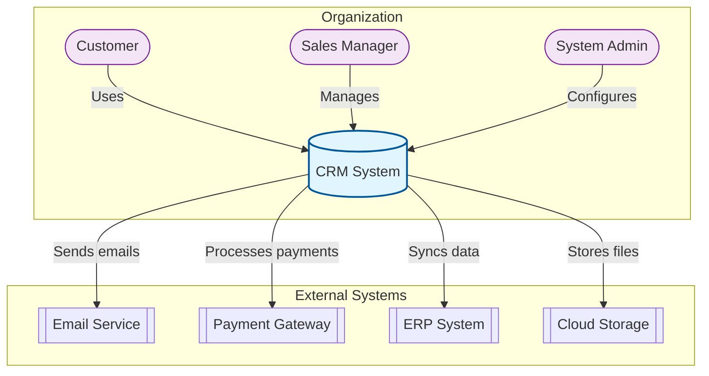
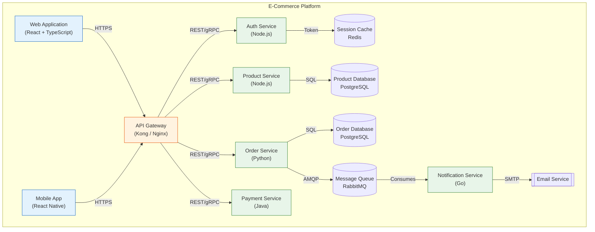
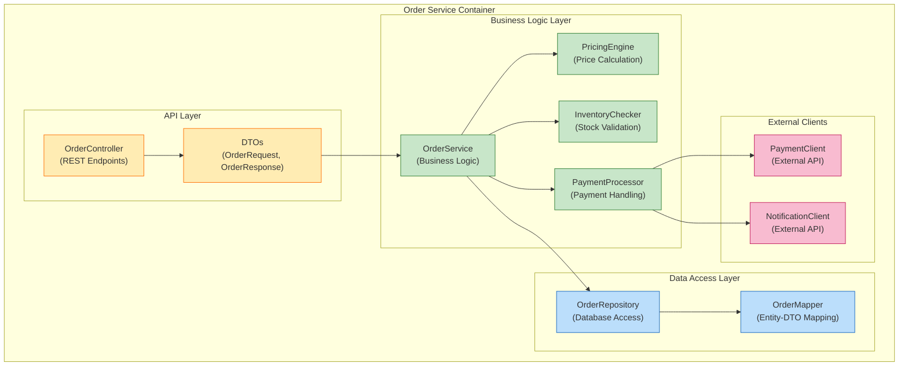
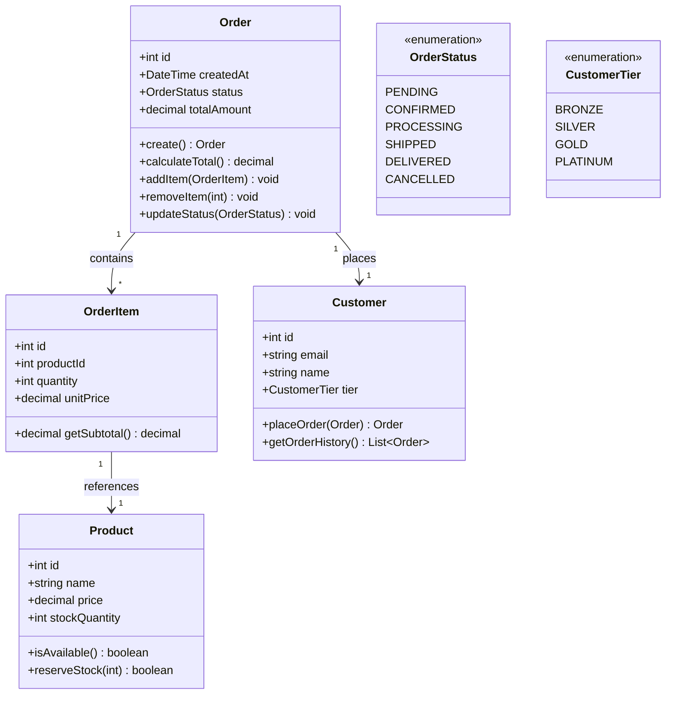
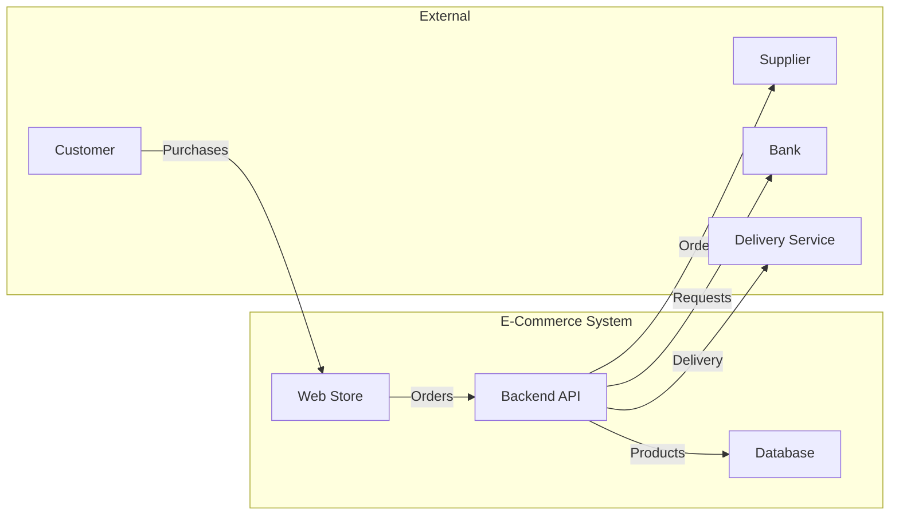
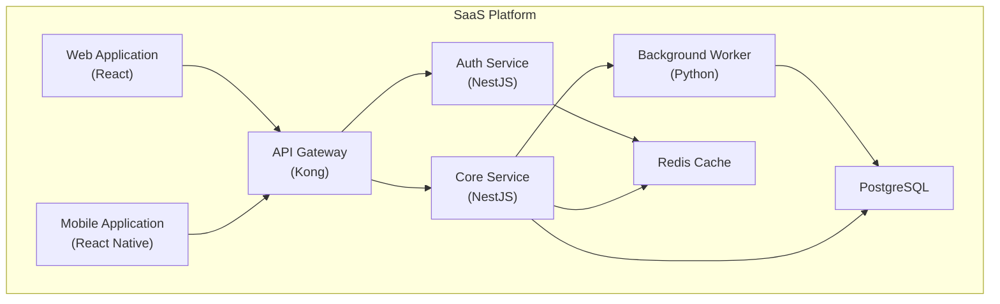
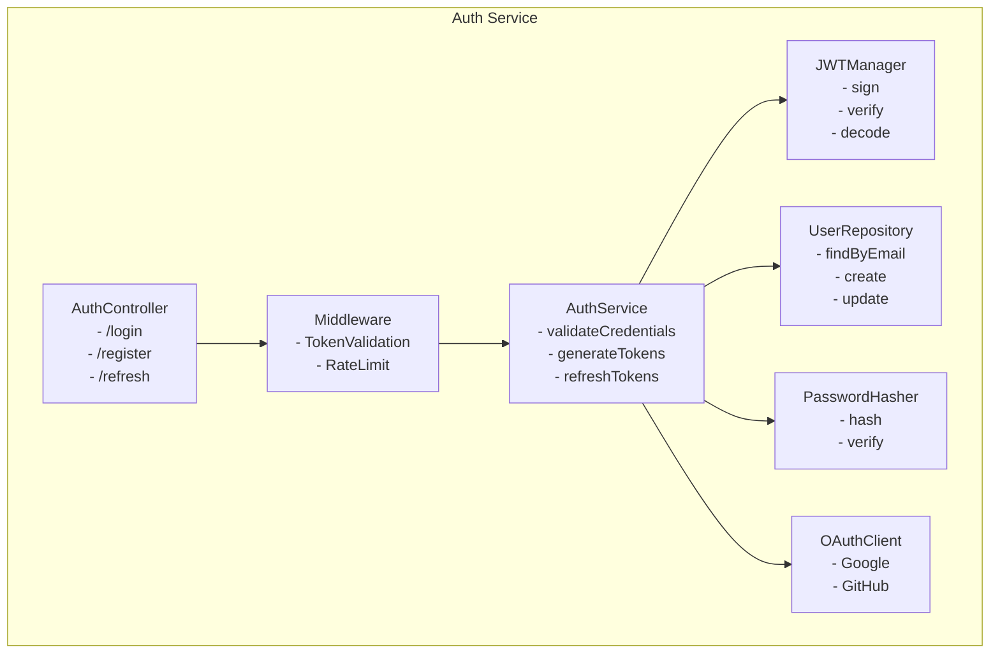

# C4 Architecture

> **Meta:** v1.0.0 | 23-02-2026

## Purpose

Skill for modeling software system architecture using the C4 model (Context, Containers, Components, Code). The C4 model provides a hierarchical approach to visualizing software architecture at four levels of detail:

- **Level 1 (Context):** The highest-level view of the system
- **Level 2 (Container):** The technological architecture of the system
- **Level 3 (Component):** Components within containers
- **Level 4 (Code):** Implementation details (optional)

The C4 model was created by Simon Brown to simplify communication between technical and non-technical stakeholders, providing a consistent understanding of system architecture.

## When to Use

Use this skill:

- When designing a new system
- For documenting existing architecture
- During onboarding of new team members
- For communicating architecture to non-technical stakeholders
- At the architecture design phase (Phase 5 SDLC)
- When selecting a technology stack
- For analyzing an existing system before refactoring
- When preparing technical specifications for Project Manager

## Functions

### Level 1: Context Diagram

The Context Diagram shows the system at its broadest scale — how it fits into the surrounding world. This is the highest-level diagram that shows:

**Diagram Elements:**

| Element | Description | Mermaid Notation |
|---------|-------------|-----------------|
| System | The system being developed | `[System]` |
| Users | People interacting with the system | `([User])` |
| External Systems | Systems that the system interacts with | `[[External System]]` |
| Data Flows | Relationships between elements | Arrows `-->`, `<--` |

**Example Context Diagram for CRM System:**

```mermaid
flowchart TB
    subgraph "Organization"
        Customer(["Customer"]) -->|Uses| CRM[("CRM System")]
        Manager(["Sales Manager"]) -->|Manages| CRM
        Admin(["System Admin"]) -->|Configures| CRM
    end
    
    subgraph "External Systems"
        CRM -->|Sends emails| Email[["Email Service"]]
        CRM -->|Processes payments| Payment[["Payment Gateway"]]
        CRM -->|Syncs data| ERP[["ERP System"]]
        CRM -->|Stores files| Storage[["Cloud Storage"]]
    end
    
    style CRM fill:#e1f5fe,stroke:#01579b,stroke-width:2px
    style Customer fill:#f3e5f5,stroke:#7b1fa2
    style Manager fill:#f3e5f5,stroke:#7b1fa2
    style Admin fill:#f3e5f5,stroke:#7b1fa2
```

**Context Diagram Recommendations:**

1. Include only external systems directly connected to your system
2. Use clear names for users (roles)
3. Show only main data flows
4. Avoid technical details at this level

---

### Level 2: Container Diagram

The Container Diagram shows the technological architecture of the system — what it consists of. A container is a standalone executable component that:

- Runs as a separate process
- Contains its own business logic
- Can be deployed independently

**Container Types:**

| Type | Description | Examples |
|------|-------------|----------|
| Server-side application | Web application, API | React SPA, Angular, Vue.js |
| Server application | Backend service | Node.js, Python, Java, Go |
| Mobile application | iOS/Android application | Swift, Kotlin, React Native |
| Desktop application | Desktop application | Electron, WPF |
| Database | Data storage | PostgreSQL, MongoDB, Redis |
| Message Broker | Asynchronous communication | RabbitMQ, Kafka |
| File System | File storage | S3, NFS |
| Cache | Temporary storage | Redis, Memcached |

**Example Container Diagram for E-commerce Platform:**

```mermaid
flowchart TB
    subgraph "E-Commerce Platform"
        WebApp["Web Application\n(React + TypeScript)"]
        MobileApp["Mobile App\n(React Native)"]
        APIGateway["API Gateway\n(Kong / Nginx)"]
        AuthService["Auth Service\n(Node.js)"]
        ProductService["Product Service\n(Node.js)"]
        OrderService["Order Service\n(Python)"]
        PaymentService["Payment Service\n(Java)"]
        NotificationService["Notification Service\n(Go)"]
        
        WebApp -->|HTTPS| APIGateway
        MobileApp -->|HTTPS| APIGateway
        APIGateway -->|REST/gRPC| AuthService
        APIGateway -->|REST/gRPC| ProductService
        APIGateway -->|REST/gRPC| OrderService
        APIGateway -->|REST/gRPC| PaymentService
        
        ProductService -->|SQL| PostgreSQL[("Product Database\nPostgreSQL")]
        OrderService -->|SQL| PostgreSQL2[("Order Database\nPostgreSQL")]
        AuthService -->|Token| Redis[("Session Cache\nRedis")]
        
        OrderService -->|AMQP| RabbitMQ[("Message Queue\nRabbitMQ")]
        RabbitMQ -->|Consumes| NotificationService
        NotificationService -->|SMTP| EmailService[["Email Service"]]
    end
    
    style WebApp fill:#e3f2fd,stroke:#1565c0
    style MobileApp fill:#e3f2fd,stroke:#1565c0
    style APIGateway fill:#fff3e0,stroke:#e65100
    style AuthService fill:#e8f5e9,stroke:#2e7d32
    style ProductService fill:#e8f5e9,stroke:#2e7d32
    style OrderService fill:#e8f5e9,stroke:#2e7d32
    style PaymentService fill:#e8f5e9,stroke:#2e7d32
    style NotificationService fill:#e8f5e9,stroke:#2e7d32
```

**Container Diagram Recommendations:**

1. Choose technologies for each container
2. Show communication protocols (REST, gRPC, AMQP)
3. Indicate data flow direction
4. Mark asynchronous interactions
5. Show external systems as dashed rectangles

---

### Level 3: Component Diagram

The Component Diagram shows what each container consists of. A component is a grouped set of related responsibilities within a container.

**Typical Components:**

| Component | Description | Examples |
|-----------|-------------|----------|
| Controller | Handling incoming requests | REST Controller, GraphQL Resolver |
| Service | Business logic | OrderService, PaymentProcessor |
| Repository | Data access | UserRepository, ProductDAO |
| Model/DTO | Data models | User, Order, Product |
| Validator | Input validation | InputValidator |
| Transformer | Data transformation | DataMapper |
| Client | External system interaction | PaymentClient, EmailClient |

**Example Component Diagram for API Service:**

```mermaid
flowchart TB
    subgraph "Order Service Container"
        subgraph "API Layer"
            OrderController["OrderController\n(REST Endpoints)"]
            DTO["DTOs\n(OrderRequest, OrderResponse)"]
        end
        
        subgraph "Business Logic Layer"
            OrderService["OrderService\n(Business Logic)"]
            PricingEngine["PricingEngine\n(Price Calculation)"]
            InventoryChecker["InventoryChecker\n(Stock Validation)"]
            PaymentProcessor["PaymentProcessor\n(Payment Handling)"]
        end
        
        subgraph "Data Access Layer"
            OrderRepository["OrderRepository\n(Database Access)"]
            OrderMapper["OrderMapper\n(Entity-DTO Mapping)"]
        end
        
        subgraph "External Clients"
            PaymentClient["PaymentClient\n(External API)"]
            NotificationClient["NotificationClient\n(External API)"]
        end
        
        OrderController --> DTO
        DTO --> OrderService
        OrderService --> PricingEngine
        OrderService --> InventoryChecker
        OrderService --> PaymentProcessor
        OrderService --> OrderRepository
        OrderRepository --> OrderMapper
        PaymentProcessor --> PaymentClient
        PaymentProcessor --> NotificationClient
    end
    
    style OrderController fill:#ffecb3,stroke:#ff6f00
    style DTO fill:#ffecb3,stroke:#ff6f00
    style OrderService fill:#c8e6c9,stroke:#2e7d32
    style PricingEngine fill:#c8e6c9,stroke:#2e7d32
    style InventoryChecker fill:#c8e6c9,stroke:#2e7d32
    style PaymentProcessor fill:#c8e6c9,stroke:#2e7d32
    style OrderRepository fill:#bbdefb,stroke:#1565c0
    style OrderMapper fill:#bbdefb,stroke:#1565c0
    style PaymentClient fill:#f8bbd0,stroke:#c2185b
    style NotificationClient fill:#f8bbd0,stroke:#c2185b
```

**Component Diagram Recommendations:**

1. Include only components within the selected container
2. Show dependencies between components
3. Indicate dependency direction (arrows point to what the component depends on)
4. Group components by layers (API, Business, Data)

---

### Level 4: Code Diagram

The Code Diagram shows implementation details — classes, interfaces, and their relationships. This is an optional level used for:

- Complex domain models
- Explaining architectural patterns
- Documenting public APIs
- Developer onboarding

**When to Use:**

| Situation | Recommendation |
|-----------|----------------|
| New team members | Create for key modules |
| Complex domain models | Always create |
| Patterns (Strategy, Factory) | Document |
| Public API libraries | Create |
| Simple CRUD services | Skip |

**Example Class Diagram:**

```mermaid
classDiagram
    class Order {
        +int id
        +DateTime createdAt
        +OrderStatus status
        +decimal totalAmount
        +create() Order
        +calculateTotal() decimal
        +addItem(OrderItem) void
        +removeItem(int) void
        +updateStatus(OrderStatus) void
    }
    
    class OrderItem {
        +int id
        +int productId
        +int quantity
        +decimal unitPrice
        +decimal getSubtotal() decimal
    }
    
    class Product {
        +int id
        +string name
        +decimal price
        +int stockQuantity
        +isAvailable() boolean
        +reserveStock(int) boolean
    }
    
    class Customer {
        +int id
        +string email
        +string name
        +CustomerTier tier
        +placeOrder(Order) Order
        +getOrderHistory() List~Order~
    }
    
    Order "1" --> "*" OrderItem : contains
    Order "1" --> "1" Customer : places
    OrderItem "1" --> "1" Product : references
    
    class OrderStatus {
        <<enumeration>>
        PENDING
        CONFIRMED
        PROCESSING
        SHIPPED
        DELIVERED
        CANCELLED
    }
    
    class CustomerTier {
        <<enumeration>>
        BRONZE
        SILVER
        GOLD
        PLATINUM
    }
```

## Integration with Project Manager

### Data for Project Manager

The skill provides the following data for planning:

**Quantitative Metrics:**

| Metric | Description |
|--------|-------------|
| Number of containers | Total number of containers in the system |
| Number of components | Total number of components |
| Number of services | Number of microservices/services |
| External integrations | Number of external systems |
| Technology stack | List of technologies |

**Architecture Complexity Estimation:**

| Complexity | Containers | Components | Time Estimate |
|------------|-------------|------------|----------------|
| Simple | 1-3 | 5-10 | 8-16 hours |
| Medium | 4-8 | 10-25 | 16-40 hours |
| Complex | 9-15 | 25-50 | 40-80 hours |
| Very Complex | 15+ | 50+ | 80-160 hours |

**Architectural Decisions:**

| Decision | Impact |
|----------|--------|
| Monolith vs Microservices | Choice affects team and DevOps |
| Synchronous vs Asynchronous | Affects performance |
| Databases (SQL/NoSQL) | Affects data and migrations |
| Caching | Affects performance |
| API Gateway | Affects security and monitoring |

**Architecture Risks:**

| Risk | Probability | Impact | Mitigation |
|------|-------------|--------|------------|
| Microservices complexity | High | High | Start with modular monolith |
| Service dependencies | Medium | High | Use contracts |
| Network performance | Medium | Medium | Query optimization |
| Data management | High | High | Migration strategy |
| Security | High | Critical | Security by design |

### Interaction

- PM requests architectural decisions for budgeting
- SA provides C4 diagrams for visualization
- PM uses metrics for team estimation
- SA advises on technology choices

## C4 Tools

### Recommended Tools

| Tool | Type | Pros | Cons |
|------|------|------|------|
| **Mermaid** | Online/VSCode | Built-in support, simple | Limited capabilities |
| **Structurizr** | SaaS/Desktop | Full C4 support, export | Paid for teams |
| **PlantUML** | Online/IDE | Powerful, many formats | Complex syntax |
| **draw.io** | Online/Desktop | Visual editor | Manual work |
| **C4-PlantUML** | Library | Specialized diagrams | Requires PlantUML |

### Mermaid in VSCode

To work with Mermaid diagrams in VSCode:

1. Install the **Mermaid Preview** extension
2. Create a file with `.mmd` extension or use code blocks
3. Use the **Mermaid: Export** command for export

## Usage Examples

### Example 1: Context Diagram for Online Store

```mermaid
flowchart LR
    subgraph "External"
        Customer["Customer"]
        Supplier["Supplier"]
        PaymentBank["Bank"]
        Delivery["Delivery Service"]
    end
    
    subgraph "E-Commerce System"
        WebStore["Web Store"]
        Backend["Backend API"]
        Database["Database"]
    end
    
    Customer -->|Purchases| WebStore
    WebStore -->|Orders| Backend
    Backend -->|Products| Database
    Backend -->|Requests| PaymentBank
    Backend -->|Delivery| Delivery
    Backend -->|Orders| Supplier
```

### Example 2: Container Diagram for SaaS Application

```mermaid
flowchart TB
    subgraph "SaaS Platform"
        Browser["Web Application\n(React)"]
        Mobile["Mobile Application\n(React Native)"]
        API["API Gateway\n(Kong)"]
        Auth["Auth Service\n(NestJS)"]
        Core["Core Service\n(NestJS)"]
        Worker["Background Worker\n(Python)"]
        Cache["Redis Cache"]
        DB["PostgreSQL"]
        
        Browser --> API
        Mobile --> API
        API --> Auth
        API --> Core
        Core --> Worker
        Worker --> DB
        Auth --> Cache
        Core --> Cache
        Core --> DB
    end
```

### Example 3: Component Diagram for Auth Service

```mermaid
flowchart TB
    subgraph "Auth Service"
        Controller["AuthController\n- /login\n- /register\n- /refresh"]
        Middleware["Middleware\n- TokenValidation\n- RateLimit"]
        Service["AuthService\n- validateCredentials\n- generateTokens\n- refreshTokens"]
        JWT["JWTManager\n- sign\n- verify\n- decode"]
        UserRepo["UserRepository\n- findByEmail\n- create\n- update"]
        PasswordHasher["PasswordHasher\n- hash\n- verify"]
        OAuthClient["OAuthClient\n- Google\n- GitHub"]
        
        Controller --> Middleware
        Middleware --> Service
        Service --> JWT
        Service --> UserRepo
        Service --> PasswordHasher
        Service --> OAuthClient
    end
```

## Best Practices

### C4 Modeling Principles

1. **Start with context:** Always create Level 1 before moving to details
2. **One level at a time:** Don't mix levels on one diagram
3. **Show relationships, not flows:** At context level show "who interacts with what"
4. **Use legend:** Explain notations for non-technical stakeholders
5. **Update diagrams:** Keep them current with code

### Detail Level Selection

| Audience | Recommended Level |
|----------|-------------------|
| Business stakeholders | Level 1 (Context) |
| Development team | Level 1-2 (Context, Container) |
| Architects | Level 1-3 (Context, Container, Component) |
| New developers | Level 1-4 (all levels) |
| Technical documentation | Level 1-3 |

### Diagram Checklist

- [ ] Diagram title is descriptive
- [ ] All elements are labeled
- [ ] Technologies are specified for containers
- [ ] Communication protocols are indicated
- [ ] Data flow direction is clear
- [ ] Legend is present (if needed)

## Related Skills

- **uml-modeling** — for creating additional UML diagrams
- **api-design** — for designing API interactions
- **data-modeling** — for designing data schemas
- **integration-patterns** — for designing integrations
- **bpm-modeling** — for modeling business processes

---

*Skill developed as part of Phase 5 SDLC for System Analyst*
