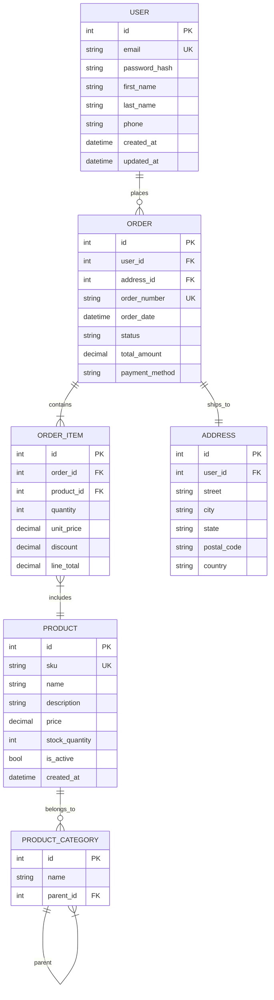

# Data Modeling

> **Meta:** v1.0.0 | 23-02-2026

## Назначение

Навык для проектирования моделей данных и создания Entity-Relationship Diagrams (ERD). Включает определение сущностей и атрибутов, установление связей между сущностями, нормализацию для устранения избыточности, денормализацию для оптимизации производительности, стратегию индексирования и определение ограничений целостности данных. Навык охватывает реляционные базы данных и предоставляет схемы данных для реализации в Universal Coding Agent.

## Когда использовать

Используйте этот навык:
- При проектировании структуры базы данных для новой системы
- Для создания ER-диаграмм с визуализацией сущностей и связей
- При нормализации существующих таблиц (1NF-3NF, BCNF)
- Для оптимизации производительности через денормализацию
- При определении стратегии индексирования
- Для настройки ограничений целостности (constraints)
- При подготовке схемы данных для разработчиков
- На этапе анализа требований к данным

## Функции

### ERD Design

Проектирование Entity-Relationship диаграмм для визуализации структуры данных:

**Сущности и атрибуты:**

| Компонент | Описание | Пример |
|-----------|----------|--------|
| Сущность (Entity) | Объект реального мира | USER, ORDER, PRODUCT |
| Атрибут | Характеристика сущности | name, email, price |
| Первичный ключ (PK) | Уникальный идентификатор | id |
| Внешний ключ (FK) | Ссылка на другую сущность | user_id |
| Уникальный ключ (UK) | Уникальное значение | email |

**Типы атрибутов:**

- **Простые** — атомарные, неделимые значения
- **Составные** — комбинация простых атрибутов (address = city + street + house)
- **Однозначные** — одно значение для сущности
- **Многозначные** — множество значений (теги товара)
- **Производные** — вычисляемые значения (age = current_date - birth_date)

**Типы связей:**

| Тип связи | Описание | Обозначение |
|-----------|----------|-------------|
| **One-to-One (1:1)** | Одна запись связана с одной записью | `||--||` |
| **One-to-Many (1:N)** | Одна запись связана со многими | `||--o{` |
| **Many-to-Many (M:N)** | Многие записи связаны со многими | `}o--o{` |

**Кардинальность:**

- **Mandatory (обязательная)** — связь должна существовать (`||`)
- **Optional (опциональная)** — связь может отсутствовать (`o`)

### Normalization

Нормализация данных для устранения избыточности и аномалий:

**1NF (Первая нормальная форма):**

Требования:
- Все атрибуты должны содержать атомарные (неделимые) значения
- Каждая колонка должна содержать значения одного типа
- Каждая запись должна быть уникальной

**Пример приведения к 1NF:**

```sql
-- До 1NF (неправильно)
CREATE TABLE orders_bad (
    id INT,
    customer_name VARCHAR(100),
    products VARCHAR(200)  -- содержит "Product1, Product2, Product3"
);

-- После 1NF (правильно)
CREATE TABLE orders (
    id INT PRIMARY KEY,
    customer_name VARCHAR(100)
);

CREATE TABLE order_products (
    id INT PRIMARY KEY,
    order_id INT REFERENCES orders(id),
    product_name VARCHAR(100)
);
```

**2NF (Вторая нормальная форма):**

Требования:
- Таблица должна быть в 1NF
- Все неключевые атрибуты должны полностью зависеть от первичного ключа
- Не должно быть частичных зависимостей

**Пример приведения к 2NF:**

```sql
-- До 2NF (частичная зависимость)
CREATE TABLE order_items_bad (
    order_id INT,
    product_id INT,
    product_name VARCHAR(100),  -- зависит только от product_id
    quantity INT,
    PRIMARY KEY (order_id, product_id)
);

-- После 2NF
CREATE TABLE orders (
    id INT PRIMARY KEY,
    customer_id INT,
    order_date DATE
);

CREATE TABLE products (
    id INT PRIMARY KEY,
    name VARCHAR(100),
    price DECIMAL
);

CREATE TABLE order_items (
    order_id INT REFERENCES orders(id),
    product_id INT REFERENCES products(id),
    quantity INT,
    PRIMARY KEY (order_id, product_id)
);
```

**3NF (Третья нормальная форма):**

Требования:
- Таблица должна быть в 2NF
- Не должно быть транзитивных зависимостей (неключевой атрибут зависит от другого неключевого атрибута)

**Пример приведения к 3NF:**

```sql
-- До 3NF (транзитивная зависимость)
CREATE TABLE employees_bad (
    id INT PRIMARY KEY,
    name VARCHAR(100),
    department_id INT,
    department_name VARCHAR(100)  -- транзитивно зависит от department_id
);

-- После 3NF
CREATE TABLE departments (
    id INT PRIMARY KEY,
    name VARCHAR(100)
);

CREATE TABLE employees (
    id INT PRIMARY KEY,
    name VARCHAR(100),
    department_id INT REFERENCES departments(id)
);
```

**BCNF (Нормальная форма Бойса-Кодда):**

Требования:
- Таблица должна быть в 3NF
- Для каждой функциональной зависимости X → Y, X должен быть суперключом

**Когда применять нормализацию:**
- Для систем с высокой частотой операций INSERT/UPDATE/DELETE
- Когда важна целостность данных
- Для транзакционных систем (OLTP)
- Когда требуется минимизировать избыточность

### Denormalization

Денормализация — намеренное добавление избыточности для повышения производительности:

**Когда денормализация оправдана:**

| Ситуация | Пример |
|----------|--------|
| Частые операции чтения | Отчёты, дашборды |
| Сложные JOIN-ы | Агрегированные данные |
| Требования к latency | Real-time системы |
| Кэширование данных | Популярные запросы |

**Типы денормализации:**

1. **Таблицы-справочники (Lookup Tables)**
   - Хранение полного названия вместо ID

2. **Денормализация через копирование**
   - Копирование атрибутов в дочерние таблицы

3. **Денормализация через合并 (Collapsing Tables)**
   - Объединение связанных таблиц в одну

4. **Добавление производных атрибутов**
   - Хранение вычисляемых значений

**Пример:**

```sql
-- Денормализация: хранение итоговой суммы заказа
CREATE TABLE orders (
    id INT PRIMARY KEY,
    customer_id INT,
    order_date DATE,
    total_amount DECIMAL,  -- денормализованное поле
    item_count INT         -- денормализованное поле
);

CREATE TABLE order_items (
    id INT PRIMARY KEY,
    order_id INT REFERENCES orders(id),
    product_id INT,
    quantity INT,
    price DECIMAL,
    item_total DECIMAL    -- quantity * price
);
```

**Trade-offs:**

| Преимущества | Недостатки |
|-------------|-------------|
| Уменьшение JOIN-ов | Избыточность данных |
| Улучшение read performance | Сложность поддержки |
| Упрощение запросов | Риск аномалий |
| Снижение нагрузки на БД | Необходимость синхронизации |

### Indexing Strategy

Стратегия создания индексов для оптимизации запросов:

**Типы индексов:**

| Тип индекса | Описание | Пример |
|-------------|----------|--------|
| **Primary Index** | Автоматически создаётся для PK | CLUSTERED |
| **Unique Index** | Гарантирует уникальность | UNIQUE |
| **Composite Index** | По нескольким колонкам | (last_name, first_name) |
| **Partial Index** | Часть таблицы | WHERE status = 'active' |
| **Bitmap Index** | Для низкокардинальных полей | gender, status |
| **Full-text Index** | Для текстового поиска | title, description |

**Правила создания индексов:**

1. **Индексируйте:**
   - Колонки в WHERE
   - Колонки в JOIN (FK)
   - Колонки в ORDER BY
   - Колонки с высокой селективностью

2. **Не индексируйте:**
   - Колонки с низкой селективностью (boolean, gender)
   - Часто обновляемые колонки
   - Маленькие таблицы
   - Колонки с NULL в большинстве строк

**Пример стратегии индексирования:**

```sql
-- Primary Key
ALTER TABLE users ADD PRIMARY KEY (id);

-- Unique index для email
CREATE UNIQUE INDEX idx_users_email ON users(email);

-- Composite index для часто используемого запроса
CREATE INDEX idx_orders_user_date ON orders(user_id, order_date DESC);

-- Partial index для активных записей
CREATE INDEX idx_products_active ON products(product_id) 
WHERE status = 'active';

-- Composite index для покрывающего запроса
CREATE INDEX idx_order_items_composite 
ON order_items(order_id, product_id, quantity, price);
```

**Влияние на производительность:**

| Операция | Без индекса | С индексом |
|----------|-------------|------------|
| SELECT | Full table scan | Index scan |
| INSERT | O(1) | O(log n) + запись в индекс |
| UPDATE | O(1) | O(log n) + запись в индекс |
| DELETE | O(1) | O(log n) + запись в индекс |

### Constraints

Ограничения целостности данных:

| Constraint | Описание | Пример |
|-----------|----------|--------|
| **NOT NULL** | Обязательное значение | `name VARCHAR(100) NOT NULL` |
| **UNIQUE** | Уникальное значение | `email VARCHAR(255) UNIQUE` |
| **PRIMARY KEY** | Уникальный идентификатор | `id INT PRIMARY KEY` |
| **FOREIGN KEY** | Ссылка на другую таблицу | `user_id INT REFERENCES users(id)` |
| **CHECK** | Условие | `age INT CHECK (age >= 0)` |
| **DEFAULT** | Значение по умолчанию | `status VARCHAR(20) DEFAULT 'active'` |

**Каскадные операции:**

```sql
-- ON DELETE: CASCADE, SET NULL, SET DEFAULT, RESTRICT, NO ACTION
-- ON UPDATE: CASCADE, SET NULL, SET DEFAULT, RESTRICT, NO ACTION

CREATE TABLE orders (
    id INT PRIMARY KEY,
    customer_id INT REFERENCES customers(id) 
        ON DELETE CASCADE
        ON UPDATE CASCADE,
    status VARCHAR(20) DEFAULT 'pending',
    created_at TIMESTAMP DEFAULT CURRENT_TIMESTAMP
);

-- CHECK constraint
CREATE TABLE products (
    id INT PRIMARY KEY,
    name VARCHAR(100) NOT NULL,
    price DECIMAL(10,2) CHECK (price > 0),
    quantity INT CHECK (quantity >= 0),
    discount DECIMAL(3,2) CHECK (discount BETWEEN 0 AND 1)
);

-- Composite unique constraint
CREATE TABLE user_roles (
    user_id INT,
    role_id INT,
    PRIMARY KEY (user_id, role_id)
);
```

**Рекомендации по использованию:**

1. Всегда используйте NOT NULL для обязательных полей
2. Применяйте FOREIGN KEY для поддержания ссылочной целостности
3. Используйте CHECK для бизнес-правил
4. Избегайте чрезмерных constraints, влияющих на производительность

## Интеграция с Project Manager

### Данные для Project Manager

Предоставляет следующие данные для PM:

**Количественные метрики:**
- Общее количество сущностей (таблиц)
- Количество атрибутов
- Количество связей (1:1, 1:N, M:N)
- Количество индексов

**Оценка сложности модели данных:**

| Сложность | Критерии | Оценка времени |
|-----------|----------|----------------|
| **Простая** | 3-5 сущностей, 1:N связи, нет M:N | 8-16 часов |
| **Средняя** | 6-10 сущностей, M:N связи, 1-2 нормальные формы | 16-40 часов |
| **Сложная** | 10+ сущностей, сложные связи, полная нормализация | 40-80 часов |

**Требования к миграции данных:**
- Необходимость миграции существующих данных
- Сложность преобразований
- Время на тестирование миграции
- Риски потери данных

**Риски архитектуры данных:**
- Сложные связи с циклическими зависимостями
- Потенциальные проблемы с производительностью
- Требования к целостности данных
- Зависимости от внешних систем

### Взаимодействие

- PM запрашивает схему данных для оценки времени разработки
- PM получает данные для планирования миграций
- PM использует метрики для распределения ресурсов
- SA валидирует изменения модели с PM

## Примеры использования

### Пример 1: ERD для e-commerce системы

**Диаграмма Mermaid:**



**SQL схема:**

```sql
-- Users
CREATE TABLE users (
    id SERIAL PRIMARY KEY,
    email VARCHAR(255) UNIQUE NOT NULL,
    password_hash VARCHAR(255) NOT NULL,
    first_name VARCHAR(100),
    last_name VARCHAR(100),
    phone VARCHAR(20),
    created_at TIMESTAMP DEFAULT CURRENT_TIMESTAMP,
    updated_at TIMESTAMP DEFAULT CURRENT_TIMESTAMP
);

-- Addresses
CREATE TABLE addresses (
    id SERIAL PRIMARY KEY,
    user_id INT REFERENCES users(id) ON DELETE CASCADE,
    street VARCHAR(255) NOT NULL,
    city VARCHAR(100) NOT NULL,
    state VARCHAR(100),
    postal_code VARCHAR(20) NOT NULL,
    country VARCHAR(100) NOT NULL
);

-- Orders
CREATE TABLE orders (
    id SERIAL PRIMARY KEY,
    user_id INT REFERENCES users(id) ON DELETE RESTRICT,
    address_id INT REFERENCES addresses(id),
    order_number VARCHAR(50) UNIQUE NOT NULL,
    order_date TIMESTAMP DEFAULT CURRENT_TIMESTAMP,
    status VARCHAR(20) DEFAULT 'pending' 
        CHECK (status IN ('pending', 'processing', 'shipped', 'delivered', 'cancelled')),
    total_amount DECIMAL(10, 2) DEFAULT 0,
    payment_method VARCHAR(50)
);

-- Products
CREATE TABLE products (
    id SERIAL PRIMARY KEY,
    sku VARCHAR(50) UNIQUE NOT NULL,
    name VARCHAR(255) NOT NULL,
    description TEXT,
    price DECIMAL(10, 2) NOT NULL CHECK (price > 0),
    stock_quantity INT DEFAULT 0 CHECK (stock_quantity >= 0),
    is_active BOOLEAN DEFAULT true,
    created_at TIMESTAMP DEFAULT CURRENT_TIMESTAMP
);

-- Product Categories
CREATE TABLE product_categories (
    id SERIAL PRIMARY KEY,
    name VARCHAR(100) NOT NULL,
    parent_id INT REFERENCES product_categories(id)
);

-- Order Items
CREATE TABLE order_items (
    id SERIAL PRIMARY KEY,
    order_id INT REFERENCES orders(id) ON DELETE CASCADE,
    product_id INT REFERENCES products(id),
    quantity INT NOT NULL CHECK (quantity > 0),
    unit_price DECIMAL(10, 2) NOT NULL,
    discount DECIMAL(10, 2) DEFAULT 0,
    line_total DECIMAL(10, 2) NOT NULL
);

-- Indexes
CREATE INDEX idx_orders_user_id ON orders(user_id);
CREATE INDEX idx_orders_status ON orders(status);
CREATE INDEX idx_orders_order_date ON orders(order_date DESC);
CREATE INDEX idx_order_items_order_id ON order_items(order_id);
CREATE INDEX idx_order_items_product_id ON order_items(product_id);
CREATE INDEX idx_products_sku ON products(sku);
CREATE INDEX idx_products_active ON products(product_id) WHERE is_active = true;
```

### Пример 2: Нормализация таблицы заказов

**До нормализации (денормализованная таблица):**

```sql
CREATE TABLE orders_denormalized (
    order_id INT,
    customer_name VARCHAR(100),
    customer_email VARCHAR(100),
    customer_phone VARCHAR(20),
    product_1_name VARCHAR(100),
    product_1_price DECIMAL,
    product_1_quantity INT,
    product_2_name VARCHAR(100),
    product_2_price DECIMAL,
    product_2_quantity INT,
    product_3_name VARCHAR(100),
    product_3_price DECIMAL,
    product_3_quantity INT,
    total_amount DECIMAL
);
```

**Проблемы:**
- Нарушение 1NF: повторяющиеся группы (product_1, product_2, product_3)
- Нарушение 2NF: частичные зависимости
- Избыточность данных
- Сложность добавления новых продуктов

**После нормализации (3NF):**

```sql
-- Customers
CREATE TABLE customers (
    customer_id INT PRIMARY KEY,
    name VARCHAR(100) NOT NULL,
    email VARCHAR(100) UNIQUE NOT NULL,
    phone VARCHAR(20)
);

-- Orders
CREATE TABLE orders (
    order_id INT PRIMARY KEY,
    customer_id INT REFERENCES customers(customer_id),
    order_date DATE NOT NULL,
    total_amount DECIMAL(10, 2)
);

-- Products
CREATE TABLE products (
    product_id INT PRIMARY KEY,
    name VARCHAR(100) NOT NULL,
    price DECIMAL(10, 2) NOT NULL
);

-- Order Items (связь M:N)
CREATE TABLE order_items (
    order_item_id INT PRIMARY KEY,
    order_id INT REFERENCES orders(order_id),
    product_id INT REFERENCES products(product_id),
    quantity INT NOT NULL,
    line_total DECIMAL(10, 2)
);
```

### Пример 3: Стратегия индексирования для высоконагруженной таблицы

**Сценарий:** Таблица логов событий с миллионами записей

```sql
CREATE TABLE event_logs (
    id BIGSERIAL PRIMARY KEY,
    event_type VARCHAR(50) NOT NULL,
    user_id INT,
    session_id VARCHAR(100),
    event_timestamp TIMESTAMP NOT NULL DEFAULT CURRENT_TIMESTAMP,
    payload JSONB,
    severity VARCHAR(20) DEFAULT 'info',
    is_processed BOOLEAN DEFAULT false
);

-- Primary index (автоматически)
-- id - уникальный идентификатор

-- Composite index для частого запроса: события пользователя за период
CREATE INDEX idx_event_logs_user_time 
ON event_logs(user_id, event_timestamp DESC);

-- Partial index для необработанных событий
CREATE INDEX idx_event_logs_unprocessed 
ON event_logs(id) WHERE is_processed = false;

-- Индекс для поиска по типу события
CREATE INDEX idx_event_logs_type 
ON event_logs(event_type);

-- Composite index для покрывающего запроса
CREATE INDEX idx_event_logs_covering 
ON event_logs(event_type, event_timestamp DESC, user_id)
INCLUDE (severity, is_processed);

-- Индекс для JSONB запросов
CREATE INDEX idx_event_logs_payload 
ON event_logs USING GIN(payload);

-- Проверка использования индексов
-- EXPLAIN ANALYZE SELECT * FROM event_logs 
-- WHERE user_id = 123 AND event_timestamp > '2026-01-01';
```

## Лучшие практики

### Проектирование ERD

1. **Именование:**
   - Используйте существительные в единственном числе (User, Order, Product)
   - Названия таблиц: snake_case (user_roles)
   - Названия колонок: snake_case (created_at)
   - PK всегда называйте `id`

2. **Связи:**
   - Используйте явные FOREIGN KEY
   - Определяйте каскадные операции
   - Избегайте циклических зависимостей

3. **Атрибуты:**
   - Выбирайте правильные типы данных
   - Используйте VARCHAR с ограничением длины
   - Для дат используйте TIMESTAMP или DATE

### Нормализация

1. Всегда начинайте с 3NF
2. Денормализуйте только при наличии доказанной необходимости
3. Документируйте решения о денормализации
4. Тестируйте производительность до и после

### Индексы

1. Создавайте индексы на основе планов запросов
2. Избегайте избыточных индексов
3. Регулярно анализируйте использование индексов
4. Удаляйте неиспользуемые индексы

### Constraints

1. Всегда используйте NOT NULL для обязательных полей
2. Применяйте CHECK для бизнес-правил
3. Используйте уникальные индексы для естественных ключей
4. Ограничивайте каскадные удаления

## Связанные навыки

- sql-development — написание SQL-запросов
- api-design — проектирование API на основе модели данных
- nosql-design — проектирование NoSQL схем
- c4-architecture — архитектура системы с учётом данных

---
