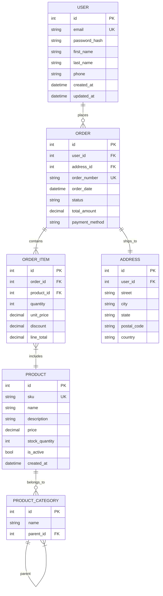

# Data Modeling

> **Meta:** v1.0.0 | 23-02-2026

## Purpose

Skill for designing data models and creating Entity-Relationship Diagrams (ERD). Includes defining entities and attributes, establishing relationships between entities, normalization to eliminate redundancy, denormalization for performance optimization, indexing strategy, and defining data integrity constraints. The skill covers relational databases and provides data schemas for implementation in Universal Coding Agent.

## When to Use

Use this skill:
- When designing database structure for a new system
- For creating ER diagrams with entity and relationship visualization
- When normalizing existing tables (1NF-3NF, BCNF)
- For performance optimization through denormalization
- When defining indexing strategy
- For configuring integrity constraints
- When preparing data schema for developers
- During data requirements analysis phase

## Functions

### ERD Design

Designing Entity-Relationship diagrams for data structure visualization:

**Entities and Attributes:**

| Component | Description | Example |
|-----------|----------|--------|
| Entity | Real-world object | USER, ORDER, PRODUCT |
| Attribute | Entity characteristic | name, email, price |
| Primary Key (PK) | Unique identifier | id |
| Foreign Key (FK) | Reference to another entity | user_id |
| Unique Key (UK) | Unique value | email |

**Attribute Types:**

- **Simple** — atomic, indivisible values
- **Composite** — combination of simple attributes (address = city + street + house)
- **Single-valued** — one value for entity
- **Multi-valued** — multiple values (product tags)
- **Derived** — calculated values (age = current_date - birth_date)

**Relationship Types:**

| Relationship Type | Description | Notation |
|-----------|----------|-------------|
| **One-to-One (1:1)** | One record linked to one record | `||--||` |
| **One-to-Many (1:N)** | One record linked to many | `||--o{` |
| **Many-to-Many (M:N)** | Many records linked to many | `}o--o{` |

**Cardinality:**

- **Mandatory** — relationship must exist (`||`)
- **Optional** — relationship may not exist (`o`)

### Normalization

Normalizing data to eliminate redundancy and anomalies:

**1NF (First Normal Form):**

Requirements:
- All attributes must contain atomic (indivisible) values
- Each column must contain values of the same type
- Each record must be unique

**Example of bringing to 1NF:**

```sql
-- Before 1NF (incorrect)
CREATE TABLE orders_bad (
    id INT,
    customer_name VARCHAR(100),
    products VARCHAR(200)  -- contains "Product1, Product2, Product3"
);

-- After 1NF (correct)
CREATE TABLE orders (
    id INT PRIMARY KEY,
    customer_name VARCHAR(100)
);

CREATE TABLE order_products (
    id INT PRIMARY KEY,
    order_id INT REFERENCES orders(id),
    product_name VARCHAR(100)
);
```

**2NF (Second Normal Form):**

Requirements:
- Table must be in 1NF
- All non-key attributes must fully depend on the primary key
- No partial dependencies

**Example of bringing to 2NF:**

```sql
-- Before 2NF (partial dependency)
CREATE TABLE order_items_bad (
    order_id INT,
    product_id INT,
    product_name VARCHAR(100),  -- depends only on product_id
    quantity INT,
    PRIMARY KEY (order_id, product_id)
);

-- After 2NF
CREATE TABLE orders (
    id INT PRIMARY KEY,
    customer_id INT,
    order_date DATE
);

CREATE TABLE products (
    id INT PRIMARY KEY,
    name VARCHAR(100),
    price DECIMAL
);

CREATE TABLE order_items (
    order_id INT REFERENCES orders(id),
    product_id INT REFERENCES products(id),
    quantity INT,
    PRIMARY KEY (order_id, product_id)
);
```

**3NF (Third Normal Form):**

Requirements:
- Table must be in 2NF
- No transitive dependencies (non-key attribute depends on another non-key attribute)

**Example of bringing to 3NF:**

```sql
-- Before 3NF (transitive dependency)
CREATE TABLE employees_bad (
    id INT PRIMARY KEY,
    name VARCHAR(100),
    department_id INT,
    department_name VARCHAR(100)  -- transitively depends on department_id
);

-- After 3NF
CREATE TABLE departments (
    id INT PRIMARY KEY,
    name VARCHAR(100)
);

CREATE TABLE employees (
    id INT PRIMARY KEY,
    name VARCHAR(100),
    department_id INT REFERENCES departments(id)
);
```

**BCNF (Boyce-Codd Normal Form):**

Requirements:
- Table must be in 3NF
- For each functional dependency X → Y, X must be a superkey

**When to apply normalization:**
- For systems with high frequency of INSERT/UPDATE/DELETE operations
- When data integrity is important
- For transactional systems (OLTP)
- When minimizing redundancy is required

### Denormalization

Denormalization — intentional addition of redundancy for performance improvement:

**When denormalization is justified:**

| Situation | Example |
|----------|--------|
| Frequent read operations | Reports, dashboards |
| Complex JOINs | Aggregated data |
| Latency requirements | Real-time systems |
| Data caching | Popular queries |

**Types of Denormalization:**

1. **Lookup Tables**
   - Storing full name instead of ID

2. **Denormalization through copying**
   - Copying attributes to child tables

3. **Denormalization through collapsing tables**
   - Combining related tables into one

4. **Adding derived attributes**
   - Storing calculated values

**Example:**

```sql
-- Denormalization: storing order total
CREATE TABLE orders (
    id INT PRIMARY KEY,
    customer_id INT,
    order_date DATE,
    total_amount DECIMAL,  -- denormalized field
    item_count INT         -- denormalized field
);

CREATE TABLE order_items (
    id INT PRIMARY KEY,
    order_id INT REFERENCES orders(id),
    product_id INT,
    quantity INT,
    price DECIMAL,
    item_total DECIMAL    -- quantity * price
);
```

**Trade-offs:**

| Advantages | Disadvantages |
|-------------|-------------|
| Fewer JOINs | Data redundancy |
| Improved read performance | Maintenance complexity |
| Simpler queries | Anomaly risks |
| Reduced DB load | Synchronization necessity |

### Indexing Strategy

Index creation strategy for query optimization:

**Index Types:**

| Index Type | Description | Example |
|-------------|----------|--------|
| **Primary Index** | Automatically created for PK | CLUSTERED |
| **Unique Index** | Ensures uniqueness | UNIQUE |
| **Composite Index** | On multiple columns | (last_name, first_name) |
| **Partial Index** | Part of table | WHERE status = 'active' |
| **Bitmap Index** | For low-cardinality fields | gender, status |
| **Full-text Index** | For text search | title, description |

**Index Creation Rules:**

1. **Index:**
   - Columns in WHERE
   - Columns in JOIN (FK)
   - Columns in ORDER BY
   - Columns with high selectivity

2. **Don't index:**
   - Low selectivity columns (boolean, gender)
   - Frequently updated columns
   - Small tables
   - Columns with NULL in most rows

**Indexing Strategy Example:**

```sql
-- Primary Key
ALTER TABLE users ADD PRIMARY KEY (id);

-- Unique index for email
CREATE UNIQUE INDEX idx_users_email ON users(email);

-- Composite index for frequently used query
CREATE INDEX idx_orders_user_date ON orders(user_id, order_date DESC);

-- Partial index for active records
CREATE INDEX idx_products_active ON products(product_id) 
WHERE status = 'active';

-- Composite index for covering query
CREATE INDEX idx_order_items_composite 
ON order_items(order_id, product_id, quantity, price);
```

**Performance Impact:**

| Operation | Without Index | With Index |
|----------|-------------|------------|
| SELECT | Full table scan | Index scan |
| INSERT | O(1) | O(log n) + index write |
| UPDATE | O(1) | O(log n) + index write |
| DELETE | O(1) | O(log n) + index write |

### Constraints

Data integrity constraints:

| Constraint | Description | Example |
|-----------|----------|--------|
| **NOT NULL** | Mandatory value | `name VARCHAR(100) NOT NULL` |
| **UNIQUE** | Unique value | `email VARCHAR(255) UNIQUE` |
| **PRIMARY KEY** | Unique identifier | `id INT PRIMARY KEY` |
| **FOREIGN KEY** | Reference to another table | `user_id INT REFERENCES users(id)` |
| **CHECK** | Condition | `age INT CHECK (age >= 0)` |
| **DEFAULT** | Default value | `status VARCHAR(20) DEFAULT 'active'` |

**Cascading Operations:**

```sql
-- ON DELETE: CASCADE, SET NULL, SET DEFAULT, RESTRICT, NO ACTION
-- ON UPDATE: CASCADE, SET NULL, SET DEFAULT, RESTRICT, NO ACTION

CREATE TABLE orders (
    id INT PRIMARY KEY,
    customer_id INT REFERENCES customers(id) 
        ON DELETE CASCADE
        ON UPDATE CASCADE,
    status VARCHAR(20) DEFAULT 'pending',
    created_at TIMESTAMP DEFAULT CURRENT_TIMESTAMP
);

-- CHECK constraint
CREATE TABLE products (
    id INT PRIMARY KEY,
    name VARCHAR(100) NOT NULL,
    price DECIMAL(10,2) CHECK (price > 0),
    quantity INT CHECK (quantity >= 0),
    discount DECIMAL(3,2) CHECK (discount BETWEEN 0 AND 1)
);

-- Composite unique constraint
CREATE TABLE user_roles (
    user_id INT,
    role_id INT,
    PRIMARY KEY (user_id, role_id)
);
```

**Usage Recommendations:**

1. Always use NOT NULL for required fields
2. Apply FOREIGN KEY for referential integrity
3. Use CHECK for business rules
4. Avoid excessive constraints affecting performance

## Integration with Project Manager

### Data for Project Manager

Provides the following data for PM:

**Quantitative Metrics:**
- Total number of entities (tables)
- Number of attributes
- Number of relationships (1:1, 1:N, M:N)
- Number of indexes

**Data Model Complexity Estimation:**

| Complexity | Criteria | Time Estimate |
|-----------|----------|----------------|
| **Simple** | 3-5 entities, 1:N relationships, no M:N | 8-16 hours |
| **Medium** | 6-10 entities, M:N relationships, 1-2 normal forms | 16-40 hours |
| **Complex** | 10+ entities, complex relationships, full normalization | 40-80 hours |

**Data Migration Requirements:**
- Necessity of migrating existing data
- Transformation complexity
- Time for migration testing
- Data loss risks

**Data Architecture Risks:**
- Complex relationships with cyclic dependencies
- Potential performance issues
- Data integrity requirements
- External system dependencies

### Interaction

- PM requests data schema for development time estimation
- PM receives data for migration planning
- PM uses metrics for resource allocation
- SA validates model changes with PM

## Usage Examples

### Example 1: ERD for E-commerce System

**Mermaid Diagram:**


```mermaid
erDiagram
    USER ||--o{ ORDER : places
    USER {
        int id PK
        string email UK
        string password_hash
        string first_name
        string last_name
        string phone
        datetime created_at
        datetime updated_at
    }
    
    ORDER ||--|{ ORDER_ITEM : contains
    ORDER ||--|| ADDRESS : ships_to
    ORDER {
        int id PK
        int user_id FK
        int address_id FK
        string order_number UK
        datetime order_date
        string status
        decimal total_amount
        string payment_method
    }
    
    ORDER_ITEM }|--|| PRODUCT : includes
    ORDER_ITEM {
        int id PK
        int order_id FK
        int product_id FK
        int quantity
        decimal unit_price
        decimal discount
        decimal line_total
    }
    
    PRODUCT ||--o{ PRODUCT_CATEGORY : belongs_to
    PRODUCT {
        int id PK
        string sku UK
        string name
        string description
        decimal price
        int stock_quantity
        bool is_active
        datetime created_at
    }
    
    PRODUCT_CATEGORY ||--|{ PRODUCT_CATEGORY : parent
    PRODUCT_CATEGORY {
        int id PK
        string name
        int parent_id FK
    }
    
    ADDRESS {
        int id PK
        int user_id FK
        string street
        string city
        string state
        string postal_code
        string country
    }
```

**SQL Schema:**

```sql
-- Users
CREATE TABLE users (
    id SERIAL PRIMARY KEY,
    email VARCHAR(255) UNIQUE NOT NULL,
    password_hash VARCHAR(255) NOT NULL,
    first_name VARCHAR(100),
    last_name VARCHAR(100),
    phone VARCHAR(20),
    created_at TIMESTAMP DEFAULT CURRENT_TIMESTAMP,
    updated_at TIMESTAMP DEFAULT CURRENT_TIMESTAMP
);

-- Addresses
CREATE TABLE addresses (
    id SERIAL PRIMARY KEY,
    user_id INT REFERENCES users(id) ON DELETE CASCADE,
    street VARCHAR(255) NOT NULL,
    city VARCHAR(100) NOT NULL,
    state VARCHAR(100),
    postal_code VARCHAR(20) NOT NULL,
    country VARCHAR(100) NOT NULL
);

-- Orders
CREATE TABLE orders (
    id SERIAL PRIMARY KEY,
    user_id INT REFERENCES users(id) ON DELETE RESTRICT,
    address_id INT REFERENCES addresses(id),
    order_number VARCHAR(50) UNIQUE NOT NULL,
    order_date TIMESTAMP DEFAULT CURRENT_TIMESTAMP,
    status VARCHAR(20) DEFAULT 'pending' 
        CHECK (status IN ('pending', 'processing', 'shipped', 'delivered', 'cancelled')),
    total_amount DECIMAL(10, 2) DEFAULT 0,
    payment_method VARCHAR(50)
);

-- Products
CREATE TABLE products (
    id SERIAL PRIMARY KEY,
    sku VARCHAR(50) UNIQUE NOT NULL,
    name VARCHAR(255) NOT NULL,
    description TEXT,
    price DECIMAL(10, 2) NOT NULL CHECK (price > 0),
    stock_quantity INT DEFAULT 0 CHECK (stock_quantity >= 0),
    is_active BOOLEAN DEFAULT true,
    created_at TIMESTAMP DEFAULT CURRENT_TIMESTAMP
);

-- Product Categories
CREATE TABLE product_categories (
    id SERIAL PRIMARY KEY,
    name VARCHAR(100) NOT NULL,
    parent_id INT REFERENCES product_categories(id)
);

-- Order Items
CREATE TABLE order_items (
    id SERIAL PRIMARY KEY,
    order_id INT REFERENCES orders(id) ON DELETE CASCADE,
    product_id INT REFERENCES products(id),
    quantity INT NOT NULL CHECK (quantity > 0),
    unit_price DECIMAL(10, 2) NOT NULL,
    discount DECIMAL(10, 2) DEFAULT 0,
    line_total DECIMAL(10, 2) NOT NULL
);

-- Indexes
CREATE INDEX idx_orders_user_id ON orders(user_id);
CREATE INDEX idx_orders_status ON orders(status);
CREATE INDEX idx_orders_order_date ON orders(order_date DESC);
CREATE INDEX idx_order_items_order_id ON order_items(order_id);
CREATE INDEX idx_order_items_product_id ON order_items(product_id);
CREATE INDEX idx_products_sku ON products(sku);
CREATE INDEX idx_products_active ON products(product_id) WHERE is_active = true;
```

### Example 2: Order Table Normalization

**Before normalization (denormalized table):**

```sql
CREATE TABLE orders_denormalized (
    order_id INT,
    customer_name VARCHAR(100),
    customer_email VARCHAR(100),
    customer_phone VARCHAR(20),
    product_1_name VARCHAR(100),
    product_1_price DECIMAL,
    product_1_quantity INT,
    product_2_name VARCHAR(100),
    product_2_price DECIMAL,
    product_2_quantity INT,
    product_3_name VARCHAR(100),
    product_3_price DECIMAL,
    product_3_quantity INT,
    total_amount DECIMAL
);
```

**Problems:**
- 1NF violation: repeating groups (product_1, product_2, product_3)
- 2NF violation: partial dependencies
- Data redundancy
- Difficulty adding new products

**After normalization (3NF):**

```sql
-- Customers
CREATE TABLE customers (
    customer_id INT PRIMARY KEY,
    name VARCHAR(100) NOT NULL,
    email VARCHAR(100) UNIQUE NOT NULL,
    phone VARCHAR(20)
);

-- Orders
CREATE TABLE orders (
    order_id INT PRIMARY KEY,
    customer_id INT REFERENCES customers(customer_id),
    order_date DATE NOT NULL,
    total_amount DECIMAL(10, 2)
);

-- Products
CREATE TABLE products (
    product_id INT PRIMARY KEY,
    name VARCHAR(100) NOT NULL,
    price DECIMAL(10, 2) NOT NULL
);

-- Order Items (M:N relationship)
CREATE TABLE order_items (
    order_item_id INT PRIMARY KEY,
    order_id INT REFERENCES orders(order_id),
    product_id INT REFERENCES products(product_id),
    quantity INT NOT NULL,
    line_total DECIMAL(10, 2)
);
```

### Example 3: Indexing Strategy for High-Load Table

**Scenario:** Event logs table with millions of records

```sql
CREATE TABLE event_logs (
    id BIGSERIAL PRIMARY KEY,
    event_type VARCHAR(50) NOT NULL,
    user_id INT,
    session_id VARCHAR(100),
    event_timestamp TIMESTAMP NOT NULL DEFAULT CURRENT_TIMESTAMP,
    payload JSONB,
    severity VARCHAR(20) DEFAULT 'info',
    is_processed BOOLEAN DEFAULT false
);

-- Primary index (automatic)
-- id - unique identifier

-- Composite index for frequent query: user events for period
CREATE INDEX idx_event_logs_user_time 
ON event_logs(user_id, event_timestamp DESC);

-- Partial index for unprocessed events
CREATE INDEX idx_event_logs_unprocessed 
ON event_logs(id) WHERE is_processed = false;

-- Index for event type search
CREATE INDEX idx_event_logs_type 
ON event_logs(event_type);

-- Composite index for covering query
CREATE INDEX idx_event_logs_covering 
ON event_logs(event_type, event_timestamp DESC, user_id)
INCLUDE (severity, is_processed);

-- Index for JSONB queries
CREATE INDEX idx_event_logs_payload 
ON event_logs USING GIN(payload);

-- Check index usage
-- EXPLAIN ANALYZE SELECT * FROM event_logs 
-- WHERE user_id = 123 AND event_timestamp > '2026-01-01';
```

## Best Practices

### ERD Design

1. **Naming:**
   - Use singular nouns (User, Order, Product)
   - Table names: snake_case (user_roles)
   - Column names: snake_case (created_at)
   - Always name PK as `id`

2. **Relationships:**
   - Use explicit FOREIGN KEY
   - Define cascading operations
   - Avoid cyclic dependencies

3. **Attributes:**
   - Choose correct data types
   - Use VARCHAR with length limit
   - For dates use TIMESTAMP or DATE

### Normalization

1. Always start with 3NF
2. Denormalize only when there's proven necessity
3. Document denormalization decisions
4. Test performance before and after

### Indexes

1. Create indexes based on query plans
2. Avoid redundant indexes
3. Regularly analyze index usage
4. Remove unused indexes

### Constraints

1. Always use NOT NULL for required fields
2. Apply CHECK for business rules
3. Use unique indexes for natural keys
4. Limit cascading deletes

## Related Skills

- sql-development — writing SQL queries
- api-design — API design based on data model
- nosql-design — NoSQL schema design
- c4-architecture — system architecture considering data

---
