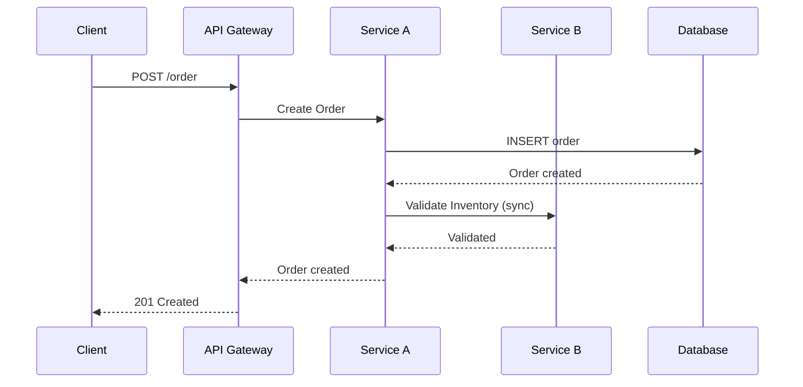
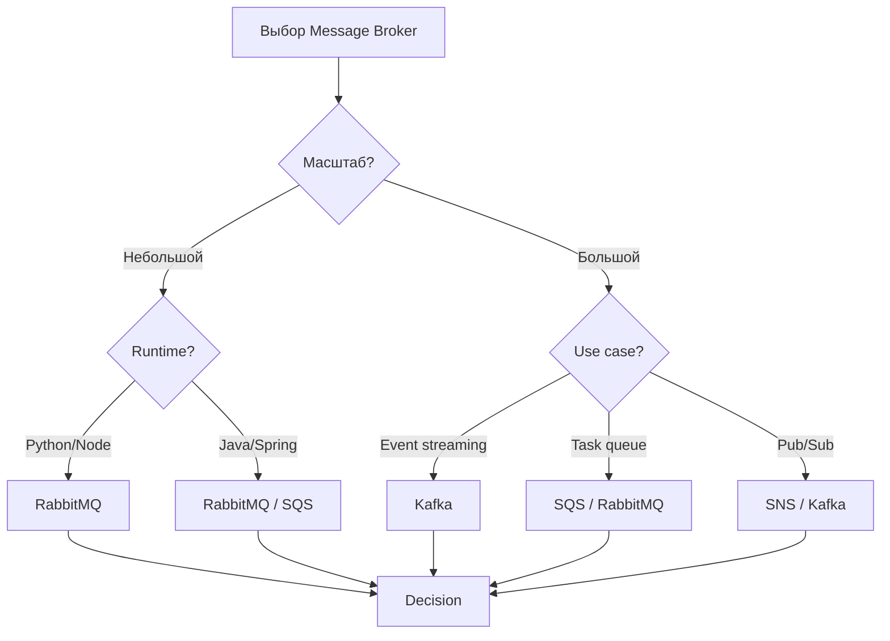
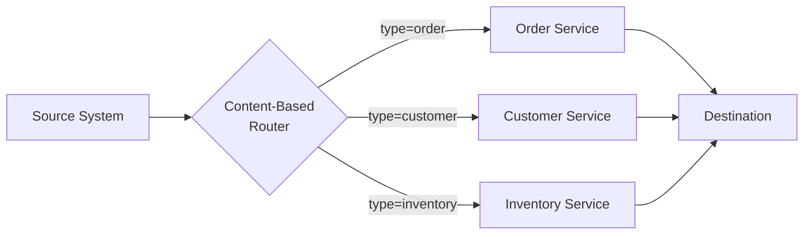
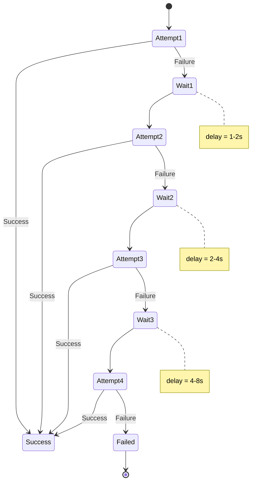
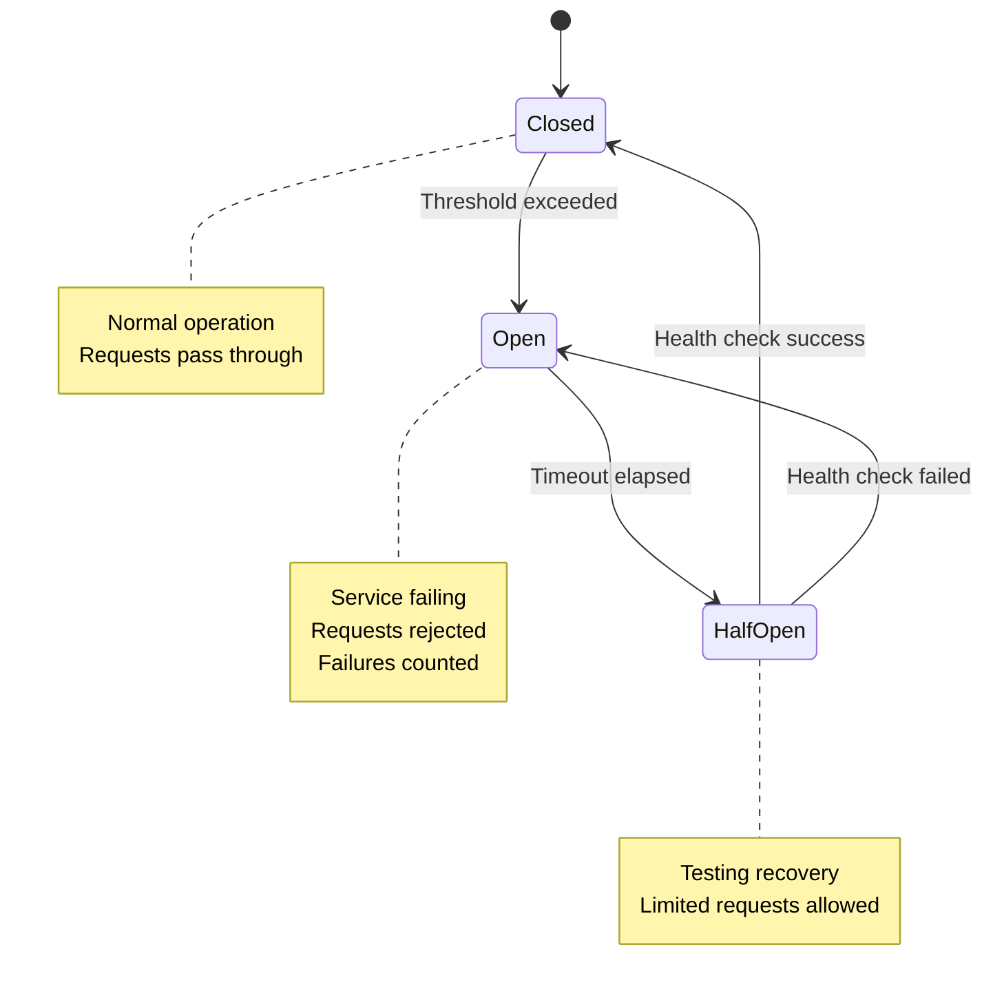
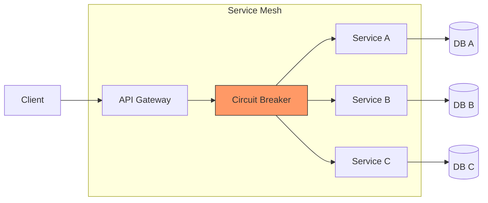

# Integration Patterns

> **Meta:** v1.0.0 | 23-02-2026

## Назначение

Навык для проектирования интеграционных паттернов между системами и сервисами. Включает выбор между синхронной и асинхронной интеграцией, проектирование архитектуры на основе сообщений (Message Brokers), проектирование Event-Driven архитектуры, проектирование ESB-паттернов и обработку ошибок в распределённых системах. Навык предоставляет полную интеграционную архитектуру для реализации в Universal Coding Agent.

## Когда использовать

Используйте этот навык:
- При проектировании интеграции между микросервисами
- Для выбора между синхронной и асинхронной интеграцией
- При проектировании архитектуры на основе сообщений
- Для реализации Event-Driven Architecture (EDA)
- При проектировании ESB-решений
- Для обеспечения отказоустойчивости интеграций
- На этапе архитектурного проектирования системы
- При выборе Message Broker (RabbitMQ, Kafka, SQS)
- Для проектирования обработки ошибок и компенсирующих транзакций

## Функции

### Synchronous vs Asynchronous

Выбор между синхронной и асинхронной интеграцией:

**Синхронная интеграция (Request-Reply):**

| Характеристика | Описание |
|----------------|----------|
| Паттерн | Request-Reply (запрос-ответ) |
| Время ответа | Немедленный ответ ожидается |
| Связь | one-to-one |
| Пример | REST API, gRPC |
| Использование | Критичные операции, требующие немедленного результата |

**Асинхронная интеграция:**

| Паттерн | Описание | Пример |
|----------|----------|--------|
| **Fire-and-Forget** | Отправка без ожидания ответа | Email notifications, logging |
| **Callback** | Асинхронный ответ через обратный вызов | Webhooks, async API |
| **Message Queue** | Очередь сообщений с подтверждением | RabbitMQ, SQS |
| **Event Streaming** | Поток событий в реальном времени | Kafka, Event Hubs |

**Когда использовать какой подход:**

| Критерий | Синхронная | Асинхронная |
|----------|------------|-------------|
| Latency requirements | Низкая (<100ms) | Высокая допустима |
| Reliability | Не критично | Критично |
| Scalability | Ограниченная | Высокая |
| Coupling | Tight coupling | Loose coupling |
| User expectation | Немедленный результат | Background processing |

**Диаграмма последовательности синхронной интеграции:**



### Message Brokers

Сравнение и выбор Message Brokers:

**RabbitMQ (AMQP):**

| Характеристика | Значение |
|----------------|----------|
| Протокол | AMQP 0.9.1, AMQP 1.0 |
| Тип | Traditional message broker |
| Ordering | Per-queue гарантия |
| Durability | Message persistence |
| Consumer models | Push-based |
| Routing | Direct, Topic, Fanout, Headers |
| Use case | Enterprise integration, complex routing |

**Apache Kafka:**

| Характеристика | Значение |
|----------------|----------|
| Протокол | Binary protocol over TCP |
| Тип | Distributed event streaming platform |
| Ordering | Per-partition гарантия |
| Durability | Log-based retention |
| Consumer models | Pull-based |
| Routing | Topic-based, partitioning |
| Use case | Event streaming, audit logs, real-time analytics |

**AWS SQS/SNS:**

| Характеристика | SQS | SNS |
|----------------|-----|-----|
| Тип | Message queue | Pub/Sub messaging |
| Delivery | At-least-once, exactly-once (FIFO) | Fire-and-forget |
| Ordering | FIFO queues guarantee | No ordering |
| Scalability | Auto-scaling | Unlimited scaling |
| Use case | Task queues, job processing | Notifications, fan-out |

**Azure Service Bus:**

| Характеристика | Значение |
|----------------|----------|
| Протокол | AMQP 1.0, SBMP |
| Тип | Enterprise message broker |
| Features | Topics, Sessions, Dead-letter |
| Use case | Enterprise integration, Azure ecosystem |

**Сравнительная таблица:**

| Критерий | RabbitMQ | Kafka | SQS | SNS | Azure SB |
|----------|-----------|-------|-----|-----|----------|
| **Latency** | Low | Medium | Medium | Low | Low |
| **Throughput** | Medium | Very High | High | Very High | Medium |
| **Ordering** | Per-queue | Per-partition | FIFO option | No | Per-session |
| **Durability** | Good | Excellent | Good | Good | Good |
| **Learning curve** | Medium | High | Low | Low | Medium |
| **Cloud-native** | Self-hosted | Managed available | AWS native | AWS native | Azure native |
| **Message size** | 128KB | 1MB (configurable) | 256KB | 256KB | 1MB |

**Выбор Message Broker:**



### ESB Patterns

Паттерны Enterprise Service Bus (ESB):

**Message Router:**

| Паттерн | Описание |
|----------|----------|
| Content-Based Router | Маршрутизация на основе содержимого сообщения |
| Header-Based Router | Маршрутизация на основе заголовков |
| Recipient List | Отправка нескольким получателям |

**Пример Content-Based Router:**



**Message Translator:**

| Паттерн | Описание |
|----------|----------|
| Message Translator | Преобразование форматов данных |
| Normalizer | Приведение к единому формату |
| Data Mapper | Маппинг между схемами |

**Пример Message Translator:**

```yaml
# Пример трансформации
input:
  user_id: 12345
  name: "John Doe"
  registration_date: "2024-01-15"

transform:
  - operation: rename
    from: user_id
    to: id
  - operation: format_date
    field: registration_date
    format: "ISO8601"
  - operation: split
    field: name
    into: [first_name, last_name]

output:
  id: 12345
  first_name: "John"
  last_name: "Doe"
  registration_date: "2024-01-15T00:00:00Z"
```

**Splitter и Aggregator:**

| Паттерн | Описание |
|----------|----------|
| Splitter | Разделение составного сообщения на части |
| Aggregator | Объединение нескольких сообщений в одно |
| Composed Message Processor | Обработка составных сообщений |

### Event-Driven Architecture

Проектирование Event-Driven Architecture (EDA):

**Event Sourcing:**

| Характеристика | Описание |
|----------------|----------|
| Принцип | Хранение всех изменений как последовательности событий |
| Преимущества | Полная история, audit trail, temporal queries |
| Недостатки | Сложность, eventual consistency |
| Use case | Financial systems, audit logs, CQRS |

**CQRS (Command Query Responsibility Segregation):**

```mermaid
flowchart TD
    subgraph Commands
        Client1[Client] --> CmdAPI[Command API]
        CmdAPI --> CmdDB[(Command DB)]
        CmdDB --> Bus[Event Bus]
    end
    
    subgraph Events
        Bus --> Events[Events]
    end
    
    subgraph Queries
        Events --> Proj[Projections]
        Proj --> QueryAPI[Query API]
        Client2[Client] --> QueryAPI
        QueryAPI --> ReadDB[(Read DB)]
    end
```

| Компонент | Описание |
|-----------|----------|
| Command Model | Запись данных, валидация, бизнес-логика |
| Query Model | Чтение данных, оптимизированные представления |
| Event Bus | Синхронизация между моделями |
| Projections | Материализованные представления |

**Pub/Sub Pattern:**

| Характеристика | Описание |
|----------------|----------|
| Publishers | Издатели событий (не знают о подписчиках) |
| Subscribers | Подписчики (подписываются на события) |
| Topic/Subject | Канал для событий |
| Message Broker | Посредник для доставки |

**Event Store:**

| Характеристика | Описание |
|----------------|----------|
| Структура | Append-only log всех событий |
| Aggregate | Группа связанных событий |
| Snapshot | Оптимизация для больших агрегатов |
| Projection | Проекции для чтения |

### Error Handling

Обработка ошибок в распределённых системах:

**Retry Patterns:**

| Паттерн | Описание |
|---------|----------|
| Immediate Retry | Немедленная повторная попытка |
| Fixed Delay | Задержка между попытками |
| Exponential Backoff | Увеличение задержки экспоненциально |
| Jitter | Добавление случайности для избежания thundering herd |

**Exponential Backoff с Jitter:**

```python
import random
import time

def retry_with_backoff(attempt: int, max_delay: int = 30) -> int:
    """
    Вычисление задержки с exponential backoff и jitter
    """
    # Базовый delay: 1 секунда
    base_delay = 1
    
    # Exponential backoff: 2^attempt
    exponential_delay = base_delay * (2 ** attempt)
    
    # Jitter: случайное значение от 0 до delay
    jitter = random.uniform(0, exponential_delay)
    
    # Итоговая задержка (не более max_delay)
    delay = min(exponential_delay + jitter, max_delay)
    
    return int(delay)

# Пример использования
for attempt in range(5):
    try:
        # Логика с retry
        process_request()
        break
    except Exception as e:
        if attempt == 4:  # Последняя попытка
            raise
        delay = retry_with_backoff(attempt)
        print(f"Попытка {attempt + 1} неудачна. Повтор через {delay} сек.")
        time.sleep(delay)
```

**Диаграмма Retry с Exponential Backoff:**



**Dead Letter Queue (DLQ):**

| Компонент | Описание |
|-----------|----------|
| Main Queue | Основная очередь для обработки |
| Dead Letter Queue | Очередь для необработанных сообщений |
| Retry Queue | Очередь для повторных попыток |
| Max Retries | Максимальное количество попыток |

```yaml
# Пример конфигурации RabbitMQ
queues:
  orders:
    durable: true
    arguments:
      x-dead-letter-exchange: dlx.exchange
      x-dead-letter-routing-key: dlq.orders
      
  orders.retry:
    durable: true
    arguments:
      x-message-ttl: 5000  # 5 секунд
      x-dead-letter-exchange: orders.exchange
      x-dead-letter-routing-key: orders
      
  dlq.orders:
    durable: true
```

**Circuit Breaker:**

| Состояние | Описание |
|-----------|----------|
| **Closed** | Нормальная работа, запросы проходят |
| **Open** | Сервис недоступен, запросы отклоняются |
| **Half-Open** | Проверка восстановления сервиса |

**State Machine Circuit Breaker:**



**Circuit Breaker Implementation:**

```python
class CircuitBreaker:
    def __init__(self, failure_threshold: int = 5, 
                 timeout: int = 60,
                 expected_exception: type = Exception):
        self.failure_threshold = failure_threshold
        self.timeout = timeout
        self.expected_exception = expected_exception
        self.failure_count = 0
        self.last_failure_time = None
        self.state = CircuitState.CLOSED
    
    def call(self, func, *args, **kwargs):
        if self.state == CircuitState.OPEN:
            if self._should_attempt_reset():
                self.state = CircuitState.HALF_OPEN
            else:
                raise CircuitBreakerOpenException()
        
        try:
            result = func(*args, **kwargs)
            self._on_success()
            return result
        except self.expected_exception as e:
            self._on_failure()
            raise
    
    def _on_success(self):
        self.failure_count = 0
        self.state = CircuitState.CLOSED
    
    def _on_failure(self):
        self.failure_count += 1
        self.last_failure_time = time.time()
        if self.failure_count >= self.failure_threshold:
            self.state = CircuitState.OPEN
    
    def _should_attempt_reset(self):
        return (time.time() - self.last_failure_time) >= self.timeout
```

**Idempotency:**

| Паттерн | Описание |
|---------|----------|
| Idempotency Key | Уникальный ключ для идентификации дубликатов |
| Database Constraints | UNIQUE constraint на ключ |
| Check-then-Act | Проверка перед действием |
| Deduplication | Дедупликация на уровне бизнес-логики |

```python
async def process_order(order_data: dict, idempotency_key: str):
    """
    Обработка заказа с идемпотентностью
    """
    # Проверка ключа идемпотентности
    existing = await db.orders.find_one({
        "idempotency_key": idempotency_key
    })
    
    if existing:
        return existing  # Повторный запрос - возврат существующего результата
    
    # Создание заказа
    order = await db.orders.insert_one({
        **order_data,
        "idempotency_key": idempotency_key,
        "status": "created"
    })
    
    return order
```

## Интеграция с Project Manager

### Данные для Project Manager

Предоставляет следующие данные для PM:

**Количественные метрики:**

| Метрика | Описание |
|---------|----------|
| Количество интеграций | Общее число внешних интеграций |
| Типы интеграций | Синхронные/асинхронные |
| Message Brokers | Выбранные брокеры и их количество |
| Очереди | Количество очередей/топиков |
| События | Количество событий в системе |

**Оценка сложности интеграций:**

| Сложность | Критерии | Оценка времени |
|-----------|----------|----------------|
| **Простая** | 1-3 REST API интеграции, без очередей | 16-24 часа |
| **Средняя** | 3-5 интеграций, 1-2 Message Brokers, простые события | 40-80 часов |
| **Сложная** | 5+ интеграций, Kafka, EDA, CQRS, множество событий | 80-160 часов |

**Требования к инфраструктуре:**

| Компонент | Требования | Оценка ресурсов |
|-----------|------------|----------------|
| Message Broker | RabbitMQ/Kafka/SQS | CPU, RAM, Storage |
| Event Store | База данных для событий | Зависит от объёма |
| Dead Letter Queues | Мониторинг и обработка | Административное время |
| Monitoring | Логирование, метрики | Инфраструктура мониторинга |

**Риски интеграции:**

| Риск | Вероятность | Влияние | Митигация |
|------|-------------|---------|-----------|
| Задержки интеграции | Высокая | Среднее | Асинхронная обработка |
| Потеря сообщений | Средняя | Высокое | DLQ, retry logic |
| Версионирование API | Средняя | Среднее | API Gateway, адаптеры |
| Circuit Breaker | Средняя | Среднее | Graceful degradation |
| Сложность отладки | Высокая | Среднее | Tracing, логирование |

### Взаимодействие

- PM запрашивает интеграционную архитектуру для оценки времени разработки
- PM получает данные о требованиях к инфраструктуре
- PM использует метрики для планирования ресурсов
- SA валидирует изменения интеграций с PM

## Примеры использования

### Пример 1: Event-Driven Architecture для e-commerce

```mermaid
flowchart TB
    subgraph Clients
        Web[Web App]
        Mobile[Mobile App]
    end
    
    subgraph API
        Gateway[API Gateway]
        Auth[Auth Service]
    end
    
    subgraph Services
        Order[Order Service]
        Payment[Payment Service]
        Inventory[Inventory Service]
        Notification[Notification Service]
    end
    
    subgraph Event Layer
        Kafka[Apache Kafka]
    end
    
    subgraph Databases
        OrderDB[(Order DB)]
        PaymentDB[(Payment DB)]
        InventoryDB[(Inventory DB)]
    end
    
    Web --> Gateway
    Mobile --> Gateway
    Gateway --> Auth
    Gateway --> Order
    
    Order --> Kafka: order.created
    Order --> OrderDB
    
    Kafka --> Payment: order.created
    Payment --> PaymentDB
    Payment --> Kafka: payment.completed
    
    Kafka --> Inventory: payment.completed
    Inventory --> InventoryDB
    Inventory --> Kafka: inventory.reserved
    
    Kafka --> Notification: inventory.reserved
```

### Пример 2: Circuit Breaker в микросервисах



### Пример 3: Retry с Exponential Backoff в коде

```python
from functools import wraps
import time
import random
import logging

logger = logging.getLogger(__name__)

def retry_with_exponential_backoff(
    max_retries: int = 5,
    base_delay: float = 1.0,
    max_delay: float = 60.0,
    exponential_base: float = 2.0,
    jitter: bool = True
):
    """
    Декоратор для повторных попыток с exponential backoff
    """
    def decorator(func):
        @wraps(func)
        def wrapper(*args, **kwargs):
            for attempt in range(max_retries):
                try:
                    return func(*args, **kwargs)
                except Exception as e:
                    if attempt == max_retries - 1:
                        logger.error(f"All {max_retries} attempts failed: {e}")
                        raise
                    
                    # Вычисление задержки
                    delay = base_delay * (exponential_base ** attempt)
                    if jitter:
                        delay = delay * (0.5 + random.random())
                    delay = min(delay, max_delay)
                    
                    logger.warning(
                        f"Attempt {attempt + 1}/{max_retries} failed: {e}. "
                        f"Retrying in {delay:.2f}s..."
                    )
                    time.sleep(delay)
            
        return wrapper
    return decorator

# Пример использования
@retry_with_exponential_backoff(max_retries=5, base_delay=1.0)
def call_external_api(endpoint: str):
    # Логика вызова внешнего API
    pass
```

## Лучшие практики

### Проектирование интеграций

1. **Связность (Coupling):**
   - Используйте loose coupling между сервисами
   - Избегайте прямых зависимостей
   - Используйте API Gateway для абстракции

2. **Надёжность:**
   - Всегда используйте DLQ для неудачных сообщений
   - Реализуйте retry с exponential backoff
   - Используйте Circuit Breaker для внешних сервисов

3. **Мониторинг:**
   - Логируйте все интеграционные события
   - Настройте alerts на сбои
   - Используйте distributed tracing

4. **Безопасность:**
   - Шифруйте сообщения в очереди
   - Используйте аутентификацию и авторизацию
   - Валидируйте все входящие данные

### Выбор архитектуры

1. **Синхронная интеграция:**
   - Используйте для критичных операций
   - Требуется немедленный ответ
   - Простая обработка ошибок

2. **Асинхронная интеграция:**
   - Используйте для долгих операций
   - Требуется масштабируемость
   - Loose coupling критичен

3. **Event-Driven:**
   - Используйте для реактивных систем
   - Требуется real-time обработка
   - Multiple consumers необходимы

## Связанные навыки

- api-design — проектирование RESTful API и спецификаций OpenAPI
- workflow-design — проектирование рабочих процессов и автоматизации
- bpmn-modeling — моделирование бизнес-процессов интеграций
- c4-architecture — архитектура системы с интеграциями
- data-modeling — проектирование моделей данных для интеграций
