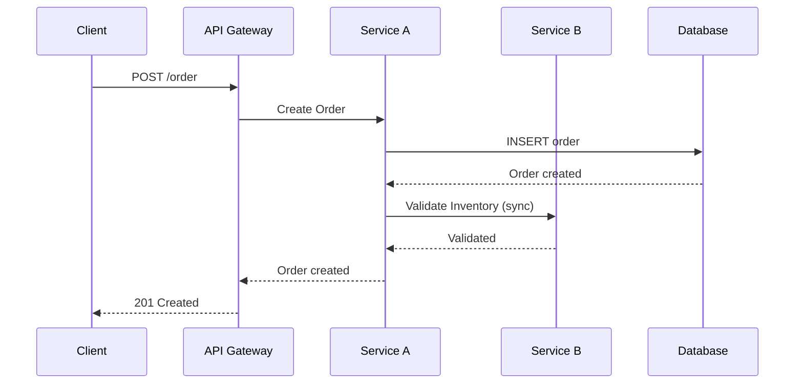
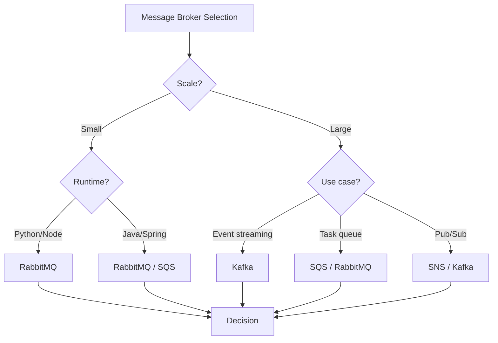
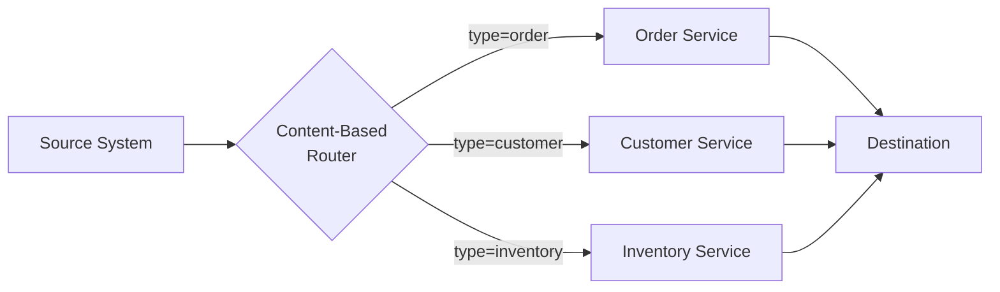
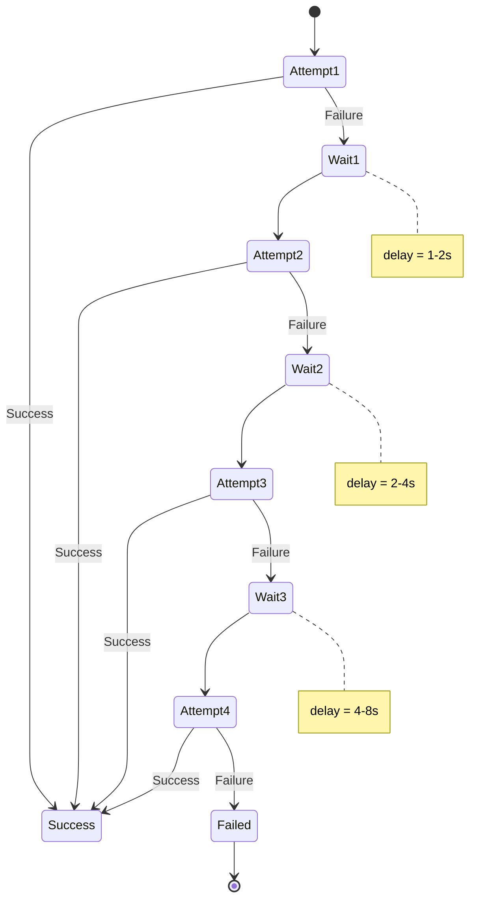
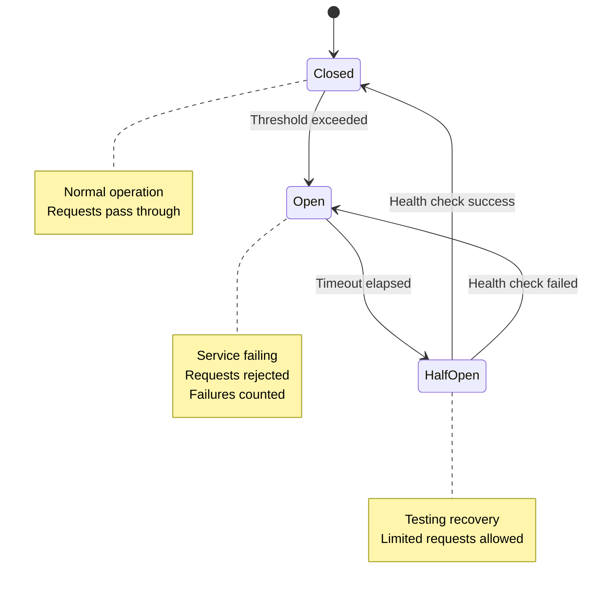
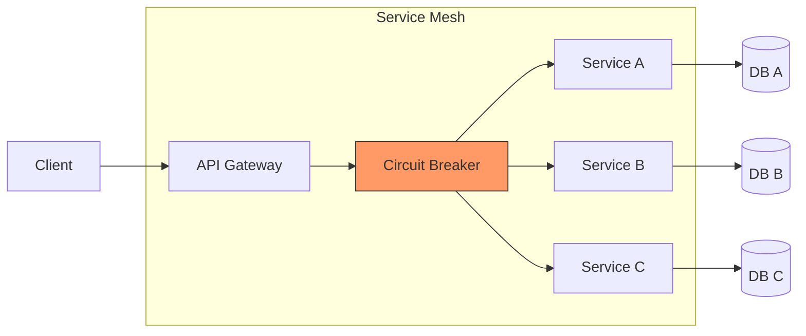

# Integration Patterns

> **Meta:** v1.0.0 | 23-02-2026

## Purpose

Skill for designing integration patterns between systems and services. Includes choosing between synchronous and asynchronous integration, designing message-based architecture (Message Brokers), designing Event-Driven architecture, designing ESB patterns, and handling errors in distributed systems. The skill provides complete integration architecture for implementation in Universal Coding Agent.

## When to Use

Use this skill:
- When designing integration between microservices
- For choosing between synchronous and asynchronous integration
- When designing message-based architecture
- For implementing Event-Driven Architecture (EDA)
- When designing ESB solutions
- For ensuring integration fault tolerance
- During system architecture design phase
- When choosing Message Broker (RabbitMQ, Kafka, SQS)
- For designing error handling and compensating transactions

## Functions

### Synchronous vs Asynchronous

Choosing between synchronous and asynchronous integration:

**Synchronous Integration (Request-Reply):**

| Characteristic | Description |
|----------------|-------------|
| Pattern | Request-Reply |
| Response Time | Immediate response expected |
| Connection | one-to-one |
| Example | REST API, gRPC |
| Usage | Critical operations requiring immediate result |

**Asynchronous Integration:**

| Pattern | Description | Example |
|---------|-------------|---------|
| **Fire-and-Forget** | Send without waiting for response | Email notifications, logging |
| **Callback** | Async response via callback | Webhooks, async API |
| **Message Queue** | Message queue with acknowledgment | RabbitMQ, SQS |
| **Event Streaming** | Real-time event streaming | Kafka, Event Hubs |

**When to use which approach:**

| Criterion | Synchronous | Asynchronous |
|-----------|-------------|--------------|
| Latency requirements | Low (<100ms) | High acceptable |
| Reliability | Not critical | Critical |
| Scalability | Limited | High |
| Coupling | Tight coupling | Loose coupling |
| User expectation | Immediate result | Background processing |

**Synchronous integration sequence diagram:**


```mermaid
sequenceDiagram
    participant Client
    participant API as API Gateway
    participant Svc1 as Service A
    participant Svc2 as Service B
    participant DB as Database
    
    Client->>API: POST /order
    API->>Svc1: Create Order
    Svc1->>DB: INSERT order
    DB-->>Svc1: Order created
    Svc1->>Svc2: Validate Inventory (sync)
    Svc2-->>Svc1: Validated
    Svc1-->>API: Order created
    API-->>Client: 201 Created
```

### Message Brokers

Comparison and selection of Message Brokers:

**RabbitMQ (AMQP):**

| Characteristic | Value |
|----------------|-------|
| Protocol | AMQP 0.9.1, AMQP 1.0 |
| Type | Traditional message broker |
| Ordering | Per-queue guarantee |
| Durability | Message persistence |
| Consumer models | Push-based |
| Routing | Direct, Topic, Fanout, Headers |
| Use case | Enterprise integration, complex routing |

**Apache Kafka:**

| Characteristic | Value |
|----------------|-------|
| Protocol | Binary protocol over TCP |
| Type | Distributed event streaming platform |
| Ordering | Per-partition guarantee |
| Durability | Log-based retention |
| Consumer models | Pull-based |
| Routing | Topic-based, partitioning |
| Use case | Event streaming, audit logs, real-time analytics |

**AWS SQS/SNS:**

| Characteristic | SQS | SNS |
|----------------|-----|-----|
| Type | Message queue | Pub/Sub messaging |
| Delivery | At-least-once, exactly-once (FIFO) | Fire-and-forget |
| Ordering | FIFO queues guarantee | No ordering |
| Scalability | Auto-scaling | Unlimited scaling |
| Use case | Task queues, job processing | Notifications, fan-out |

**Azure Service Bus:**

| Characteristic | Value |
|----------------|-------|
| Protocol | AMQP 1.0, SBMP |
| Type | Enterprise message broker |
| Features | Topics, Sessions, Dead-letter |
| Use case | Enterprise integration, Azure ecosystem |

**Comparison table:**

| Criterion | RabbitMQ | Kafka | SQS | SNS | Azure SB |
|-----------|----------|-------|-----|-----|----------|
| **Latency** | Low | Medium | Medium | Low | Low |
| **Throughput** | Medium | Very High | High | Very High | Medium |
| **Ordering** | Per-queue | Per-partition | FIFO option | No | Per-session |
| **Durability** | Good | Excellent | Good | Good | Good |
| **Learning curve** | Medium | High | Low | Low | Medium |
| **Cloud-native** | Self-hosted | Managed available | AWS native | AWS native | Azure native |
| **Message size** | 128KB | 1MB (configurable) | 256KB | 256KB | 1MB |

**Message Broker Selection:**


```mermaid
flowchart TD
    A[Message Broker Selection] --> B{Scale?}
    B -->|Small| C{Runtime?}
    B -->|Large| D{Use case?}
    
    C -->|Python/Node| E[RabbitMQ]
    C -->|Java/Spring| F[RabbitMQ / SQS]
    
    D -->|Event streaming| G[Kafka]
    D -->|Task queue| H[SQS / RabbitMQ]
    D -->|Pub/Sub| I[SNS / Kafka]
    
    E --> J[Decision]
    F --> J
    G --> J
    H --> J
    I --> J
```

### ESB Patterns

Enterprise Service Bus (ESB) patterns:

**Message Router:**

| Pattern | Description |
|---------|-------------|
| Content-Based Router | Routing based on message content |
| Header-Based Router | Routing based on headers |
| Recipient List | Sending to multiple recipients |

**Content-Based Router Example:**


```mermaid
flowchart LR
    Source[Source System] --> Router{Content-Based<br/>Router}
    
    Router -->|type=order| OrderSvc[Order Service]
    Router -->|type=customer| CustSvc[Customer Service]
    Router -->|type=inventory| InvSvc[Inventory Service]
    
    OrderSvc --> Dest1[Destination]
    CustSvc --> Dest1
    InvSvc --> Dest1
```

**Message Translator:**

| Pattern | Description |
|---------|-------------|
| Message Translator | Data format transformation |
| Normalizer | Bringing to a unified format |
| Data Mapper | Mapping between schemas |

**Message Translator Example:**

```yaml
# Transformation example
input:
  user_id: 12345
  name: "John Doe"
  registration_date: "2024-01-15"

transform:
  - operation: rename
    from: user_id
    to: id
  - operation: format_date
    field: registration_date
    format: "ISO8601"
  - operation: split
    field: name
    into: [first_name, last_name]

output:
  id: 12345
  first_name: "John"
  last_name: "Doe"
  registration_date: "2024-01-15T00:00:00Z"
```

**Splitter and Aggregator:**

| Pattern | Description |
|---------|-------------|
| Splitter | Splitting compound message into parts |
| Aggregator | Combining multiple messages into one |
| Composed Message Processor | Processing compound messages |

### Event-Driven Architecture

Designing Event-Driven Architecture (EDA):

**Event Sourcing:**

| Characteristic | Description |
|----------------|-------------|
| Principle | Storing all changes as sequence of events |
| Advantages | Complete history, audit trail, temporal queries |
| Disadvantages | Complexity, eventual consistency |
| Use case | Financial systems, audit logs, CQRS |

**CQRS (Command Query Responsibility Segregation):**

```mermaid
flowchart TD
    subgraph Commands
        Client1[Client] --> CmdAPI[Command API]
        CmdAPI --> CmdDB[(Command DB)]
        CmdDB --> Bus[Event Bus]
    end
    
    subgraph Events
        Bus --> Events[Events]
    end
    
    subgraph Queries
        Events --> Proj[Projections]
        Proj --> QueryAPI[Query API]
        Client2[Client] --> QueryAPI
        QueryAPI --> ReadDB[(Read DB)]
    end
```

| Component | Description |
|-----------|-------------|
| Command Model | Data recording, validation, business logic |
| Query Model | Data reading, optimized views |
| Event Bus | Synchronization between models |
| Projections | Materialized views |

**Pub/Sub Pattern:**

| Characteristic | Description |
|----------------|-------------|
| Publishers | Event publishers (don't know about subscribers) |
| Subscribers | Subscribers (subscribe to events) |
| Topic/Subject | Channel for events |
| Message Broker | Mediator for delivery |

**Event Store:**

| Characteristic | Description |
|----------------|-------------|
| Structure | Append-only log of all events |
| Aggregate | Group of related events |
| Snapshot | Optimization for large aggregates |
| Projection | Projections for reading |

### Error Handling

Error handling in distributed systems:

**Retry Patterns:**

| Pattern | Description |
|---------|-------------|
| Immediate Retry | Immediate retry attempt |
| Fixed Delay | Delay between attempts |
| Exponential Backoff | Delay increases exponentially |
| Jitter | Adding randomness to avoid thundering herd |

**Exponential Backoff with Jitter:**

```python
import random
import time

def retry_with_backoff(attempt: int, max_delay: int = 30) -> int:
    """
    Calculating delay with exponential backoff and jitter
    """
    # Base delay: 1 second
    base_delay = 1
    
    # Exponential backoff: 2^attempt
    exponential_delay = base_delay * (2 ** attempt)
    
    # Jitter: random value from 0 to delay
    jitter = random.uniform(0, exponential_delay)
    
    # Final delay (no more than max_delay)
    delay = min(exponential_delay + jitter, max_delay)
    
    return int(delay)

# Usage example
for attempt in range(5):
    try:
        # Logic with retry
        process_request()
        break
    except Exception as e:
        if attempt == 4:  # Last attempt
            raise
        delay = retry_with_backoff(attempt)
        print(f"Attempt {attempt + 1} failed. Retrying in {delay} sec.")
        time.sleep(delay)
```

**Retry Diagram with Exponential Backoff:**


```mermaid
stateDiagram-v2
    [*] --> Attempt1
    Attempt1 --> Success: Success
    Attempt1 --> Wait1: Failure
    Wait1 --> Attempt2
    Attempt2 --> Success: Success
    Attempt2 --> Wait2: Failure
    Wait2 --> Attempt3
    Attempt3 --> Success: Success
    Attempt3 --> Wait3: Failure
    Wait3 --> Attempt4
    Attempt4 --> Success: Success
    Attempt4 --> Failed: Failure
    Failed --> [*]
    
    note right of Wait1
        delay = 1-2s
    end note
    
    note right of Wait2
        delay = 2-4s
    end note
    
    note right of Wait3
        delay = 4-8s
    end note
```

**Dead Letter Queue (DLQ):**

| Component | Description |
|-----------|-------------|
| Main Queue | Main queue for processing |
| Dead Letter Queue | Queue for unprocessed messages |
| Retry Queue | Queue for retry attempts |
| Max Retries | Maximum number of attempts |

```yaml
# RabbitMQ configuration example
queues:
  orders:
    durable: true
    arguments:
      x-dead-letter-exchange: dlx.exchange
      x-dead-letter-routing-key: dlq.orders
      
  orders.retry:
    durable: true
    arguments:
      x-message-ttl: 5000  # 5 seconds
      x-dead-letter-exchange: orders.exchange
      x-dead-letter-routing-key: orders
      
  dlq.orders:
    durable: true
```

**Circuit Breaker:**

| State | Description |
|-------|-------------|
| **Closed** | Normal operation, requests pass through |
| **Open** | Service unavailable, requests rejected |
| **Half-Open** | Testing service recovery |

**Circuit Breaker State Machine:**


```mermaid
stateDiagram-v2
    [*] --> Closed
    
    Closed --> Open: Threshold exceeded
    Open --> HalfOpen: Timeout elapsed
    HalfOpen --> Closed: Health check success
    HalfOpen --> Open: Health check failed
    
    note right of Closed
        Normal operation
        Requests pass through
    end note
    
    note right of Open
        Service failing
        Requests rejected
        Failures counted
    end note
    
    note right of HalfOpen
        Testing recovery
        Limited requests allowed
    end note
```

**Circuit Breaker Implementation:**

```python
class CircuitBreaker:
    def __init__(self, failure_threshold: int = 5, 
                 timeout: int = 60,
                 expected_exception: type = Exception):
        self.failure_threshold = failure_threshold
        self.timeout = timeout
        self.expected_exception = expected_exception
        self.failure_count = 0
        self.last_failure_time = None
        self.state = CircuitState.CLOSED
    
    def call(self, func, *args, **kwargs):
        if self.state == CircuitState.OPEN:
            if self._should_attempt_reset():
                self.state = CircuitState.HALF_OPEN
            else:
                raise CircuitBreakerOpenException()
        
        try:
            result = func(*args, **kwargs)
            self._on_success()
            return result
        except self.expected_exception as e:
            self._on_failure()
            raise
    
    def _on_success(self):
        self.failure_count = 0
        self.state = CircuitState.CLOSED
    
    def _on_failure(self):
        self.failure_count += 1
        self.last_failure_time = time.time()
        if self.failure_count >= self.failure_threshold:
            self.state = CircuitState.OPEN
    
    def _should_attempt_reset(self):
        return (time.time() - self.last_failure_time) >= self.timeout
```

**Idempotency:**

| Pattern | Description |
|---------|-------------|
| Idempotency Key | Unique key for identifying duplicates |
| Database Constraints | UNIQUE constraint on key |
| Check-then-Act | Check before action |
| Deduplication | Deduplication at business logic level |

```python
async def process_order(order_data: dict, idempotency_key: str):
    """
    Processing order with idempotency
    """
    # Check idempotency key
    existing = await db.orders.find_one({
        "idempotency_key": idempotency_key
    })
    
    if existing:
        return existing  # Duplicate request - return existing result
    
    # Create order
    order = await db.orders.insert_one({
        **order_data,
        "idempotency_key": idempotency_key,
        "status": "created"
    })
    
    return order
```

## Integration with Project Manager

### Data for Project Manager

Provides the following data for PM:

**Quantitative Metrics:**

| Metric | Description |
|--------|-------------|
| Number of integrations | Total number of external integrations |
| Integration types | Synchronous/asynchronous |
| Message Brokers | Selected brokers and their quantity |
| Queues | Number of queues/topics |
| Events | Number of events in the system |

**Integration Complexity Estimation:**

| Complexity | Criteria | Time Estimate |
|------------|----------|----------------|
| **Simple** | 1-3 REST API integrations, no queues | 16-24 hours |
| **Medium** | 3-5 integrations, 1-2 Message Brokers, simple events | 40-80 hours |
| **Complex** | 5+ integrations, Kafka, EDA, CQRS, many events | 80-160 hours |

**Infrastructure Requirements:**

| Component | Requirements | Resource Estimate |
|-----------|--------------|-------------------|
| Message Broker | RabbitMQ/Kafka/SQS | CPU, RAM, Storage |
| Event Store | Database for events | Depends on volume |
| Dead Letter Queues | Monitoring and processing | Administrative time |
| Monitoring | Logging, metrics | Monitoring infrastructure |

**Integration Risks:**

| Risk | Probability | Impact | Mitigation |
|------|-------------|--------|------------|
| Integration delays | High | Medium | Asynchronous processing |
| Message loss | Medium | High | DLQ, retry logic |
| API versioning | Medium | Medium | API Gateway, adapters |
| Circuit Breaker | Medium | Medium | Graceful degradation |
| Debugging complexity | High | Medium | Tracing, logging |

### Interaction

- PM requests integration architecture for development time estimation
- PM receives infrastructure requirements data
- PM uses metrics for resource planning
- SA validates integration changes with PM

## Usage Examples

### Example 1: Event-Driven Architecture for E-commerce

```mermaid
flowchart TB
    subgraph Clients
        Web[Web App]
        Mobile[Mobile App]
    end
    
    subgraph API
        Gateway[API Gateway]
        Auth[Auth Service]
    end
    
    subgraph Services
        Order[Order Service]
        Payment[Payment Service]
        Inventory[Inventory Service]
        Notification[Notification Service]
    end
    
    subgraph Event Layer
        Kafka[Apache Kafka]
    end
    
    subgraph Databases
        OrderDB[(Order DB)]
        PaymentDB[(Payment DB)]
        InventoryDB[(Inventory DB)]
    end
    
    Web --> Gateway
    Mobile --> Gateway
    Gateway --> Auth
    Gateway --> Order
    
    Order --> Kafka: order.created
    Order --> OrderDB
    
    Kafka --> Payment: order.created
    Payment --> PaymentDB
    Payment --> Kafka: payment.completed
    
    Kafka --> Inventory: payment.completed
    Inventory --> InventoryDB
    Inventory --> Kafka: inventory.reserved
    
    Kafka --> Notification: inventory.reserved
```

### Example 2: Circuit Breaker in Microservices


```mermaid
flowchart LR
    Client[Client] --> Gateway[API Gateway]
    
    subgraph Service Mesh
        Gateway --> CB[Circuit Breaker]
        CB --> SvcA[Service A]
        CB --> SvcB[Service B]
        CB --> SvcC[Service C]
    end
    
    SvcA --> DB1[(DB A)]
    SvcB --> DB2[(DB B)]
    SvcC --> DB3[(DB C)]
    
    style CB fill:#f96,stroke:#333
```

### Example 3: Retry with Exponential Backoff in Code

```python
from functools import wraps
import time
import random
import logging

logger = logging.getLogger(__name__)

def retry_with_exponential_backoff(
    max_retries: int = 5,
    base_delay: float = 1.0,
    max_delay: float = 60.0,
    exponential_base: float = 2.0,
    jitter: bool = True
):
    """
    Decorator for retry attempts with exponential backoff
    """
    def decorator(func):
        @wraps(func)
        def wrapper(*args, **kwargs):
            for attempt in range(max_retries):
                try:
                    return func(*args, **kwargs)
                except Exception as e:
                    if attempt == max_retries - 1:
                        logger.error(f"All {max_retries} attempts failed: {e}")
                        raise
                    
                    # Calculate delay
                    delay = base_delay * (exponential_base ** attempt)
                    if jitter:
                        delay = delay * (0.5 + random.random())
                    delay = min(delay, max_delay)
                    
                    logger.warning(
                        f"Attempt {attempt + 1}/{max_retries} failed: {e}. "
                        f"Retrying in {delay:.2f}s..."
                    )
                    time.sleep(delay)
            
        return wrapper
    return decorator

# Usage example
@retry_with_exponential_backoff(max_retries=5, base_delay=1.0)
def call_external_api(endpoint: str):
    # Logic for calling external API
    pass
```

## Best Practices

### Integration Design

1. **Coupling:**
   - Use loose coupling between services
   - Avoid direct dependencies
   - Use API Gateway for abstraction

2. **Reliability:**
   - Always use DLQ for failed messages
   - Implement retry with exponential backoff
   - Use Circuit Breaker for external services

3. **Monitoring:**
   - Log all integration events
   - Configure alerts for failures
   - Use distributed tracing

4. **Security:**
   - Encrypt messages in queues
   - Use authentication and authorization
   - Validate all incoming data

### Architecture Choice

1. **Synchronous Integration:**
   - Use for critical operations
   - Immediate response required
   - Simple error handling

2. **Asynchronous Integration:**
   - Use for long-running operations
   - Scalability required
   - Loose coupling is critical

3. **Event-Driven:**
   - Use for reactive systems
   - Real-time processing required
   - Multiple consumers necessary

## Related Skills

- api-design — designing RESTful API and OpenAPI specifications
- workflow-design — designing workflows and automation
- bpm-modeling — modeling integration business processes
- c4-architecture — system architecture with integrations
- data-modeling — designing data models for integrations
