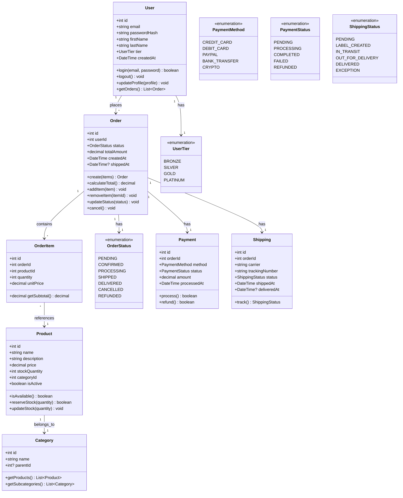
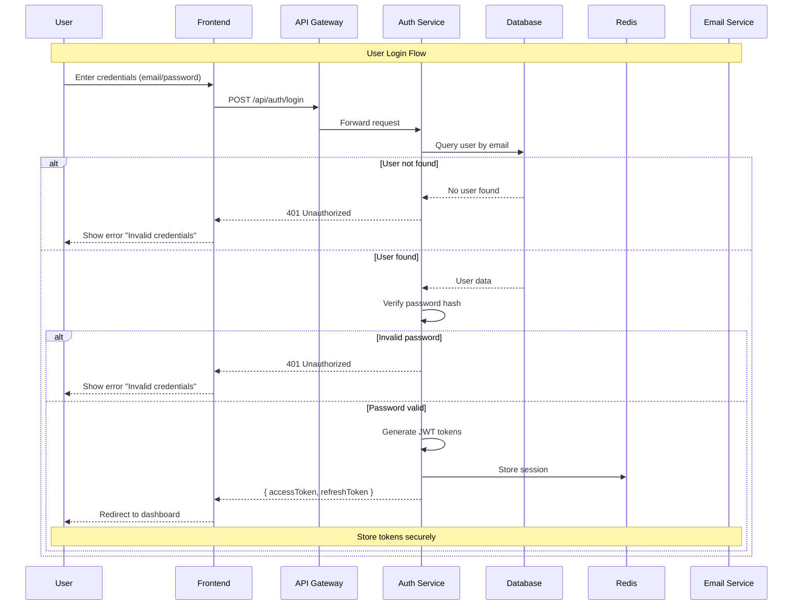
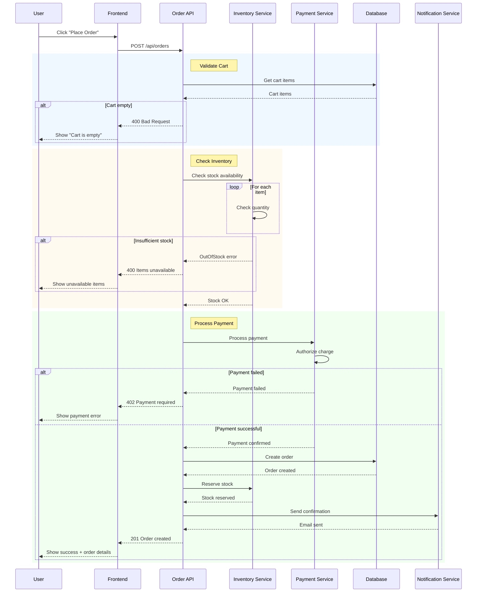
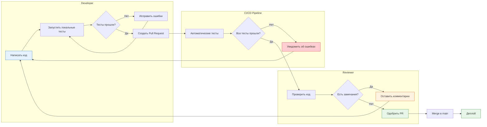
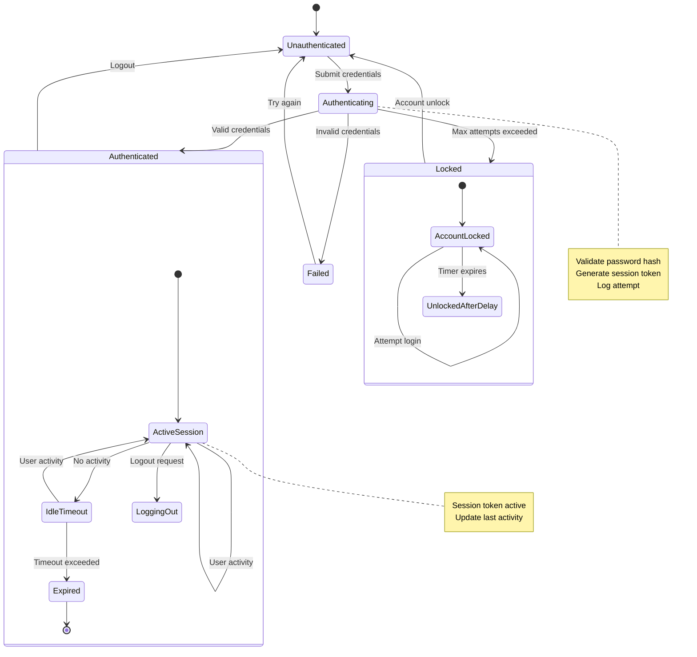
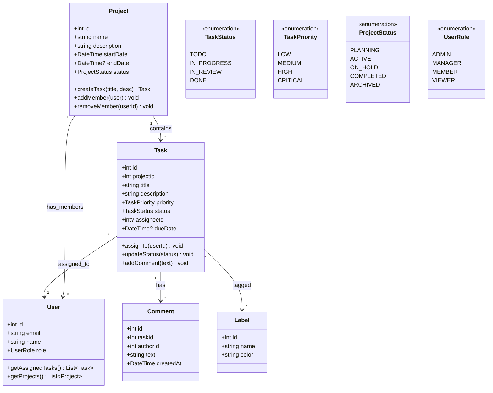
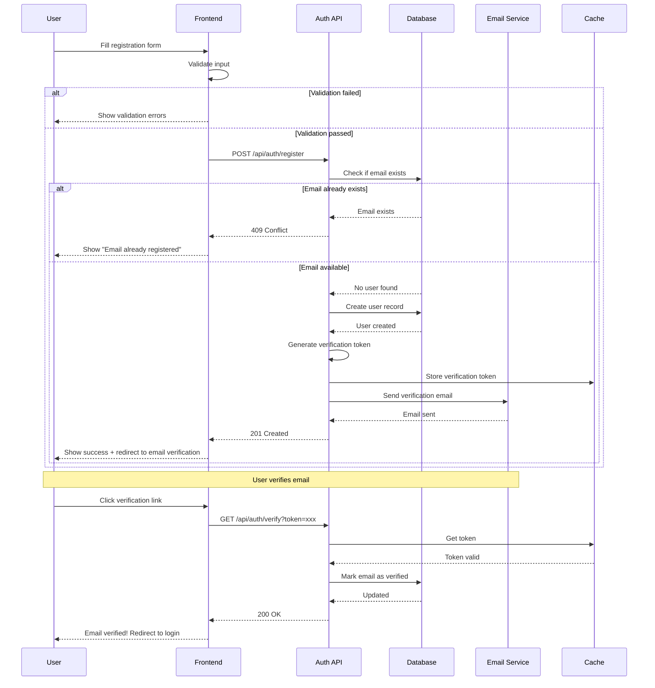
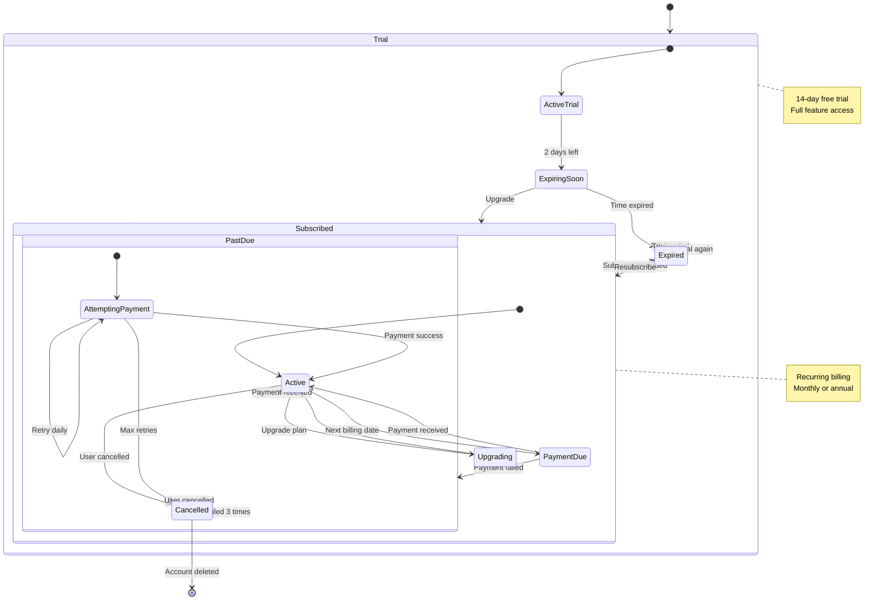

# UML Modeling

> **Meta:** v1.0.0 | 23-02-2026

## Назначение

Навык для создания UML-диаграмм (Unified Modeling Language) — стандартизированного языка моделирования для визуализации, спецификации, проектирования и документирования программных систем.

UML предоставляет множество типов диаграмм, каждая из которых фокусируется на определённом аспекте системы:

- **Structure Diagrams (Структурные диаграммы):** показывают статическую структуру системы
  - Class Diagram, Object Diagram, Component Diagram, Package Diagram, Deployment Diagram
  
- **Behavior Diagrams (Диаграммы поведения):** показывают динамическое поведение системы
  - Use Case Diagram, Activity Diagram, State Machine Diagram
  - Interaction Diagrams (Sequence Diagram, Communication Diagram, Timing Diagram)

Данный навык фокусируется на четырёх ключевых типах диаграмм, наиболее часто используемых при проектировании программных систем.

## Когда использовать

Используйте этот навык:

- При проектировании объектно-ориентированной архитектуры
- Для документирования структуры классов и их отношений
- При необходимости визуализации взаимодействия между компонентами системы
- Для моделирования бизнес-процессов и потоков управления
- При проектировании конечных автоматов (state machines)
- На этапе архитектурного проектирования (Фаза 5 SDLC)
- Для онбординга новых членов команды
- При подготовке технической документации для Project Manager
- Для коммуникации архитектурных решений со стейкхолдерами

## Функции

### Class Diagrams

Диаграмма классов — основа объектно-ориентированного проектирования. Показывает статическую структуру системы в виде классов, их атрибутов, методов и отношений между ними.

**Основные элементы:**

| Элемент | Описание | Обозначение |
|---------|----------|-------------|
| Класс | Базовый элемент с атрибутами и методами | Прямоугольник с тремя секциями |
| Interface | Контракт без реализации | `<<interface>>` стереотип |
| Enumeration | Набор констант | `<<enumeration>>` стереотип |
| Abstract Class | Класс с абстрактными методами | Курсивное название |
| Visibility | Область видимости | `+` public, `-` private, `#` protected, `~` package |

**Типы отношений:**

| Тип | Описание | Обозначение Mermaid |
|-----|----------|---------------------|
| Association | Простая связь | `<--`, `-->` |
| Aggregation | "часть-целое" (has-a), не владеет | `o--` |
| Composition | "часть-целое" (owns-a), полностью владеет | `*--` |
| Inheritance | Наследование | `--\|>` |
| Realization | Реализация интерфейса | `..\|>` |
| Dependency | Зависимость | `<..`, `..>` |

**Пример Class Diagram для E-commerce системы:**



**Рекомендации по Class Diagrams:**

1. Начинайте с основных сущностей домена
2. Показывайте только публичные методы (контракт класса)
3. Используйте интерфейсы для абстракций
4. Применяйте правильные типы отношений (агрегация vs композиция)
5. Обозначайте multiplicity (1, *, 0..1, 1..*)
6. Используйте enums для фиксированных наборов значений

---

### Sequence Diagrams

Диаграмма последовательности показывает взаимодействие объектов во времени. Особенно полезна для визуализации сценариев использования и потоков данных.

**Основные элементы:**

| Элемент | Описание | Обозначение |
|---------|----------|-------------|
| Participant | Участник взаимодействия | Объект, актер или компонент |
| Lifeline | Вертикальная линия жизни | Пунктирная линия вниз |
| Message | Сообщение между участниками | Горизонтальная стрелка |
| Activation Bar | Блок активации | Прямоугольник на lifeline |
| Return Message | Возврат результата | Пунктирная стрелка |
| Self Message | Вызов самого себя | Стрелка к себе |
| Found Message | Входящее асинхронное | Стрелка от начала |
| Lost Message | Исходящее асинхронное | Стрелка к концу |

**Типы сообщений:**

| Тип | Описание | Обозначение Mermaid |
|-----|----------|---------------------|
| Synchronous | Синхронный вызов (ждёт ответа) | `->>` |
| Asynchronous | Асинхронный вызов (не ждёт) | `-->>` |
| Return | Возврат значения | `-->` |
| Dotted | Информационный | `-.->` |

**Фрагменты взаимодействия:**

| Фрагмент | Описание | Обозначение |
|----------|----------|-------------|
| alt | Альтернативные пути | `alt` / `else` / `end` |
| opt | Опциональный путь | `opt` / `end` |
| loop | Повторение | `loop` / `end` |
| par | Параллельное выполнение | `par` / `end` |
| break | Выход из цикла | `break` / `end` |
| ref | Ссылка на другую диаграмму | `ref` |

**Пример Sequence Diagram для аутентификации пользователя:**



**Пример Sequence Diagram с фрагментами (создание заказа):**



**Рекомендации по Sequence Diagrams:**

1. Начинайте с основного сценария (happy path)
2. Добавляйте альтернативные потоки с помощью `alt`
3. Показывайте асинхронные операции пунктирными стрелками
4. Используйте активационные блоки для визуализации занятости
5. Группируйте логические блоки с помощью `rect`
6. Добавляйте примечания для пояснений

---

### Activity Diagrams

Диаграмма деятельности показывает потоки управления и деятельности в системе. Особенно полезна для моделирования бизнес-процессов и рабочих потоков.

**Основные элементы:**

| Элемент | Описание | Обозначение |
|---------|----------|-------------|
| Activity | Деятельность (процесс) | Скруглённый прямоугольник |
| Action | Действие (атомарная операция) | Прямоугольник |
| Start/End | Начало/конец | Круг / Двойной круг |
| Decision | Условие (ветвление) | Ромб |
| Merge | Слияние ветвей | Ромб |
| Fork | Параллельное разветвление | Чёрная черта |
| Join | Синхронизация параллельных ветвей | Чёрная черта |
| Swimlane | Дорожка (участник) | Вертикальные секции |
| Object Flow | Поток объектов | Стрелка с пунктиром |

**Пример Activity Diagram для обработки заказа:**

```mermaid
flowchart TD
    subgraph "Customer"
        A1([Начало: Клиент оформляет заказ]) --> A2[Выбор товаров]
        A2 --> A3{Товары в наличии?}
        A3 -->|Да| A4[Добавление в корзину]
        A3 -->|Нет| A5[Уведомление о недоступности]
        A5 --> A2
    end
    
    A4 --> A6[Переход к оформлению]
    
    subgraph "Checkout Process"
        A6 --> A7[Ввод данных доставки]
        A7 --> A8[Выбор способа оплаты]
        A8 --> A9[Ввод платёжных данных]
    end
    
    A9 --> A10{Валидация данных?}
    
    rect rgb(255, 240, 240)
        A10 -->|Ошибка| A11[Показать ошибки валидации]
        A11 --> A7
    end
    
    A10 -->|Успех| A12[Подтверждение заказа]
    
    subgraph "Payment Processing"
        A12 --> A13[Обработка платежа]
        A13 --> A14{Платёж успешен?}
        
        rect rgb(255, 240, 240)
            A14 -->|Нет| A15[Уведомление об ошибке]
            A15 --> A8
        end
    end
    
    A14 -->|Да| A16[Создание заказа в БД]
    A16 --> A17[Резервирование товара]
    A17 --> A18[Отправка email подтверждения]
    A18 --> A19([Конец: Заказ оформлен])
    
    style A1 fill:#e3f2fd,stroke:#1565c0
    style A19 fill:#e8f5e9,stroke:#2e7d32
    style A3 fill:#fff3e0,stroke:#e65100
    style A10 fill:#fff3e0,stroke:#e65100
    style A14 fill:#fff3e0,stroke:#e65100
    style A13 fill:#f3e5f5,stroke:#7b1fa2
    style A16 fill:#f3e5f5,stroke:#7b1fa2
```

**Пример Activity Diagram с Swimlanes (процесс ревью кода):**



**Рекомендации по Activity Diagrams:**

1. Используйте swimlanes для разделения ответственности
2. Применяйте решения (ромбы) для ветвления логики
3. Используйте fork/join для параллельных потоков
4. Добавляйте начальное и конечное состояния
5. Группируйте связанные действия в подграфы
6. Используйте цвета для визуального разделения этапов

---

### State Machine Diagrams

Диаграмма состояний (State Machine) показывает состояния объекта и переходы между ними. Особенно полезна для моделирования поведения объектов с конечным набором состояний.

**Основные элементы:**

| Элемент | Описание | Обозначение |
|---------|----------|-------------|
| Initial State | Начальное состояние | Залитый круг |
| Final State | Конечное состояние | Двойной залитый круг |
| State | Состояние | Прямоугольник со скруглёнными углами |
| Transition | Переход | Стрелка между состояниями |
| Event | Событие (триггер перехода) | Надпись на стрелке |
| Guard Condition | Условие перехода | `[condition]` на стрелке |
| Action | Действие при переходе | `/ action` на стрелке |

**Типы действий:**

| Тип | Описание | Обозначение |
|-----|----------|-------------|
| Entry | Действие при входе в состояние | `entry / action` |
| Exit | Действие при выходе | `exit / action` |
| Do | Действие внутри состояния | `do / action` |
| Transition | Действие при переходе | `event / action` |

**Пример State Machine Diagram для жизненного цикла заказа:**

```mermaid
stateDiagram-v2
    [*] --> Draft: Create Order
    
    state Draft {
        [*] --> NewDraft
        NewDraft --> Editing: Add Items
        Editing --> NewDraft: Remove All
        Editing --> Submitted: Submit Order
        Submitted --> Editing: Cancel Submit
        NewDraft --> [*]: Abandon
    }
    
    Submitted --> Confirmed: Confirm
    Submitted --> Cancelled: Cancel
    
    state Confirmed {
        [*] --> PaymentPending
        PaymentPending --> Processing: Payment Received
        PaymentPending --> Cancelled: Payment Failed
        Processing --> Shipped: Ship Order
    }
    
    state Shipped {
        [*] --> InTransit
        InTransit --> OutForDelivery: Arrived at Local Hub
        OutForDelivery --> Delivered: Delivered
        OutForDelivery --> Exception: Delivery Failed
    }
    
    Delivered --> [*]: Complete
    
    state Exception {
        [*] --> AttemptingRetry
        AttemptingRetry --> AttemptingRetry: Retry Delivery
        AttemptingRetry --> ReturnToSender: Max Retries
        ReturnToSender --> Refunded: Refund Complete
        Exception --> Delivered: Successfully Resolved
    }
    
    Cancelled --> Refunded: Process Refund
    Refunded --> [*]
    
    note right of Delivered
        Order lifecycle complete
        Customer can leave review
    end note
```

**Пример State Machine Diagram для конечного автомата (лифт):**

```mermaid
stateDiagram-v2
    [*] --> Idle
    
    Idle --> MovingUp: / Close doors
    MovingUp --> MovingUp: Floor button pressed
    MovingUp --> Arriving: Reached floor
    Arriving --> Idle: / Open doors
    
    Idle --> MovingDown: / Close doors
    MovingDown --> MovingDown: Floor button pressed
    MovingDown --> Arriving: Reached floor
    Arriving --> Idle: / Open doors
    
    state Arriving {
        [*] --> Arriving
        Arriving: entry / stop motor
        Arriving: exit / start motor
    }
    
    note right of Idle
        Waiting for requests
        Doors can open/close
    end note
    
    note right of MovingUp
        Motor running upward
        Cannot change direction
    end note
```

**Пример State Machine Diagram для аутентификации:**



**Рекомендации по State Machine Diagrams:**

1. Определите все возможные состояния объекта
2. Идентифицируйте события, вызывающие переходы
3. Добавьте guard conditions для условных переходов
4. Определите действия при входе/выходе/переходе
5. Проверьте, что каждое состояние достижимо
6. Используйте подсостояния для сложных машин
7. Документируйте неочевидные переходы

## Интеграция с Project Manager

### Данные для Project Manager

Навык предоставляет следующие данные для планирования:

**Количественные метрики:**

| Метрика | Описание |
|---------|----------|
| Количество классов | Общее число классов в диаграмме |
| Количество интерфейсов | Число интерфейсов и контрактов |
| Количество состояний | Число состояний в state machine |
| Количество сценариев | Число вариантов использования (sequence) |
| Сложность отношений | Число связей между классами |

**Оценка сложности:**

| Сложность | Классы | Состояния | Sequence Steps | Оценка времени |
|-----------|--------|-----------|----------------|----------------|
| Простая | 1-5 | 2-4 | 3-5 | 4-8 часов |
| Средняя | 6-15 | 5-8 | 5-10 | 8-24 часа |
| Сложная | 16-30 | 9-15 | 10-20 | 24-48 часов |
| Очень сложная | 30+ | 15+ | 20+ | 48-80 часов |

**Данные для оценки проекта:**

| Данные | Использование PM |
|--------|------------------|
| Структура классов | Оценка объёма работ по разработке |
| Зависимости между классами | Планирование модульной разработки |
| State diagrams | Оценка сложности бизнес-логики |
| Sequence diagrams | Оценка интеграционных работ |
| Activity flows | Планирование тестирования |

**Архитектурные решения:**

| Решение | Влияние |
|---------|---------|
| Architecture Pattern | MVC, MVVM, DDD влияют на структуру классов |
| Инкапсуляция | Visibility модификаторы влияют на тестирование |
| Композиция vs Наследование | Влияет на гибкость системы |
| State Management | Выбор паттерна влияет на сложность state machine |

**Риски проектирования:**

| Риск | Вероятность | Влияние | Митигация |
|------|-------------|---------|-----------|
| Слишком много классов | Средняя | Среднее | Использовать композицию |
| Глубокое наследование | Высокая | Высокое | Предпочитать композицию |
| Сложные state machines | Средняя | Высокое | Декомпозиция на подмашины |
| Неполные sequence diagrams | Средняя | Среднее | Итеративное уточнение |

### Взаимодействие

- PM запрашивает UML диаграммы для документирования архитектуры
- SA создаёт диаграммы для визуализации системы
- PM использует метрики для оценки сложности и планирования
- SA предоставляет обновлённые диаграммы при изменении архитектуры

## Инструменты для UML

### Рекомендуемые инструменты

| Инструмент | Тип | Плюсы | Минусы |
|------------|-----|-------|--------|
| **Mermaid** | Онлайн/VSCode | Встроенная поддержка, простота | Ограниченные возможности |
| **PlantUML** | Онлайн/IDE | Мощный, все типы UML | Сложный синтаксис |
| **draw.io** | Онлайн/Desktop | Визуальный редактор | Ручная работа |
| **StarUML** | Desktop | Профессиональный инструмент | Платный |
| **Visual Paradigm** | SaaS/Desktop | Полная поддержка UML | Платный |

### Mermaid в VSCode

Для работы с Mermaid диаграммами в VSCode:

1. Установите расширение **Mermaid Preview**
2. Создайте файл с расширением `.mmd` или используйте кодовые блоки
3. Используйте команду **Mermaid: Export** для экспорта

## Примеры использования

### Пример 1: Class Diagram для Domain Model (система управления задачами)



### Пример 2: Sequence Diagram для регистрации пользователя



### Пример 3: Activity Diagram для процесса онбординга сотрудника

```mermaid
flowchart TD
    subgraph "HR Process"
        A1([Начало: Новый сотрудник принят]) --> A2[Создание учётной записи]
        A2 --> A3[Настройка email]
        A3 --> A4[Выдача оборудования]
        A4 --> A5[Назначение ментора]
    end
    
    A5 --> A6[Согласование документов]
    
    subgraph "Documentation"
        A6 --> A7[Подписание договора]
        A7 --> A8[Подписание NDA]
        A8 --> A9[Заполнение анкеты]
        A9 --> A10[Согласование графика]
    end
    
    A10 --> A11{Документы в порядке?}
    
    rect rgb(255, 240, 240)
        A11 -->|Нет| A12[Запросить недостающие]
        A12 --> A6
    end
    
    A11 -->|Да| A13[Создание профиля в системе]
    
    subgraph "IT Setup"
        A13 --> A14[Доступ к почте]
        A14 --> A15[Доступ к Slack/Teams]
        A15 --> A16[Доступ к GitHub/Jira]
        A16 --> A17[Доступ к корпоративным системам]
    end
    
    A17 --> A18[Настройка рабочего места]
    A18 --> A19[Инструктаж по безопасности]
    A19 --> A20[Первый день работы]
    A20 --> A21([Конец: Онбординг завершён])
    
    style A1 fill:#e3f2fd,stroke:#1565c0
    style A21 fill:#e8f5e9,stroke:#2e7d32
    style A11 fill:#fff3e0,stroke:#e65100
    style A12 fill:#ffcdd2,stroke:#c62828
```

### Пример 4: State Machine Diagram для статуса подписки



## Best Practices

### Принципы UML моделирования

1. **Выбирайте правильный тип диаграммы:** Не пытайтесь показать всё на одной диаграмме
2. **Начинайте с высокого уровня:** Создавайте overview перед детализацией
3. **Поддерживайте актуальность:** Обновляйте диаграммы при изменении кода
4. **Используйте стандартные обозначения:** Следуйте UML спецификации
5. **Добавляйте документацию:** Комментируйте сложные элементы
6. **Итеративно уточняйте:** Начинайте с простого, добавляйте детали

### Чек-лист для диаграмм

- [ ] Название диаграммы описательное
- [ ] Все элементы помечены и имеют значения
- [ ] Отношения имеют правильные типы
- [ ] Multiplicity указаны (где применимо)
- [ ] Начальное и конечное состояния присутствуют
- [ ] Легенда добавлена (при необходимости)
- [ ] Диаграмма помещается на одном экране

### Выбор типа диаграммы

| Задача | Рекомендуемая диаграмма |
|--------|------------------------|
| Показать структуру классов | Class Diagram |
| Показать взаимодействие во времени | Sequence Diagram |
| Показать бизнес-процесс | Activity Diagram |
| Показать поведение объекта | State Machine Diagram |
| Показать архитектуру системы | C4 (Container/Component) |
| Показать варианты использования | Use Case Diagram |

## Связанные навыки

- **c4-architecture** — для моделирования архитектуры на уровне контейнеров и компонентов
- **data-modeling** — для проектирования схем данных и ERD
- **bpmn-modeling** — для моделирования бизнес-процессов в нотации BPMN
- **workflow-design** — для проектирования рабочих процессов и автоматизации
- **api-design** — для проектирования API взаимодействий

---

*Навык разработан в рамках Фазы 5 SDLC для System Analyst*
