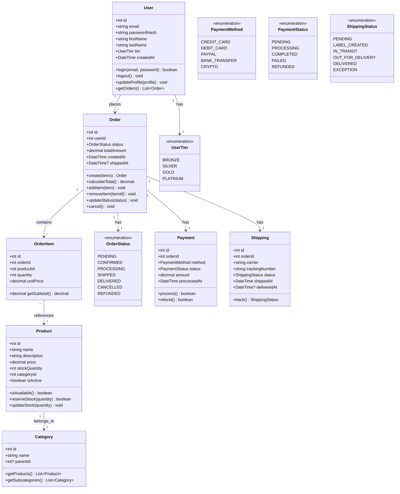
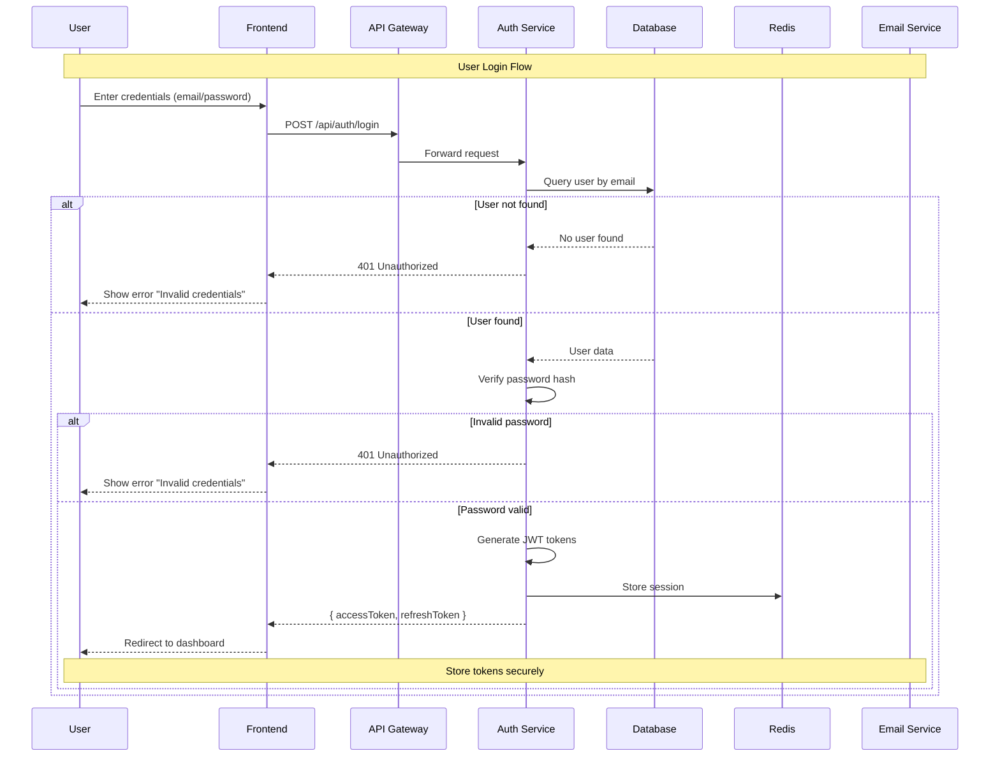
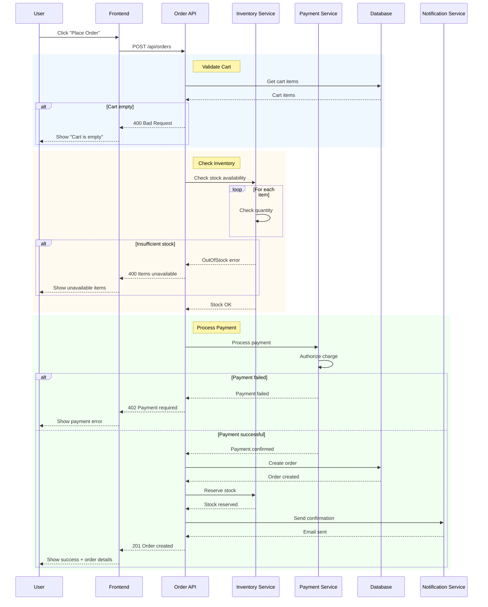
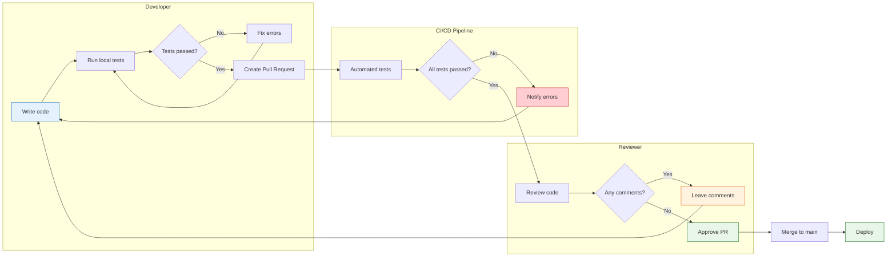
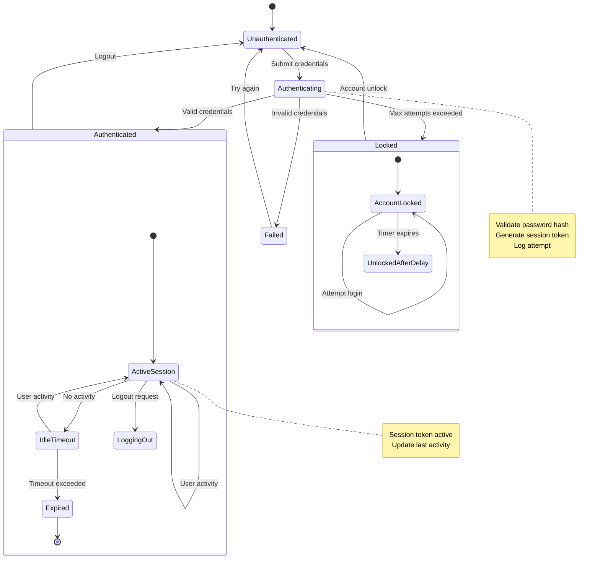
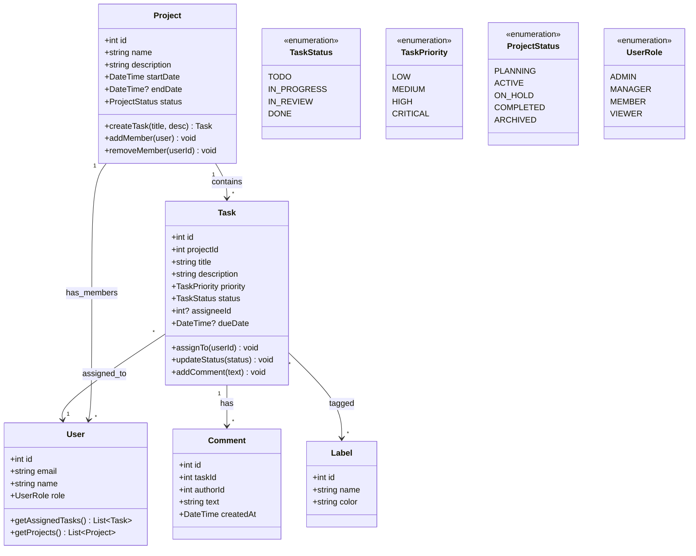
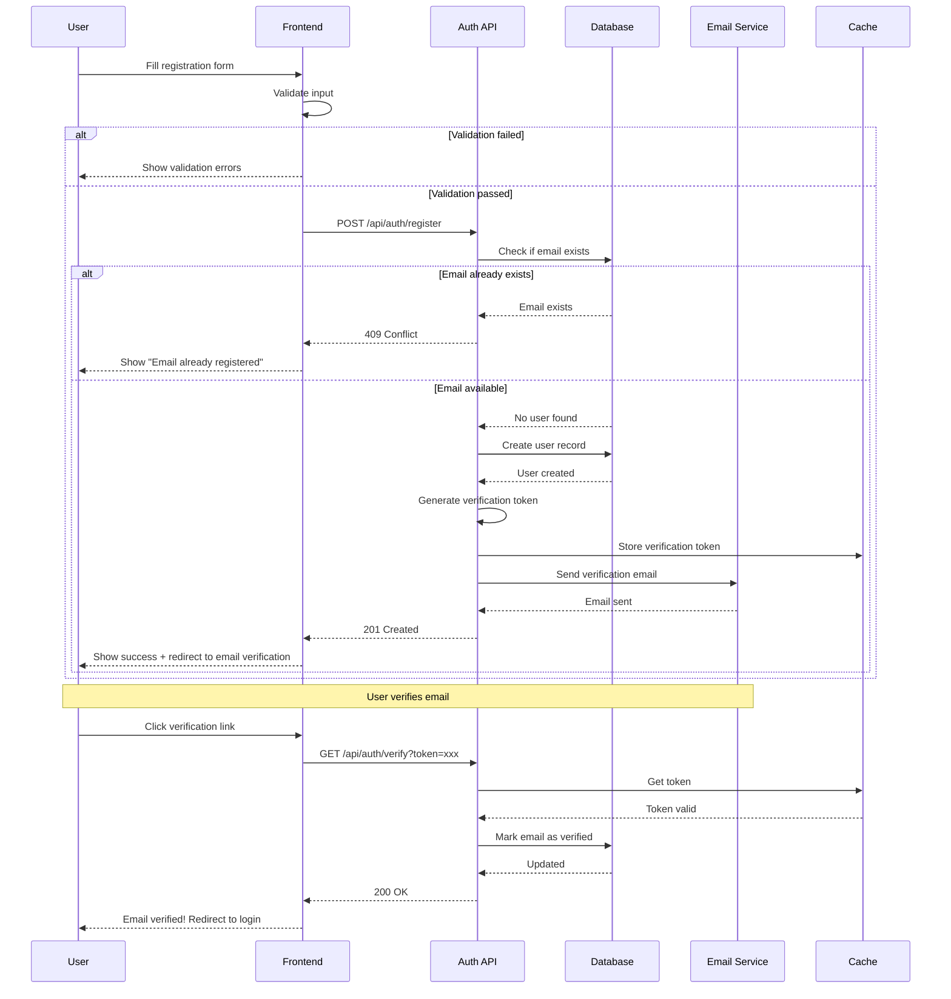
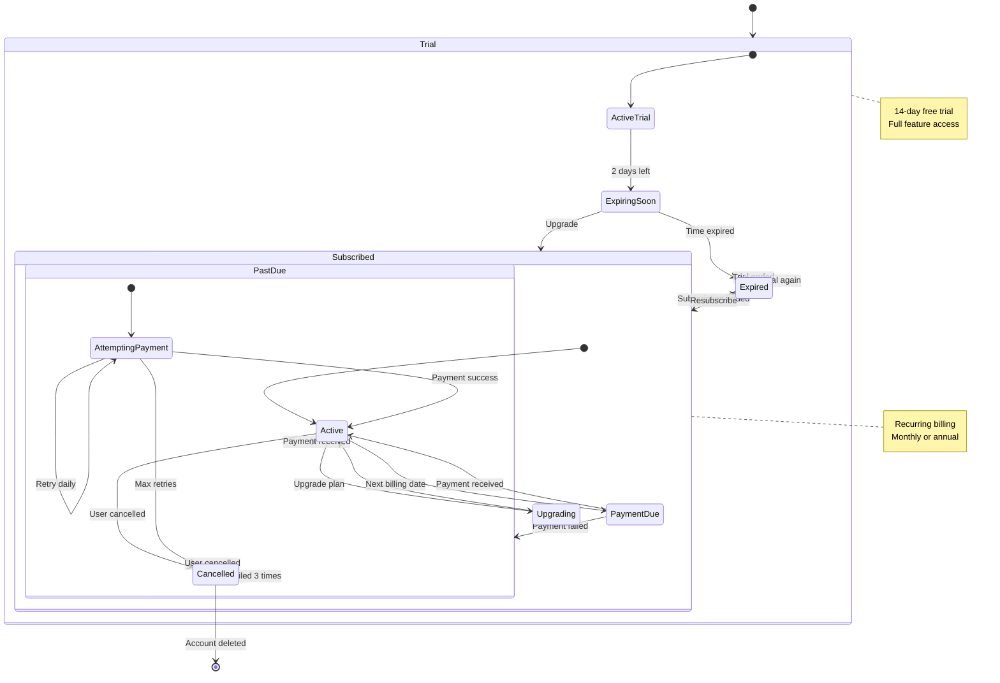

# UML Modeling

> **Meta:** v1.0.0 | 23-02-2026

## Purpose

Skill for creating UML diagrams (Unified Modeling Language) — a standardized modeling language for visualizing, specifying, designing, and documenting software systems.

UML provides many types of diagrams, each focusing on a specific aspect of the system:

- **Structure Diagrams:** Show the static structure of the system
  - Class Diagram, Object Diagram, Component Diagram, Package Diagram, Deployment Diagram
  
- **Behavior Diagrams:** Show the dynamic behavior of the system
  - Use Case Diagram, Activity Diagram, State Machine Diagram
  - Interaction Diagrams (Sequence Diagram, Communication Diagram, Timing Diagram)

This skill focuses on four key diagram types most commonly used in software system design.

## When to Use

Use this skill:

- When designing object-oriented architecture
- For documenting class structure and their relationships
- When visualizing interaction between system components
- For modeling business processes and control flows
- When designing finite state machines
- At the architecture design phase (Phase 5 SDLC)
- For onboarding new team members
- When preparing technical documentation for Project Manager
- For communicating architectural decisions with stakeholders

## Functions

### Class Diagrams

Class diagram is the foundation of object-oriented design. Shows the static structure of the system in the form of classes, their attributes, methods, and relationships between them.

**Main Elements:**

| Element | Description | Notation |
|---------|-------------|----------|
| Class | Basic element with attributes and methods | Rectangle with three sections |
| Interface | Contract without implementation | `<<interface>>` stereotype |
| Enumeration | Set of constants | `<<enumeration>>` stereotype |
| Abstract Class | Class with abstract methods | Italic name |
| Visibility | Scope | `+` public, `-` private, `#` protected, `~` package |

**Relationship Types:**

| Type | Description | Mermaid Notation |
|------|-------------|---------------------|
| Association | Simple connection | `<--`, `-->` |
| Aggregation | "part-whole" (has-a), doesn't own | `o--` |
| Composition | "part-whole" (owns-a), fully owns | `*--` |
| Inheritance | Inheritance | `--|>` |
| Realization | Interface implementation | `..|>` |
| Dependency | Dependency | `<..`, `..>` |

**Example Class Diagram for E-commerce System:**

```mermaid
classDiagram
    class User {
        +int id
        +string email
        +string passwordHash
        +string firstName
        +string lastName
        +UserTier tier
        +DateTime createdAt
        +login(email, password) boolean
        +logout() void
        +updateProfile(profile) void
        +getOrders() List~Order~
    }
    
    class Order {
        +int id
        +int userId
        +OrderStatus status
        +decimal totalAmount
        +DateTime createdAt
        +DateTime? shippedAt
        +create(items) Order
        +calculateTotal() decimal
        +addItem(item) void
        +removeItem(itemId) void
        +updateStatus(status) void
        +cancel() void
    }
    
    class OrderItem {
        +int id
        +int orderId
        +int productId
        +int quantity
        +decimal unitPrice
        +decimal getSubtotal() decimal
    }
    
    class Product {
        +int id
        +string name
        +string description
        +decimal price
        +int stockQuantity
        +int categoryId
        +boolean isActive
        +isAvailable() boolean
        +reserveStock(quantity) boolean
        +updateStock(quantity) void
    }
    
    class Category {
        +int id
        +string name
        +int? parentId
        +getProducts() List~Product~
        +getSubcategories() List~Category~
    }
    
    class UserTier {
        <<enumeration>>
        BRONZE
        SILVER
        GOLD
        PLATINUM
    }
    
    class OrderStatus {
        <<enumeration>>
        PENDING
        CONFIRMED
        PROCESSING
        SHIPPED
        DELIVERED
        CANCELLED
        REFUNDED
    }
    
    User "1" --> "*" Order : places
    Order "1" --> "*" OrderItem : contains
    OrderItem "*" --> "1" Product : references
    Product "1" --> "1" Category : belongs_to
    Order "1" --> "1" OrderStatus : has
    User "1" --> "1" UserTier : has
    
    class Payment {
        +int id
        +int orderId
        +PaymentMethod method
        +PaymentStatus status
        +decimal amount
        +DateTime processedAt
        +process() boolean
        +refund() boolean
    }
    
    class Shipping {
        +int id
        +int orderId
        +string carrier
        +string trackingNumber
        +ShippingStatus status
        +DateTime shippedAt
        +DateTime? deliveredAt
        +track() ShippingStatus
    }
    
    Order "1" --> "1" Payment : has
    Order "1" --> "1" Shipping : has
    
    class PaymentMethod {
        <<enumeration>>
        CREDIT_CARD
        DEBIT_CARD
        PAYPAL
        BANK_TRANSFER
        CRYPTO
    }
    
    class PaymentStatus {
        <<enumeration>>
        PENDING
        PROCESSING
        COMPLETED
        FAILED
        REFUNDED
    }
    
    class ShippingStatus {
        <<enumeration>>
        PENDING
        LABEL_CREATED
        IN_TRANSIT
        OUT_FOR_DELIVERY
        DELIVERED
        EXCEPTION
    }
```

**Class Diagram Recommendations:**

1. Start with main domain entities
2. Show only public methods (class contract)
3. Use interfaces for abstractions
4. Apply correct relationship types (aggregation vs composition)
5. Indicate multiplicity (1, *, 0..1, 1..*)
6. Use enums for fixed value sets

---

### Sequence Diagrams

Sequence diagram shows object interaction over time. Especially useful for visualizing use cases and data flows.

**Main Elements:**

| Element | Description | Notation |
|---------|-------------|----------|
| Participant | Interaction participant | Object, actor, or component |
| Lifeline | Vertical life line | Dashed line down |
| Message | Message between participants | Horizontal arrow |
| Activation Bar | Activation block | Rectangle on lifeline |
| Return Message | Return result | Dashed arrow |
| Self Message | Self-call | Arrow to self |
| Found Message | Incoming asynchronous | Arrow from start |
| Lost Message | Outgoing asynchronous | Arrow to end |

**Message Types:**

| Type | Description | Mermaid Notation |
|------|-------------|---------------------|
| Synchronous | Synchronous call (waits for response) | `->>` |
| Asynchronous | Asynchronous call (doesn't wait) | `-->>` |
| Return | Return value | `-->` |
| Dotted | Informational | `-.->` |

**Interaction Fragments:**

| Fragment | Description | Notation |
|----------|-------------|----------|
| alt | Alternative paths | `alt` / `else` / `end` |
| opt | Optional path | `opt` / `end` |
| loop | Repetition | `loop` / `end` |
| par | Parallel execution | `par` / `end` |
| break | Exit from loop | `break` / `end` |
| ref | Reference to another diagram | `ref` |

**Example Sequence Diagram for User Authentication:**

```mermaid
sequenceDiagram
    participant U as User
    participant FE as Frontend
    participant API as API Gateway
    participant Auth as Auth Service
    participant DB as Database
    participant Cache as Redis
    participant Email as Email Service
    
    Note over U,Email: User Login Flow
    
    U->>FE: Enter credentials (email/password)
    FE->>API: POST /api/auth/login
    API->>Auth: Forward request
    Auth->>DB: Query user by email
    
    alt User not found
        DB-->>Auth: No user found
        Auth-->>FE: 401 Unauthorized
        FE-->>U: Show error "Invalid credentials"
    
    else User found
        DB-->>Auth: User data
        Auth->>Auth: Verify password hash
        
        alt Invalid password
            Auth-->>FE: 401 Unauthorized
            FE-->>U: Show error "Invalid credentials"
        
        else Password valid
            Auth->>Auth: Generate JWT tokens
            Auth->>Cache: Store session
            Auth-->>FE: { accessToken, refreshToken }
            FE-->>U: Redirect to dashboard
            
            Note over U,Email: Store tokens securely
        end
    end
```

**Example Sequence Diagram with Fragments (Order Creation):**

```mermaid
sequenceDiagram
    participant U as User
    participant FE as Frontend
    participant API as Order API
    participant Inv as Inventory Service
    participant Pay as Payment Service
    participant DB as Database
    participant Notif as Notification Service
    
    U->>FE: Click "Place Order"
    FE->>API: POST /api/orders
    
    rect rgb(240, 248, 255)
        note right of API: Validate Cart
        API->>DB: Get cart items
        DB-->>API: Cart items
        alt Cart empty
            API-->>FE: 400 Bad Request
            FE-->>U: Show "Cart is empty"
        end
    end
    
    rect rgb(255, 250, 240)
        note right of API: Check Inventory
        API->>Inv: Check stock availability
        loop For each item
            Inv->>Inv: Check quantity
        end
        alt Insufficient stock
            Inv-->>API: OutOfStock error
            API-->>FE: 400 Items unavailable
            FE-->>U: Show unavailable items
        end
        Inv-->>API: Stock OK
    end
    
    rect rgb(240, 255, 240)
        note right of API: Process Payment
        API->>Pay: Process payment
        Pay->>Pay: Authorize charge
        
        alt Payment failed
            Pay-->>API: Payment failed
            API-->>FE: 402 Payment required
            FE-->>U: Show payment error
        
        else Payment successful
            Pay-->>API: Payment confirmed
            API->>DB: Create order
            DB-->>API: Order created
            
            API->>Inv: Reserve stock
            Inv-->>API: Stock reserved
            
            API->>Notif: Send confirmation
            Notif-->>API: Email sent
            
            API-->>FE: 201 Order created
            FE-->>U: Show success + order details
        end
    end
```

**Sequence Diagram Recommendations:**

1. Start with the main scenario (happy path)
2. Add alternative flows using `alt`
3. Show asynchronous operations with dashed arrows
4. Use activation blocks to visualize busyness
5. Group logical blocks using `rect`
6. Add notes for explanations

---

### Activity Diagrams

Activity diagram shows control flows and activities in the system. Especially useful for modeling business processes and workflows.

**Main Elements:**

| Element | Description | Notation |
|---------|-------------|----------|
| Activity | Activity (process) | Rounded rectangle |
| Action | Action (atomic operation) | Rectangle |
| Start/End | Start/end | Circle / Double circle |
| Decision | Condition (branching) | Diamond |
| Merge | Branch merging | Diamond |
| Fork | Parallel branching | Black bar |
| Join | Parallel branch synchronization | Black bar |
| Swimlane | Lane (participant) | Vertical sections |
| Object Flow | Object flow | Dashed arrow |

**Example Activity Diagram for Order Processing:**

```mermaid
flowchart TD
    subgraph "Customer"
        A1([Start: Customer places order]) --> A2[Select products]
        A2 --> A3{Products available?}
        A3 -->|Yes| A4[Add to cart]
        A3 -->|No| A5[Notify unavailability]
        A5 --> A2
    end
    
    A4 --> A6[Proceed to checkout]
    
    subgraph "Checkout Process"
        A6 --> A7[Enter delivery details]
        A7 --> A8[Select payment method]
        A8 --> A9[Enter payment details]
    end
    
    A9 --> A10{Data validation?}
    
    rect rgb(255, 240, 240)
        A10 -->|Error| A11[Show validation errors]
        A11 --> A7
    end
    
    A10 -->|Success| A12[Confirm order]
    
    subgraph "Payment Processing"
        A12 --> A13[Process payment]
        A13 --> A14{Payment successful?}
        
        rect rgb(255, 240, 240)
            A14 -->|No| A15[Notify error]
            A15 --> A8
        end
    end
    
    A14 -->|Yes| A16[Create order in DB]
    A16 --> A17[Reserve inventory]
    A18 --> A19[Send confirmation email]
    A18 --> A19([End: Order placed])
    
    style A1 fill:#e3f2fd,stroke:#1565c0
    style A19 fill:#e8f5e9,stroke:#2e7d32
    style A3 fill:#fff3e0,stroke:#e65100
    style A10 fill:#fff3e0,stroke:#e65100
    style A14 fill:#fff3e0,stroke:#e65100
    style A13 fill:#f3e5f5,stroke:#7b1fa2
    style A16 fill:#f3e5f5,stroke:#7b1fa2
```

**Example Activity Diagram with Swimlanes (Code Review Process):**

```mermaid
flowchart LR
    subgraph Developer
        D1[Write code] --> D2[Run local tests]
        D2 --> D3{Tests passed?}
        D3 -->|No| D4[Fix errors]
        D4 --> D2
        D3 -->|Yes| D5[Create Pull Request]
    end
    
    subgraph "CI/CD Pipeline"
        D5 --> CI1[Automated tests]
        CI1 --> CI2{All tests passed?}
        CI2 -->|No| CI3[Notify errors]
        CI3 --> D1
    end
    
    subgraph Reviewer
        CI2 -->|Yes| R1[Review code]
        R1 --> R2{Any comments?}
        R2 -->|Yes| R3[Leave comments]
        R3 --> D1
        R2 -->|No| R4[Approve PR]
    end
    
    R4 --> M1[Merge to main]
    M1 --> M2[Deploy]
    
    style D1 fill:#e3f2fd,stroke:#1565c0
    style R4 fill:#e8f5e9,stroke:#2e7d32
    style M2 fill:#e8f5e9,stroke:#2e7d32
    style R3 fill:#fff3e0,stroke:#e65100
    style CI3 fill:#ffcdd2,stroke:#c62828
```

**Activity Diagram Recommendations:**

1. Use swimlanes to separate responsibilities
2. Apply decisions (diamonds) for logic branching
3. Use fork/join for parallel flows
4. Add initial and final states
5. Group related actions into subgraphs
6. Use colors for visual separation of stages

---

### State Machine Diagrams

State Machine diagram shows object states and transitions between them. Especially useful for modeling behavior of objects with a finite set of states.

**Main Elements:**

| Element | Description | Notation |
|---------|-------------|----------|
| Initial State | Starting state | Filled circle |
| Final State | Ending state | Double filled circle |
| State | State | Rounded rectangle |
| Transition | Transition | Arrow between states |
| Event | Event (transition trigger) | Label on arrow |
| Guard Condition | Transition condition | `[condition]` on arrow |
| Action | Transition action | `/ action` on arrow |

**Action Types:**

| Type | Description | Notation |
|------|-------------|----------|
| Entry | Action on entering state | `entry / action` |
| Exit | Action on exiting | `exit / action` |
| Do | Action within state | `do / action` |
| Transition | Action on transition | `event / action` |

**Example State Machine Diagram for Order Lifecycle:**

```mermaid
stateDiagram-v2
    [*] --> Draft: Create Order
    
    state Draft {
        [*] --> NewDraft
        NewDraft --> Editing: Add Items
        Editing --> NewDraft: Remove All
        Editing --> Submitted: Submit Order
        Submitted --> Editing: Cancel Submit
        NewDraft --> [*]: Abandon
    }
    
    Submitted --> Confirmed: Confirm
    Submitted --> Cancelled: Cancel
    
    state Confirmed {
        [*] --> PaymentPending
        PaymentPending --> Processing: Payment Received
        PaymentPending --> Cancelled: Payment Failed
        Processing --> Shipped: Ship Order
    }
    
    state Shipped {
        [*] --> InTransit
        InTransit --> OutForDelivery: Arrived at Local Hub
        OutForDelivery --> Delivered: Delivered
        OutForDelivery --> Exception: Delivery Failed
    }
    
    Delivered --> [*]: Complete
    
    state Exception {
        [*] --> AttemptingRetry
        AttemptingRetry --> AttemptingRetry: Retry Delivery
        AttemptingRetry --> ReturnToSender: Max Retries
        ReturnToSender --> Refunded: Refund Complete
        Exception --> Delivered: Successfully Resolved
    }
    
    Cancelled --> Refunded: Process Refund
    Refunded --> [*]
    
    note right of Delivered
        Order lifecycle complete
        Customer can leave review
    end note
```

**Example State Machine Diagram for Finite State Machine (Elevator):**

```mermaid
stateDiagram-v2
    [*] --> Idle
    
    Idle --> MovingUp: / Close doors
    MovingUp --> MovingUp: Floor button pressed
    MovingUp --> Arriving: Reached floor
    Arriving --> Idle: / Open doors
    
    Idle --> MovingDown: / Close doors
    MovingDown --> MovingDown: Floor button pressed
    MovingDown --> Arriving: Reached floor
    Arriving --> Idle: / Open doors
    
    state Arriving {
        [*] --> Arriving
        Arriving: entry / stop motor
        Arriving: exit / start motor
    }
    
    note right of Idle
        Waiting for requests
        Doors can open/close
    end note
    
    note right of MovingUp
        Motor running upward
        Cannot change direction
    end note
```

**Example State Machine Diagram for Authentication:**

```mermaid
stateDiagram-v2
    [*] --> Unauthenticated
    
    Unauthenticated --> Authenticating: Submit credentials
    Authenticating --> Authenticated: Valid credentials
    Authenticating --> Failed: Invalid credentials
    Authenticating --> Locked: Max attempts exceeded
    
    state Authenticated {
        [*] --> ActiveSession
        ActiveSession --> ActiveSession: User activity
        ActiveSession --> IdleTimeout: No activity
        IdleTimeout --> ActiveSession: User activity
        ActiveSession --> LoggingOut: Logout request
        IdleTimeout --> Expired: Timeout exceeded
        Expired --> [*]
    }
    
    Authenticated --> Unauthenticated: Logout
    Failed --> Unauthenticated: Try again
    Locked --> Unauthenticated: Account unlock
    
    state Locked {
        [*] --> AccountLocked
        AccountLocked --> AccountLocked: Attempt login
        AccountLocked --> UnlockedAfterDelay: Timer expires
    }
    
    note right of Authenticating
        Validate password hash
        Generate session token
        Log attempt
    end note
    
    note right of ActiveSession
        Session token active
        Update last activity
    end note
```

**State Machine Diagram Recommendations:**

1. Identify all possible states of the object
2. Identify events that trigger transitions
3. Add guard conditions for conditional transitions
4. Define entry/exit/transition actions
5. Verify that each state is reachable
6. Use substates for complex machines
7. Document non-obvious transitions

## Integration with Project Manager

### Data for Project Manager

The skill provides the following data for planning:

**Quantitative Metrics:**

| Metric | Description |
|--------|-------------|
| Number of classes | Total number of classes in the diagram |
| Number of interfaces | Number of interfaces and contracts |
| Number of states | Number of states in state machine |
| Number of scenarios | Number of use cases (sequence) |
| Relationship complexity | Number of relationships between classes |

**Complexity Estimation:**

| Complexity | Classes | States | Sequence Steps | Time Estimate |
|------------|---------|--------|----------------|---------------|
| Simple | 1-5 | 2-4 | 3-5 | 4-8 hours |
| Medium | 6-15 | 5-8 | 5-10 | 8-24 hours |
| Complex | 16-30 | 9-15 | 10-20 | 24-48 hours |
| Very Complex | 30+ | 15+ | 20+ | 48-80 hours |

**Data for Project Estimation:**

| Data | PM Usage |
|------|----------|
| Class structure | Estimating development effort |
| Class dependencies | Planning modular development |
| State diagrams | Estimating business logic complexity |
| Sequence diagrams | Estimating integration work |
| Activity flows | Planning testing |

**Architectural Decisions:**

| Decision | Impact |
|----------|--------|
| Architecture Pattern | MVC, MVVM, DDD affect class structure |
| Encapsulation | Visibility modifiers affect testing |
| Composition vs Inheritance | Affects system flexibility |
| State Management | Pattern choice affects state machine complexity |

**Design Risks:**

| Risk | Probability | Impact | Mitigation |
|------|-------------|--------|------------|
| Too many classes | Medium | Medium | Use composition |
| Deep inheritance | High | High | Prefer composition |
| Complex state machines | Medium | High | Decompose into submachines |
| Incomplete sequence diagrams | Medium | Medium | Iterative refinement |

### Interaction

- PM requests UML diagrams for documenting architecture
- SA creates diagrams for system visualization
- PM uses metrics for complexity estimation and planning
- SA provides updated diagrams when architecture changes

## UML Tools

### Recommended Tools

| Tool | Type | Pros | Cons |
|------|------|------|------|
| **Mermaid** | Online/VSCode | Built-in support, simple | Limited capabilities |
| **PlantUML** | Online/IDE | Powerful, all UML types | Complex syntax |
| **draw.io** | Online/Desktop | Visual editor | Manual work |
| **StarUML** | Desktop | Professional tool | Paid |
| **Visual Paradigm** | SaaS/Desktop | Full UML support | Paid |

### Mermaid in VSCode

To work with Mermaid diagrams in VSCode:

1. Install the **Mermaid Preview** extension
2. Create a file with `.mmd` extension or use code blocks
3. Use the **Mermaid: Export** command for export

## Usage Examples

### Example 1: Class Diagram for Domain Model (Task Management System)

```mermaid
classDiagram
    class Project {
        +int id
        +string name
        +string description
        +DateTime startDate
        +DateTime? endDate
        +ProjectStatus status
        +createTask(title, desc) Task
        +addMember(user) void
        +removeMember(userId) void
    }
    
    class Task {
        +int id
        +int projectId
        +string title
        +string description
        +TaskPriority priority
        +TaskStatus status
        +int? assigneeId
        +DateTime? dueDate
        +assignTo(userId) void
        +updateStatus(status) void
        +addComment(text) void
    }
    
    class User {
        +int id
        +string email
        +string name
        +UserRole role
        +getAssignedTasks() List~Task~
        +getProjects() List~Project~
    }
    
    class Comment {
        +int id
        +int taskId
        +int authorId
        +string text
        +DateTime createdAt
    }
    
    class Label {
        +int id
        +string name
        +string color
    }
    
    Project "1" --> "*" Task : contains
    Task "*" --> "1" User : assigned_to
    Task "1" --> "*" Comment : has
    Task "*" --> "*" Label : tagged
    Project "1" --> "*" User : has_members
    
    class TaskStatus {
        <<enumeration>>
        TODO
        IN_PROGRESS
        IN_REVIEW
        DONE
    }
    
    class TaskPriority {
        <<enumeration>>
        LOW
        MEDIUM
        HIGH
        CRITICAL
    }
    
    class ProjectStatus {
        <<enumeration>>
        PLANNING
        ACTIVE
        ON_HOLD
        COMPLETED
        ARCHIVED
    }
    
    class UserRole {
        <<enumeration>>
        ADMIN
        MANAGER
        MEMBER
        VIEWER
    }
```

### Example 2: Sequence Diagram for User Registration

```mermaid
sequenceDiagram
    participant U as User
    participant FE as Frontend
    participant API as Auth API
    participant DB as Database
    participant Email as Email Service
    participant Cache as Cache
    
    U->>FE: Fill registration form
    FE->>FE: Validate input
    
    alt Validation failed
        FE-->>U: Show validation errors
    
    else Validation passed
        FE->>API: POST /api/auth/register
        API->>DB: Check if email exists
        
        alt Email already exists
            DB-->>API: Email exists
            API-->>FE: 409 Conflict
            FE-->>U: Show "Email already registered"
        
        else Email available
            DB-->>API: No user found
            API->>DB: Create user record
            DB-->>API: User created
            API->>API: Generate verification token
            API->>Cache: Store verification token
            API->>Email: Send verification email
            Email-->>API: Email sent
            
            API-->>FE: 201 Created
            FE-->>U: Show success + redirect to email verification
        end
    end
    
    Note over U,Email: User verifies email
    U->>FE: Click verification link
    FE->>API: GET /api/auth/verify?token=xxx
    API->>Cache: Get token
    Cache-->>API: Token valid
    API->>DB: Mark email as verified
    DB-->>API: Updated
    API-->>FE: 200 OK
    FE-->>U: Email verified! Redirect to login
```

### Example 3: Activity Diagram for Employee Onboarding Process

```mermaid
flowchart TD
    subgraph "HR Process"
        A1([Start: New employee hired]) --> A2[Create account]
        A2 --> A3[Setup email]
        A3 --> A4[Issue equipment]
        A4 --> A5[Assign mentor]
    end
    
    A5 --> A6[Document approval]
    
    subgraph "Documentation"
        A6 --> A7[Sign contract]
        A7 --> A8[Sign NDA]
        A8 --> A9[Fill questionnaire]
        A9 --> A10[Approve schedule]
    end
    
    A10 --> A11{Documents in order?}
    
    rect rgb(255, 240, 240)
        A11 -->|No| A12[Request missing]
        A12 --> A6
    end
    
    A11 -->|Yes| A13[Create profile in system]
    
    subgraph "IT Setup"
        A13 --> A14[Email access]
        A14 --> A15[Slack/Teams access]
        A15 --> A16[GitHub/Jira access]
        A16 --> A17[Corporate systems access]
    end
    
    A17 --> A18[Setup workplace]
    A18 --> A19[Security briefing]
    A19 --> A20[First day]
    A20 --> A21([End: Onboarding complete])
    
    style A1 fill:#e3f2fd,stroke:#1565c0
    style A21 fill:#e8f5e9,stroke:#2e7d32
    style A11 fill:#fff3e0,stroke:#e65100
    style A12 fill:#ffcdd2,stroke:#c62828
```

### Example 4: State Machine Diagram for Subscription Status

```mermaid
stateDiagram-v2
    [*] --> Trial
    
    state Trial {
        [*] --> ActiveTrial
        ActiveTrial --> ExpiringSoon: 2 days left
        ExpiringSoon --> Expired: Time expired
        ExpiringSoon --> Subscribed: Upgrade
    }
    
    Trial --> Expired: Trial ended
    Trial --> Cancelled: User cancelled
    
    state Subscribed {
        [*] --> Active
        Active --> PaymentDue: Next billing date
        PaymentDue --> Active: Payment received
        PaymentDue --> PastDue: Payment failed
        PastDue --> Active: Payment received
        PastDue --> Cancelled: Payment failed 3 times
        Active --> Cancelled: User cancelled
        Active --> Upgrading: Upgrade plan
        Upgrading --> Active
    }
    
    Subscribed --> Expired: Subscription ended
    Expired --> Trial: Start trial again
    Expired --> Subscribed: Resubscribe
    
    Cancelled --> [*]: Account deleted
    
    state PastDue {
        [*] --> AttemptingPayment
        AttemptingPayment --> AttemptingPayment: Retry daily
        AttemptingPayment --> Cancelled: Max retries
        AttemptingPayment --> Active: Payment success
    }
    
    note right of Trial
        14-day free trial
        Full feature access
    end note
    
    note right of Subscribed
        Recurring billing
        Monthly or annual
    end note
```

## Best Practices

### UML Modeling Principles

1. **Choose the right diagram type:** Don't try to show everything in one diagram
2. **Start with high level:** Create overview before detailing
3. **Keep up to date:** Update diagrams when code changes
4. **Use standard notations:** Follow UML specification
5. **Add documentation:** Comment complex elements
6. **Iteratively refine:** Start simple, add details

### Diagram Checklist

- [ ] Diagram title is descriptive
- [ ] All elements are labeled and have values
- [ ] Relationships have correct types
- [ ] Multiplicity indicated (where applicable)
- [ ] Initial and final states present
- [ ] Legend added (if needed)
- [ ] Diagram fits on one screen

### Diagram Type Selection

| Task | Recommended Diagram |
|------|--------------------|
| Show class structure | Class Diagram |
| Show interaction over time | Sequence Diagram |
| Show business process | Activity Diagram |
| Show object behavior | State Machine Diagram |
| Show system architecture | C4 (Container/Component) |
| Show use cases | Use Case Diagram |

## Related Skills

- **c4-architecture** — for modeling architecture at container and component level
- **data-modeling** — for designing data schemas and ERD
- **bpm-modeling** — for modeling business processes in BPMN notation
- **workflow-design** — for designing workflows and automation
- **api-design** — for designing API interactions

---

*Skill developed as part of Phase 5 SDLC for System Analyst*
