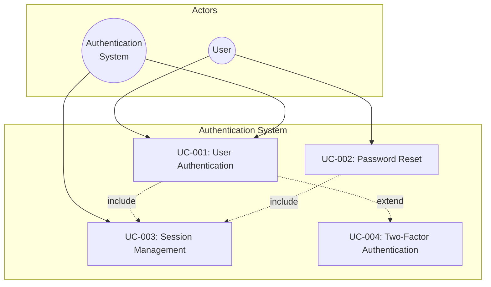
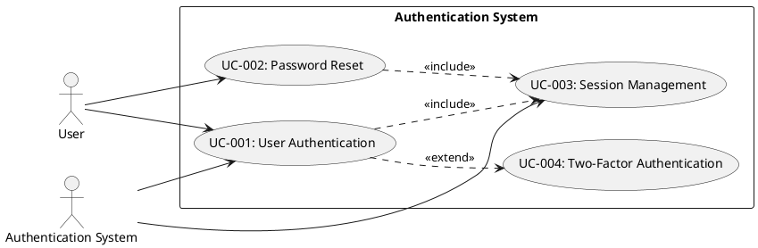
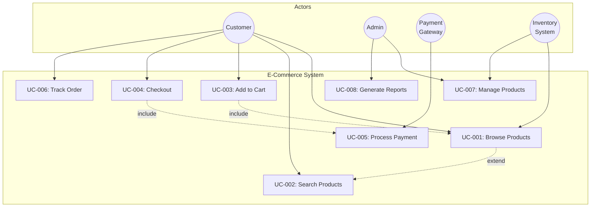
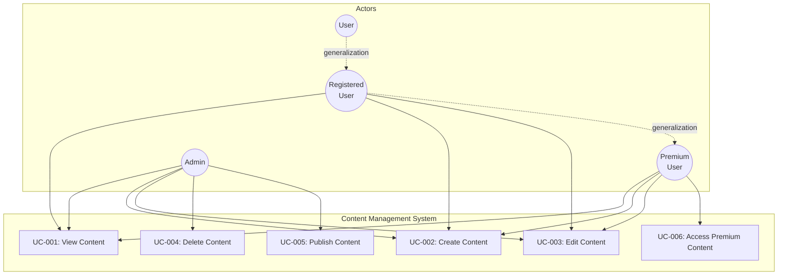

# Use Case Modeling

> **Meta:** v1.0.0 | 23-02-2026

## Назначение

Навык для создания диаграмм вариантов использования (Use Case Diagrams) — визуального представления функциональных требований системы. Включает идентификацию актёров, определение вариантов использования (use cases), описание потоков выполнения (basic, alternative, exception), установление отношений между use cases (include, extend, generalization) и генерацию диаграмм в формате Mermaid.js или PlantUML.

## Когда использовать

Используйте этот навык:
- При визуализации функциональных требований системы
- Для определения границ системы и взаимодействия с внешними сущностями
- При описании поведения системы с точки зрения пользователей
- Для идентификации всех актёров и их взаимодействия с системой
- При подготовке данных для Project Manager (количество и сложность use cases)
- На этапе анализа и проектирования требований

## Функции

### Actor Identification

Идентификация всех актёров системы:

**Типы актёров:**
- **Первичные актёры** — пользователи, инициирующие варианты использования
- **Вторичные актёры** — системы, участвующие в выполнении use case
- **Внешние системы** — API, сервисы, базы данных

**Критерии идентификации:**
- Кто использует систему?
- Кто получает информацию от системы?
- Кто поддерживает и администрирует систему?
- Какие внешние системы взаимодействуют с данной системой?

### Use Case Definition

Определение вариантов использования по шаблону:

```markdown
## UC-{ID}: {Название}

**Actors:** {Список актёров}
**Pre-conditions:** {Предусловия}
**Post-conditions:** {Постусловия}
**Trigger:** {Событие, инициирующее use case}

### Basic Flow
1. {Шаг 1}
2. {Шаг 2}
...

### Alternative Flows
{ID шага}a. {Название альтернативного потока}
    {ID шага}a1. {Действие}
    {ID шага}a2. {Действие}

### Exception Flows
{ID шага}a. {Название исключительного потока}
    {ID шага}a1. {Действие}
    {ID шага}a2. {Действие}

### Business Rules
- {Бизнес-правило 1}
- {Бизнес-правило 2}

### Non-functional Requirements
- {NFR для данного use case}
```

### Relationships

Определение отношений между use cases:

| Отношение | Описание | Обозначение |
|-----------|----------|-------------|
| **Association** | Связь актёра с use case | Линия |
| **Include** | Обязательное включение другого use case | `<<include>>` |
| **Extend** | Опциональное расширение use case | `<<extend>>` |
| **Generalization** | Наследование между use cases или актёрами | Стрелка с треугольником |

**Правила использования:**
- **Include:** используется для повторно используемых фрагментов поведения
- **Extend:** используется для опционального поведения, зависящего от условия
- **Generalization:** используется для специализации актёров или use cases

### Diagram Generation

Генерация диаграмм в форматах:
- **Mermaid.js** — для Markdown-документации
- **PlantUML** — для детальных диаграмм с расширенными возможностями

## Интеграция с Project Manager

### Данные для Project Manager

Предоставляет следующие данные для PM:

**Количественные метрики:**
- Общее количество use cases
- Количество актёров
- Количество отношений (include, extend)

**Оценка сложности use cases:**

| Сложность | Критерии | Оценка времени |
|-----------|----------|----------------|
| **Простой** | 1-3 шага, 1 актёр, нет альтернативных потоков | 4-8 часов |
| **Средний** | 4-7 шагов, 2 актёра, 1-2 альтернативных потока | 8-16 часов |
| **Сложный** | 8+ шагов, 3+ актёра, 3+ альтернативных/исключительных потоков | 16-40 часов |

**Зависимости между use cases:**
- Include-зависимости (обязательные)
- Extend-зависимости (опциональные)
- Внешние зависимости (API, интеграции)

**Риски:**
- Use cases с высокой сложностью
- Use cases с множественными зависимостями
- Use cases с неопределёнными требованиями

### Взаимодействие

- PM запрашивает диаграммы use cases для планирования итераций
- PM получает данные для оценки трудозатрат
- PM использует приоритеты use cases для планирования релизов
- SA валидирует изменения use cases с PM

## Примеры использования

### Пример 1: Use Case для системы аутентификации

**Описание Use Case:**

```markdown
## UC-001: User Authentication

**Actors:** User, Authentication System
**Pre-conditions:** User has valid credentials
**Post-conditions:** User is authenticated, session is created
**Trigger:** User requests access to protected resource

### Basic Flow
1. User navigates to login page
2. System displays login form
3. User enters username and password
4. System validates credentials
5. System creates user session
6. System redirects user to dashboard

### Alternative Flows
4a. Invalid credentials
    4a1. System displays error message "Invalid username or password"
    4a2. System increments failed attempt counter
    4a3. User can retry (return to step 3)
    
4b. Account locked (3 failed attempts)
    4b1. System displays error message "Account temporarily locked"
    4b2. System sends unlock instructions to email
    4b3. Use case ends

### Exception Flows
5a. Session creation failed
    5a1. System logs error
    5a2. System displays generic error message
    5a3. User is asked to try again later
    
5b. Authentication service unavailable
    5b1. System displays maintenance message
    5b2. System suggests alternative login methods

### Business Rules
- BR-001: Maximum 3 failed login attempts before account lock
- BR-002: Session expires after 30 minutes of inactivity
- BR-003: Password must meet complexity requirements

### Non-functional Requirements
- NFR-001: Authentication response time < 2 seconds
- NFR-002: Support 100 concurrent authentication requests
```

**Диаграмма Mermaid:**



**Диаграмма PlantUML:**



### Пример 2: Use Case для e-commerce системы

**Диаграмма Mermaid:**



**Описание ключевых Use Cases:**

```markdown
## UC-004: Checkout

**Actors:** Customer, Payment Gateway
**Pre-conditions:** Customer has items in cart, Customer is authenticated
**Post-conditions:** Order is created, Payment is processed, Inventory is updated
**Trigger:** Customer clicks "Proceed to Checkout"

### Basic Flow
1. Customer initiates checkout
2. System validates cart contents
3. System displays shipping options
4. Customer selects shipping method
5. System calculates total cost
6. Customer enters payment information
7. System processes payment via Payment Gateway
8. System creates order
9. System sends order confirmation to Customer
10. System updates inventory

### Alternative Flows
2a. Cart is empty
    2a1. System displays message "Your cart is empty"
    2a2. Use case ends
    
7a. Payment declined
    7a1. System displays error message
    7a2. Customer can try different payment method
    7a3. Return to step 6

### Exception Flows
7b. Payment gateway unavailable
    7b1. System logs error
    7b2. System saves order as "Payment Pending"
    7b3. System notifies Customer to retry payment later
```

### Пример 3: Use Case с наследованием актёров

**Диаграмма Mermaid:**



## Шаблоны документов

### Шаблон таблицы Use Cases

| ID | Название | Актёры | Приоритет | Сложность | Статус |
|----|----------|--------|-----------|-----------|--------|
| UC-001 | User Authentication | User, Auth System | High | Medium | Approved |
| UC-002 | Password Reset | User, Email System | Medium | Simple | Draft |
| UC-003 | User Profile Management | User | Medium | Simple | Draft |

### Шаблон матрицы актёров и use cases

| Актёр \ Use Case | UC-001 | UC-002 | UC-003 | UC-004 |
|------------------|--------|--------|--------|--------|
| Customer | X | X | X | X |
| Admin | X | - | X | X |
| Payment Gateway | - | - | - | X |

## Лучшие практики

### Именование Use Cases

- Используйте глагол + существительное: "Create Order", "Process Payment"
- Избегайте технических терминов в названиях
- Названия должны отражать бизнес-цель
- Используйте согласованный стиль для всех use cases

### Уровень детализации

- **Уровеньsummary:** один шаг, несколько use cases
- **Уровень user:** несколько шагов, один путь пользователя
- **Уровень subfunction:** детали конкретной функции

### Типичные ошибки

1. **Слишком много деталей** — не описывайте UI в use case
2. **Слишком мало деталей** — упущенные альтернативные потоки
3. **Технический фокус** — focus на бизнес-требованиях
4. **Отсутствие границ системы** — чётко определите, что внутри, а что снаружи

## Связанные навыки

- requirements-analysis — сбор и анализ требований
- srs-specification — спецификация требований к ПО
- bpmn-modeling — моделирование бизнес-процессов
- api-design — проектирование API на основе use cases

---
