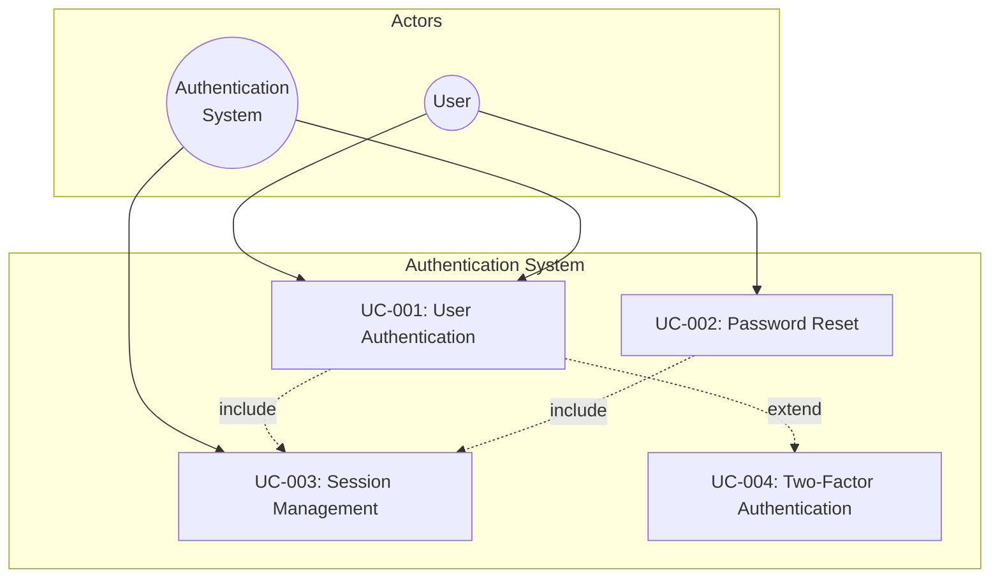
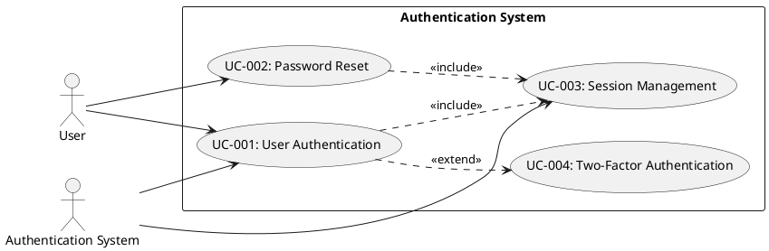
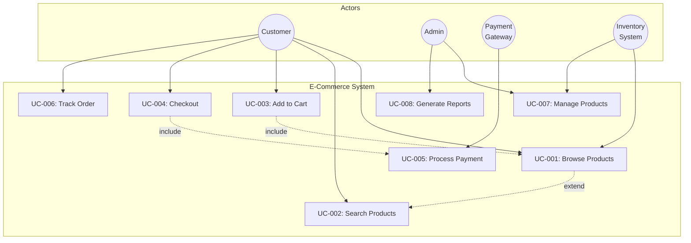
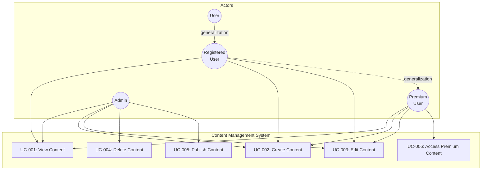

# Use Case Modeling

> **Meta:** v1.0.0 | 23-02-2026

## Purpose

Skill for creating Use Case Diagrams — visual representation of system functional requirements. Includes identifying actors, defining use cases, describing execution flows (basic, alternative, exception), establishing relationships between use cases (include, extend, generalization) and generating diagrams in Mermaid.js or PlantUML format.

## When to Use

Use this skill:
- When visualizing system functional requirements
- For defining system boundaries and interaction with external entities
- When describing system behavior from the user's perspective
- For identifying all actors and their interaction with the system
- When preparing data for Project Manager (number and complexity of use cases)
- During requirements analysis and design phase

## Functions

### Actor Identification

Identifying all system actors:

**Actor Types:**
- **Primary actors** — users who initiate use cases
- **Secondary actors** — systems participating in use case execution
- **External systems** — APIs, services, databases

**Identification Criteria:**
- Who uses the system?
- Who receives information from the system?
- Who maintains and administers the system?
- Which external systems interact with this system?

### Use Case Definition

Defining use cases using the template:

```markdown
## UC-{ID}: {Name}

**Actors:** {List of actors}
**Pre-conditions:** {Pre-conditions}
**Post-conditions:** {Post-conditions}
**Trigger:** {Event that triggers use case}

### Basic Flow
1. {Step 1}
2. {Step 2}
...

### Alternative Flows
{Step ID}a. {Alternative flow name}
    {Step ID}a1. {Action}
    {Step ID}a2. {Action}

### Exception Flows
{Step ID}a. {Exception flow name}
    {Step ID}a1. {Action}
    {Step ID}a2. {Action}

### Business Rules
- {Business rule 1}
- {Business rule 2}

### Non-functional Requirements
- {NFR for this use case}
```

### Relationships

Defining relationships between use cases:

| Relationship | Description | Notation |
|-----------|----------|-------------|
| **Association** | Actor to use case link | Line |
| **Include** | Mandatory inclusion of another use case | `<<include>>` |
| **Extend** | Optional extension of use case | `<<extend>>` |
| **Generalization** | Inheritance between use cases or actors | Arrow with triangle |

**Usage Rules:**
- **Include:** used for reusable behavior fragments
- **Extend:** used for optional behavior depending on condition
- **Generalization:** used for specialization of actors or use cases

### Diagram Generation

Generating diagrams in formats:
- **Mermaid.js** — for Markdown documentation
- **PlantUML** — for detailed diagrams with extended capabilities

## Integration with Project Manager

### Data for Project Manager

Provides the following data for PM:

**Quantitative Metrics:**
- Total number of use cases
- Number of actors
- Number of relationships (include, extend)

**Use Case Complexity Estimation:**

| Complexity | Criteria | Time Estimate |
|-----------|----------|----------------|
| **Simple** | 1-3 steps, 1 actor, no alternative flows | 4-8 hours |
| **Medium** | 4-7 steps, 2 actors, 1-2 alternative flows | 8-16 hours |
| **Complex** | 8+ steps, 3+ actors, 3+ alternative/exception flows | 16-40 hours |

**Dependencies between Use Cases:**
- Include dependencies (mandatory)
- Extend dependencies (optional)
- External dependencies (API, integrations)

**Risks:**
- Use cases with high complexity
- Use cases with multiple dependencies
- Use cases with undefined requirements

### Interaction

- PM requests use case diagrams for iteration planning
- PM receives data for effort estimation
- PM uses use case priorities for release planning
- SA validates use case changes with PM

## Usage Examples

### Example 1: Use Case for Authentication System

**Use Case Description:**

```markdown
## UC-001: User Authentication

**Actors:** User, Authentication System
**Pre-conditions:** User has valid credentials
**Post-conditions:** User is authenticated, session is created
**Trigger:** User requests access to protected resource

### Basic Flow
1. User navigates to login page
2. System displays login form
3. User enters username and password
4. System validates credentials
5. System creates user session
6. System redirects user to dashboard

### Alternative Flows
4a. Invalid credentials
    4a1. System displays error message "Invalid username or password"
    4a2. System increments failed attempt counter
    4a3. User can retry (return to step 3)
    
4b. Account locked (3 failed attempts)
    4b1. System displays error message "Account temporarily locked"
    4b2. System sends unlock instructions to email
    4b3. Use case ends

### Exception Flows
5a. Session creation failed
    5a1. System logs error
    5a2. System displays generic error message
    5a3. User is asked to try again later
    
5b. Authentication service unavailable
    5b1. System displays maintenance message
    5b2. System suggests alternative login methods

### Business Rules
- BR-001: Maximum 3 failed login attempts before account lock
- BR-002: Session expires after 30 minutes of inactivity
- BR-003: Password must meet complexity requirements

### Non-functional Requirements
- NFR-001: Authentication response time < 2 seconds
- NFR-002: Support 100 concurrent authentication requests
```

**Mermaid Diagram:**


```mermaid
graph TB
    subgraph Actors
        User((User))
        AuthSystem((Authentication<br>System))
    end
    
    subgraph "Authentication System"
        UC1[UC-001: User Authentication]
        UC2[UC-002: Password Reset]
        UC3[UC-003: Session Management]
        UC4[UC-004: Two-Factor Authentication]
    end
    
    User --> UC1
    User --> UC2
    AuthSystem --> UC1
    AuthSystem --> UC3
    
    UC1 -.->|include| UC3
    UC1 -.->|extend| UC4
    UC2 -.->|include| UC3
```

**PlantUML Diagram:**


```plantuml
@startuml
left to right direction
skinparam packageStyle rectangle

actor User as User
actor "Authentication System" as AuthSystem

rectangle "Authentication System" {
    usecase "UC-001: User Authentication" as UC1
    usecase "UC-002: Password Reset" as UC2
    usecase "UC-003: Session Management" as UC3
    usecase "UC-004: Two-Factor Authentication" as UC4
}

User --> UC1
User --> UC2
AuthSystem --> UC1
AuthSystem --> UC3

UC1 ..> UC3 : <<include>>
UC1 ..> UC4 : <<extend>>
UC2 ..> UC3 : <<include>>

@enduml
```

### Example 2: Use Case for E-commerce System

**Mermaid Diagram:**


```mermaid
graph TB
    subgraph Actors
        Customer((Customer))
        Admin((Admin))
        PaymentGateway((Payment<br>Gateway))
        InventorySystem((Inventory<br>System))
    end
    
    subgraph "E-Commerce System"
        UC1[UC-001: Browse Products]
        UC2[UC-002: Search Products]
        UC3[UC-003: Add to Cart]
        UC4[UC-004: Checkout]
        UC5[UC-005: Process Payment]
        UC6[UC-006: Track Order]
        UC7[UC-007: Manage Products]
        UC8[UC-008: Generate Reports]
    end
    
    Customer --> UC1
    Customer --> UC2
    Customer --> UC3
    Customer --> UC4
    Customer --> UC6
    
    Admin --> UC7
    Admin --> UC8
    
    PaymentGateway --> UC5
    InventorySystem --> UC1
    InventorySystem --> UC7
    
    UC4 -.->|include| UC5
    UC1 -.->|extend| UC2
    UC3 -.->|include| UC1
```

**Key Use Cases Description:**

```markdown
## UC-004: Checkout

**Actors:** Customer, Payment Gateway
**Pre-conditions:** Customer has items in cart, Customer is authenticated
**Post-conditions:** Order is created, Payment is processed, Inventory is updated
**Trigger:** Customer clicks "Proceed to Checkout"

### Basic Flow
1. Customer initiates checkout
2. System validates cart contents
3. System displays shipping options
4. Customer selects shipping method
5. System calculates total cost
6. Customer enters payment information
7. System processes payment via Payment Gateway
8. System creates order
9. System sends order confirmation to Customer
10. System updates inventory

### Alternative Flows
2a. Cart is empty
    2a1. System displays message "Your cart is empty"
    2a2. Use case ends
    
7a. Payment declined
    7a1. System displays error message
    7a2. Customer can try different payment method
    7a3. Return to step 6

### Exception Flows
7b. Payment gateway unavailable
    7b1. System logs error
    7b2. System saves order as "Payment Pending"
    7b3. System notifies Customer to retry payment later
```

### Example 3: Use Case with Actor Generalization

**Mermaid Diagram:**


```mermaid
graph TB
    subgraph Actors
        User((User))
        RegisteredUser((Registered<br>User))
        PremiumUser((Premium<br>User))
        Admin((Admin))
    end
    
    subgraph "Content Management System"
        UC1[UC-001: View Content]
        UC2[UC-002: Create Content]
        UC3[UC-003: Edit Content]
        UC4[UC-004: Delete Content]
        UC5[UC-005: Publish Content]
        UC6[UC-006: Access Premium Content]
    end
    
    RegisteredUser --> UC1
    RegisteredUser --> UC2
    RegisteredUser --> UC3
    
    PremiumUser --> UC1
    PremiumUser --> UC2
    PremiumUser --> UC3
    PremiumUser --> UC6
    
    Admin --> UC1
    Admin --> UC2
    Admin --> UC3
    Admin --> UC4
    Admin --> UC5
    
    User -.->|generalization| RegisteredUser
    RegisteredUser -.->|generalization| PremiumUser
```

## Document Templates

### Use Case Table Template

| ID | Name | Actors | Priority | Complexity | Status |
|----|----------|--------|-----------|-----------|--------|
| UC-001 | User Authentication | User, Auth System | High | Medium | Approved |
| UC-002 | Password Reset | User, Email System | Medium | Simple | Draft |
| UC-003 | User Profile Management | User | Medium | Simple | Draft |

### Actor-Use Case Matrix Template

| Actor \ Use Case | UC-001 | UC-002 | UC-003 | UC-004 |
|------------------|--------|--------|--------|--------|
| Customer | X | X | X | X |
| Admin | X | - | X | X |
| Payment Gateway | - | - | - | X |

## Best Practices

### Use Case Naming

- Use verb + noun: "Create Order", "Process Payment"
- Avoid technical terms in names
- Names should reflect business goal
- Use consistent style for all use cases

### Level of Detail

- **Summary level:** one step, several use cases
- **User level:** several steps, one user path
- **Subfunction level:** details of specific function

### Common Mistakes

1. **Too much detail** — don't describe UI in use case
2. **Too little detail** — missing alternative flows
3. **Technical focus** — focus on business requirements
4. **No system boundaries** — clearly define what is inside and outside

## Related Skills

- requirements-analysis — requirements gathering and analysis
- srs-specification — software requirements specification
- bpmn-modeling — business process modeling
- api-design — API design based on use cases

---
