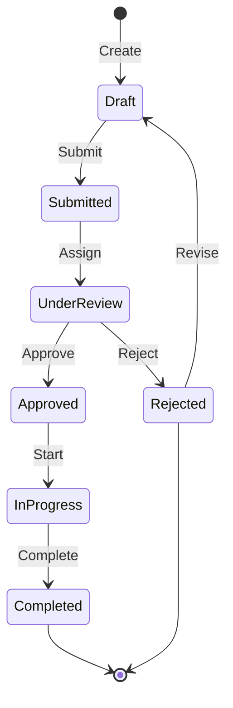
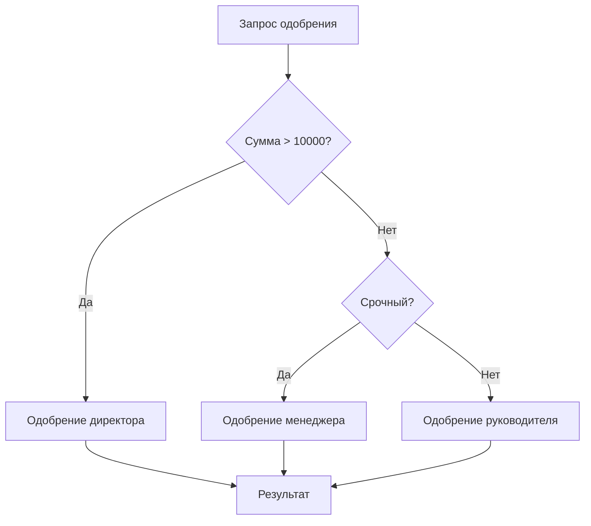
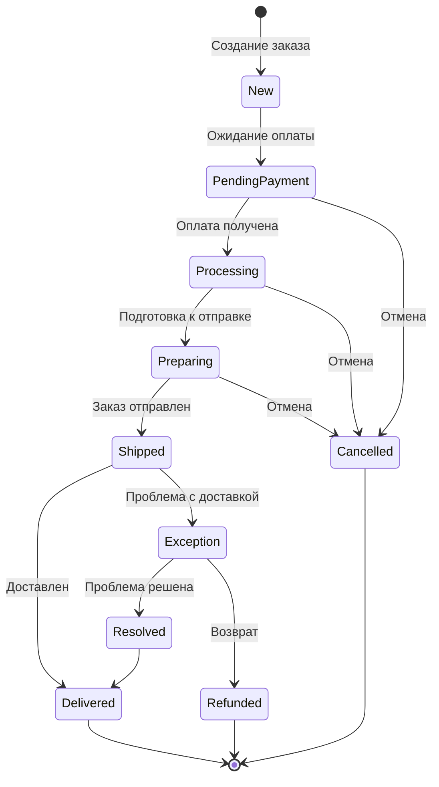
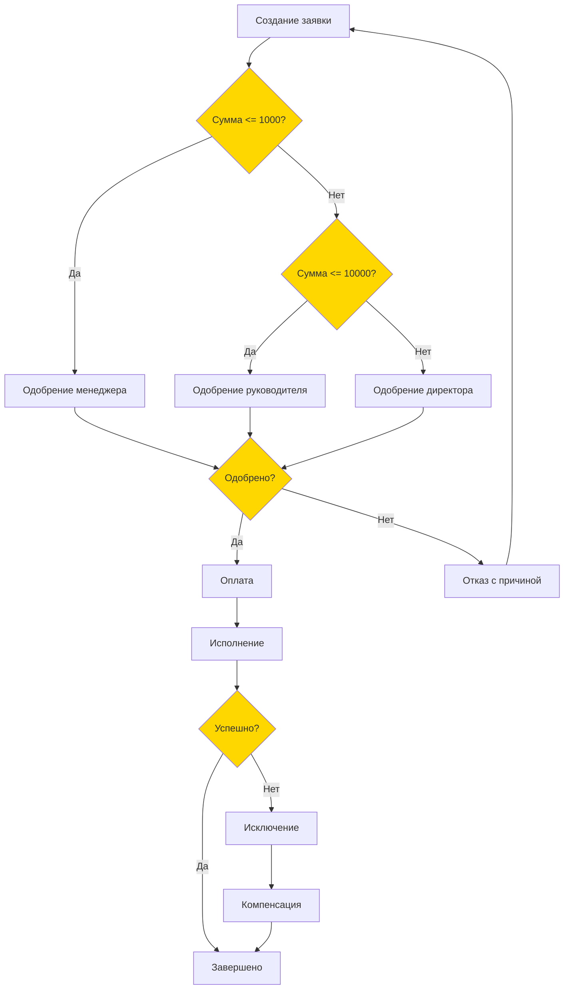
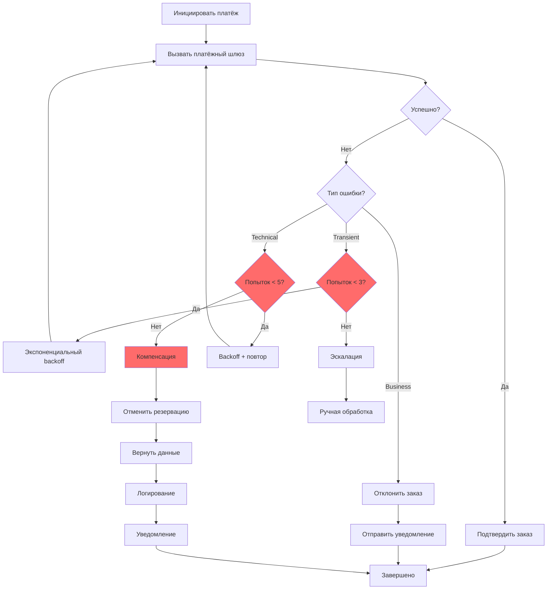

# Workflow Design

> **Meta:** v1.0.0 | 23-02-2026

## Назначение

Навык для проектирования рабочих процессов (workflows) и систем автоматизации бизнес-процессов. Включает создание диаграмм состояний (state machines), процессов одобрения (approval flows), обработку исключений (exception handling), определение триггеров и действий, а также проектирование retry логики и компенсирующих транзакций. Предназначен для детализации автоматизации на основе бизнес-требований и подготовки технических спецификаций для разработчиков.

## Когда использовать

Используйте этот навык:
- При проектировании автоматизируемых бизнес-процессов
- Для создания диаграмм состояний объектов (заказ, заявка, документ)
- При проектировании процессов одобрения (approval workflows)
- Для определения стратегий обработки ошибок и исключений
- При проектировании retry логики и компенсирующих транзакций
- На этапе детализации требований после BPMN-моделирования
- Для подготовки данных для universal-coding-agent (требования к автоматизации)
- Для оценки сложности автоматизации Project Manager

## Функции

### Workflow Automation

Проектирование автоматизируемых процессов с определением триггеров, действий и условий:

**Компоненты workflow:**
- **Trigger (Триггер)** — событие, инициирующее запуск workflow
- **Action (Действие)** — операция, выполняемая в рамках workflow
- **Condition (Условие)** — логика ветвления на основе данных
- **State (Состояние)** — текущее состояние workflow или объекта

**Типы триггеров:**

| Тип | Описание | Пример |
|-----|----------|--------|
| Event-based | Событие в системе | Создание заказа, изменение статуса |
| Schedule-based | По расписанию | Ежедневный отчёт, еженедельная рассылка |
| Manual | Ручной запуск | Обработка заявки оператором |
| API | Внешний вызов | Webhook от внешней системы |

**Структура действия:**

```
Action: {
  name: "Название действия",
  type: "service|user|script|notification",
  handler: "Исполнитель (сервис/роль/скрипт)",
  timeout: "Таймаут выполнения",
  retry: {
    maxAttempts: 3,
    backoff: "exponential|linear",
    delay: "Интервал"
  },
  onSuccess: "Следующий шаг",
  onFailure: "Обработка ошибки"
}
```

**Правила проектирования:**
- Каждый workflow должен иметь чёткую точку входа и выхода
- Все возможные исходы должны быть обработаны
- Длительные операции должны быть асинхронными
- Критические операции требуют compensation логики

### State Machines

Проектирование диаграмм состояний для объектов системы:

**Элементы state machine:**
- **States (Состояния)** — дискретные состояния объекта
- **Events (События)** — переходы между состояниями
- **Transitions (Переходы)** — связи между состояниями
- **Actions (Действия)** — операции при входе/выходе/переходе

**Типы состояний:**

| Тип | Обозначение | Описание |
|-----|-------------|----------|
| Initial | ● | Начальное состояние |
| Final | ◉ | Конечное состояние |
| Intermediate | ○ | Промежуточное состояние |
| Error | ✗ | Состояние ошибки |
| Parallel | ‖ | Параллельные подсостояния |

**Атрибуты перехода:**

```
Transition: {
  from: "Текущее состояние",
  event: "Событие (триггер)",
  guard: "Условие (опционально)",
  action: "Действие при переходе",
  to: "Следующее состояние"
}
```

**Пример диаграммы состояний:**



### Approval Flows

Проектирование процессов одобрения с различными сценариями:

**Типы approval flows:**

| Тип | Описание | Применение |
|-----|----------|------------|
| Single | Одноуровневое одобрение | Простые запросы |
| Sequential | Последовательное одобрение | Многоэтапное согласование |
| Parallel | Параллельное одобрение | Одобрение несколькими лицами |
| Conditional | Условное одобрение | Зависит от параметров |
| Escalation | Эскалация при отсутствии | Срочные процессы |

**Компоненты approval flow:**

```
ApprovalFlow: {
  name: "Название процесса",
  approvers: [
    {
      role: "Роль/Пользователь",
      level: 1,
      type: "required|optional",
      timeout: "Таймаут ответа",
      escalateTo: "Эскалация при таймауте"
    }
  ],
  conditions: {
    amount: { min: 1000, escalate: true },
    priority: { high: ["manager", "director"] }
  },
  delegation: {
    enabled: true,
    maxDelegations: 3
  },
  notifications: {
    onRequest: "Уведомление о запросе",
    onApproval: "Уведомление об одобрении",
    onEscalation: "Уведомление об эскалации"
  }
}
```

**Ветвление условий:**



### Exception Handling

Проектирование стратегий обработки исключений и ошибок:

**Типы исключений:**

| Тип | Описание | Пример |
|-----|----------|--------|
| Transient | Временная ошибка | Сетевой сбой, таймаут |
| Permanent | Постоянная ошибка | Неверные данные, отказ системы |
| Business | Нарушение бизнес-правил | Недостаточно средств |
| Technical | Техническая ошибка | Ошибка базы данных |

**Стратегии обработки:**

```
ExceptionStrategy: {
  type: "retry|fallback|compensation|escalation",
  retry: {
    maxAttempts: 3,
    strategy: "exponential",
    baseDelay: 1000,
    maxDelay: 30000,
    jitter: true,
    retryableErrors: ["timeout", "connection"]
  },
  fallback: {
    action: "Альтернативное действие",
    dataSource: "Резервный источник"
  },
  compensation: {
    enabled: true,
    steps: ["Отменить платёж", "Вернуть库存", "Уведомить клиента"]
  },
  escalation: {
    trigger: "После 3 неудачных попыток",
    to: "Операционный менеджер",
    notify: true
  }
}
```

**Компенсирующие транзакции:**

```
CompensationTransaction: {
  name: "Компенсация заказа",
  steps: [
    {
      order: 1,
      action: "cancel_payment",
      target: "Payment Gateway",
      compensateOn: "payment_failed"
    },
    {
      order: 2,
      action: "release_inventory",
      target: "Inventory System",
      compensateOn: "inventory_release_failed"
    },
    {
      order: 3,
      action: "send_notification",
      target: "Notification Service",
      compensateOn: "notification_failed"
    }
  ],
  rollback: "Последовательное выполнение в обратном порядке"
}
```

## Интеграция с Project Manager

### Данные для Project Manager

Предоставляет следующие данные для PM:

**Метрики автоматизации:**

| Метрика | Описание | Влияние на оценку |
|---------|----------|------------------|
| Количество workflows | Общее число автоматизируемых процессов | Объём разработки |
| Количество state machines | Число диаграмм состояний | Сложность моделирования |
| Сложность transitions | Среднее число переходов на состояние | Сложность логики |
| Количество approval steps | Число шагов одобрения | Время на согласование |
| Тип exceptions | Соотношение типов исключений | Надёжность системы |

**Оценка сложности workflow:**

| Уровень | Критерии | Коэффициент |
|---------|----------|-------------|
| Простой | < 5 состояний, < 10 переходов | 1.0 |
| Средний | 5-10 состояний, 10-20 переходов | 1.5 |
| Сложный | 10-20 состояний, 20-50 переходов | 2.0 |
| Очень сложный | > 20 состояний, > 50 переходов | 3.0 |

**Требования к ресурсам:**

| Компонент | Требования |
|-----------|------------|
| State management | Redis/БД для хранения состояний |
| Workflow engine | BPMN движок (Camunda, Zeebe, Temporal) |
| Notification service | Email/SMS для approval уведомлений |
| Audit log | Хранение истории переходов |
| Compensation | Transaction coordinator |

**Риски автоматизации:**

| Риск | Вероятность | Влияние | Митигация |
|------|-------------|---------|-----------|
| Неполная обработка исключений | Высокая | Высокое | Компенсирующие транзакции |
| Deadlock состояний | Средняя | Высокое | Таймауты и мониторинг |
| Race conditions | Средняя | Среднее | Синхронизация и блокировки |
| Сложность отладки | Высокая | Среднее | Логирование и трассировка |

### Взаимодействие

- PM запрашивает данные об автоматизации для оценки трудозатрат
- PM получает метрики сложности workflow для планирования
- PM использует данные о рисках для управления проектом
- SA уточняет требования к автоматизации с PM и стейкхолдерами

## Примеры использования

### Пример 1: State Machine — Процесс обработки заказа



**Спецификация состояний:**

| State | Description | Entry Action | Exit Action |
|-------|-------------|--------------|-------------|
| New | Заказ создан | Create order record | Send confirmation |
| PendingPayment | Ожидает оплаты | Set payment deadline | - |
| Processing | Оплачен, в обработке | Reserve inventory | - |
| Preparing | Подготовка к отправке | Generate packing list | - |
| Shipped | Отправлен | Update tracking | Send notification |
| Delivered | Доставлен | Complete order | Send survey |
| Cancelled | Отменён | Release inventory | Send cancellation |
| Exception | Проблема | Notify support | - |
| Refunded | Возвращён | Process refund | - |

### Пример 2: Approval Flow — Одобрение расходного документа



**Конфигурация approval:**

```yaml
approval_flow:
  name: Expense Approval
  
  rules:
    - condition: "amount <= 1000"
      approvers:
        - role: Manager
          timeout: 24h
    
    - condition: "amount > 1000 AND amount <= 10000"
      approvers:
        - role: Team Lead
          timeout: 48h
    
    - condition: "amount > 10000"
      approvers:
        - role: Director
          timeout: 72h
    
    - condition: "priority = urgent"
      escalation:
        to: Department Head
        after: 4h

  delegation:
    enabled: true
    max_depth: 2
    proxy_approvers:
      - role: Manager
        delegates:
          - Team Lead
          - Senior Employee
```

### Пример 3: Exception Handling — Обработка платежа



**Retry конфигурация:**

```yaml
retry_config:
  max_attempts: 3
  strategy: exponential
  base_delay_ms: 1000
  max_delay_ms: 30000
  jitter: true
  
  retryable_errors:
    - TIMEOUT
    - CONNECTION_REFUSED
    - SERVICE_UNAVAILABLE
    
  non_retryable_errors:
    - INVALID_AMOUNT
    - INSUFFICIENT_FUNDS
    - ACCOUNT_BLOCKED

compensation:
  enabled: true
  steps:
    - order: 1
      action: release_inventory
      on_failure: log_and_alert
    - order: 2
      action: cancel_reservation
      on_failure: create_manual_task
    - order: 3
      action: notify_customer
      on_failure: log

escalation:
  trigger: "after_max_retries"
  timeout: 30m
  notify:
    - email: ops-manager@example.com
    - slack: "#payment-issues"
```

### Пример 4: Complex Workflow с параллельными задачами

```mermaid
stateDiagram-v2
    [*] --> Processing
    
    Processing --> ParallelExecution: Запуск
    
    ParallelExecution --> CheckInventory: Проверка库存
    ParallelExecution --> CheckPayment: Проверка оплаты
    ParallelExecution --> CheckFraud: Проверка мошенничества
    
    CheckInventory --> AwaitAll: Завершение
    CheckPayment --> AwaitAll: Завершение
    CheckFraud --> AwaitAll: Завершение
    
    AwaitAll --> Decision{Все проверки пройдены?}
    
    Decision -->|Да| Fulfill: Выполнение заказа
    Decision -->|Нет| Reject: Отклонение
    
    Fulfill --> [*]
    Reject --> Compensation: Компенсация
    Compensation --> [*]
    
    note right of ParallelExecution: Все проверки выполняются параллельно
    note right of AwaitAll: Ожидаем завершения всех задач
```

## Шаблоны документов

### Шаблон State Machine

```markdown
# State Machine: {Название объекта}

**Object:** {Сущность в системе}
**Version:** 1.0
**Owner:** {Владелец}
**Last Updated:** {Дата}

## States

| State | Description | Entry Action | Exit Action |
|-------|-------------|--------------|-------------|
| {State1} | {Описание} | {Действие при входе} | {Действие при выходе} |

## Transitions

| From | Event | Guard | Action | To |
|------|-------|-------|--------|-----|
| {State1} | {Event1} | {Condition} | {Action} | {State2} |

## Diagram
{Mermaid диаграмма}

## Business Rules
- {Правило 1}
- {Правило 2}
```

### Шаблон Approval Flow

```markdown
# Approval Flow: {Название}

**Type:** {Single|Sequential|Parallel|Conditional}
**Version:** 1.0

## Trigger
{Что инициирует процесс одобрения}

## Approvers

| Level | Role | Type | Timeout | Escalation |
|-------|------|------|---------|------------|
| 1 | {Role} | {Required|Optional} | {Time} | {Escalation to} |

## Conditions

| Condition | Approvers | Priority |
|-----------|-----------|----------|
| {Expression} | {List} | {Number} |

## Notifications
- {Уведомление 1}
- {Уведомление 2}

## Diagram
{Mermaid диаграмма}
```

### Шаблон Exception Handling

```markdown
# Exception Handling: {Компонент/Процесс}

## Exception Types

| Type | Description | Retryable | Compensation |
|------|-------------|-----------|--------------|
| {Type} | {Description} | {Yes/No} | {Action} |

## Retry Policy

- Max Attempts: {Number}
- Strategy: {exponential|linear}
- Base Delay: {Time}

## Compensation Steps

| Order | Action | On Failure |
|-------|--------|------------|
| 1 | {Action} | {Fallback} |

## Escalation

- Trigger: {Condition}
- To: {Role}
- Notification: {Method}
```

## Лучшие практики

### Проектирование State Machines

1. **Минимальное число состояний** — не дробите на избыточные состояния
2. **Однонаправленные переходы** — избегайте циклов без условий
3. **Обработка всех ошибок** — каждое состояние должно иметь выход
4. **Идемпотентность** — повторный вход в состояние без побочных эффектов

### Проектирование Approval Flows

1. **Минимум согласований** — достаточно для контроля, минимум для скорости
2. **Таймауты** — всегда устанавливайте максимальное время ожидания
3. **Эскалация** — настраивайте для срочных процессов
4. **Аудит** — логируйте все действия одобрения

### Проектирование Exception Handling

1. **Независимость** — каждый retry не зависит от предыдущих
2. **Idempotency** — операции должны быть идемпотентными
3. **Компенсация** — планируйте откат заранее
4. **Мониторинг** — отслеживайте частые исключения

## Связанные навыки

- bpmn-modeling — моделирование бизнес-процессов BPMN
- requirements-analysis — сбор и анализ требований
- use-case-modeling — варианты использования системы
- user-stories — пользовательские истории
- api-design — проектирование API для workflow сервисов
- data-modeling — проектирование данных для хранения состояний

---
