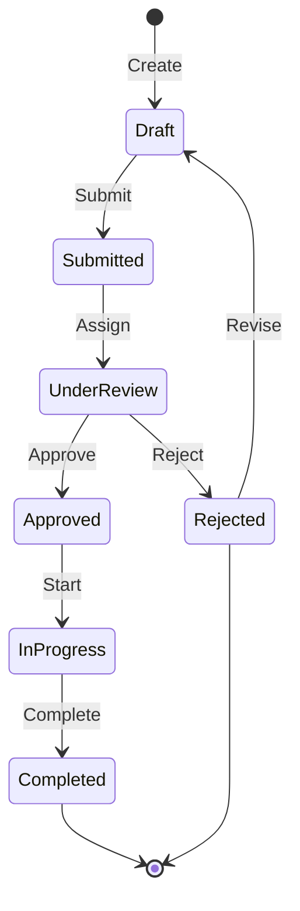
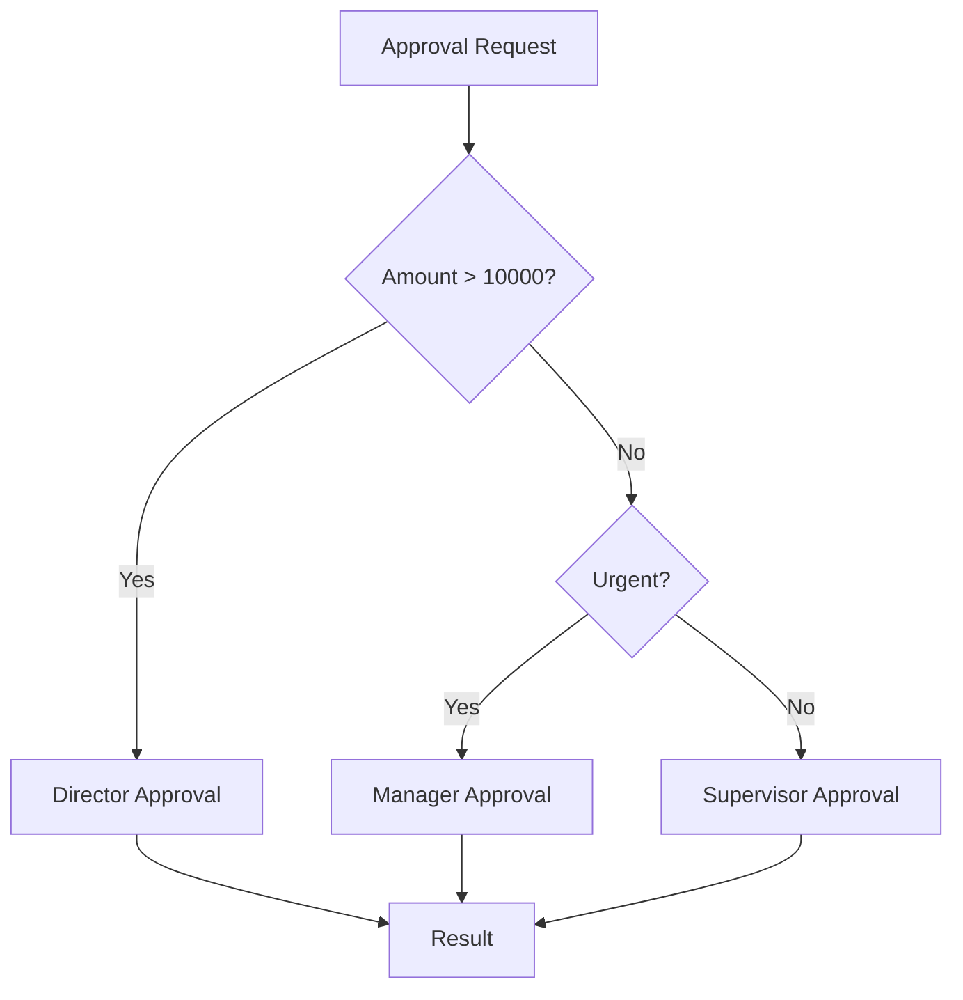
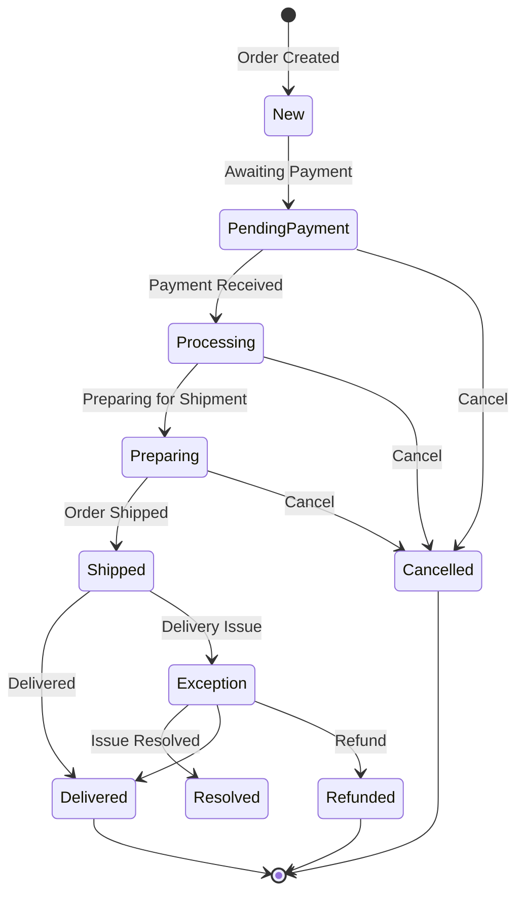
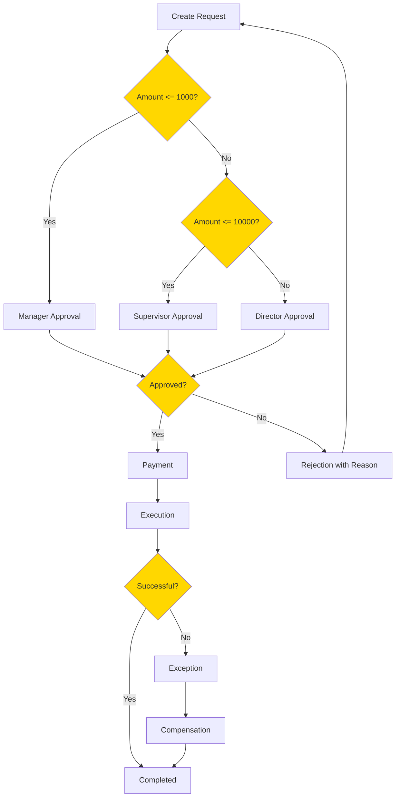
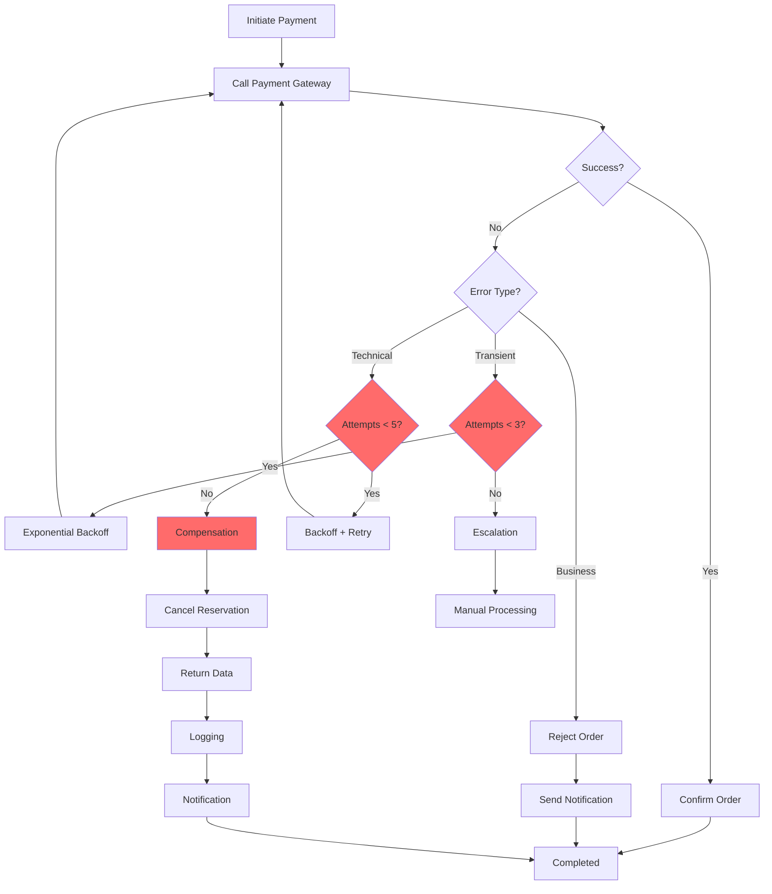

# Workflow Design

> **Meta:** v1.0.0 | 23-02-2026

## Purpose

Skill for designing workflows and business process automation systems. Includes creating state machine diagrams, approval flows, exception handling, defining triggers and actions, as well as designing retry logic and compensating transactions. Designed for detailing automation based on business requirements and preparing technical specifications for developers.

## When to Use

Use this skill:
- When designing automatable business processes
- For creating state diagrams for objects (order, request, document)
- When designing approval workflows
- For defining error and exception handling strategies
- When designing retry logic and compensating transactions
- During requirements detailing phase after BPMN modeling
- For preparing data for universal-coding-agent (automation requirements)
- For Project Manager complexity estimation of automation

## Functions

### Workflow Automation

Designing automatable processes with triggers, actions, and conditions:

**Workflow Components:**
- **Trigger** — event that initiates workflow execution
- **Action** — operation performed within workflow
- **Condition** — branching logic based on data
- **State** — current state of workflow or object

**Trigger Types:**

| Type | Description | Example |
|-----|----------|--------|
| Event-based | System event | Order creation, status change |
| Schedule-based | Scheduled | Daily report, weekly newsletter |
| Manual | Manual launch | Request processing by operator |
| API | External call | Webhook from external system |

**Action Structure:**

```
Action: {
  name: "Action name",
  type: "service|user|script|notification",
  handler: "Performer (service/role/script)",
  timeout: "Execution timeout",
  retry: {
    maxAttempts: 3,
    backoff: "exponential|linear",
    delay: "Interval"
  },
  onSuccess: "Next step",
  onFailure: "Error handling"
}
```

**Design Rules:**
- Each workflow must have clear entry and exit points
- All possible outcomes must be handled
- Long-running operations should be asynchronous
- Critical operations require compensation logic

### State Machines

Designing state diagrams for system objects:

**State Machine Elements:**
- **States** — discrete object states
- **Events** — transitions between states
- **Transitions** — connections between states
- **Actions** — operations on entry/exit/transition

**State Types:**

| Type | Notation | Description |
|-----|-------------|----------|
| Initial | ● | Initial state |
| Final | ◉ | Final state |
| Intermediate | ○ | Intermediate state |
| Error | ✗ | Error state |
| Parallel | ‖ | Parallel substates |

**Transition Attributes:**

```
Transition: {
  from: "Current state",
  event: "Event (trigger)",
  guard: "Condition (optional)",
  action: "Transition action",
  to: "Next state"
}
```

**State Diagram Example:**


```mermaid
stateDiagram-v2
    [*] --> Draft: Create
    Draft --> Submitted: Submit
    Submitted --> UnderReview: Assign
    UnderReview --> Approved: Approve
    UnderReview --> Rejected: Reject
    Rejected --> Draft: Revise
    Approved --> InProgress: Start
    InProgress --> Completed: Complete
    Completed --> [*]
    Rejected --> [*]
```

### Approval Flows

Designing approval processes with various scenarios:

**Approval Flow Types:**

| Type | Description | Application |
|-----|----------|------------|
| Single | Single-level approval | Simple requests |
| Sequential | Sequential approval | Multi-stage approval |
| Parallel | Parallel approval | Approval by multiple persons |
| Conditional | Conditional approval | Depends on parameters |
| Escalation | Escalation on absence | Urgent processes |

**Approval Flow Components:**

```
ApprovalFlow: {
  name: "Process name",
  approvers: [
    {
      role: "Role/User",
      level: 1,
      type: "required|optional",
      timeout: "Response timeout",
      escalateTo: "Escalation on timeout"
    }
  ],
  conditions: {
    amount: { min: 1000, escalate: true },
    priority: { high: ["manager", "director"] }
  },
  delegation: {
    enabled: true,
    maxDelegations: 3
  },
  notifications: {
    onRequest: "Request notification",
    onApproval: "Approval notification",
    onEscalation: "Escalation notification"
  }
}
```

**Condition Branching:**


```mermaid
flowchart TD
    A[Approval Request] --> B{Amount > 10000?}
    B -->|Yes| C[Director Approval]
    B -->|No| D{Urgent?}
    D -->|Yes| E[Manager Approval]
    D -->|No| F[Supervisor Approval]
    C --> G[Result]
    E --> G
    F --> G
```

### Exception Handling

Designing exception and error handling strategies:

**Exception Types:**

| Type | Description | Example |
|-----|----------|--------|
| Transient | Temporary error | Network failure, timeout |
| Permanent | Permanent error | Invalid data, system failure |
| Business | Business rule violation | Insufficient funds |
| Technical | Technical error | Database error |

**Handling Strategies:**

```
ExceptionStrategy: {
  type: "retry|fallback|compensation|escalation",
  retry: {
    maxAttempts: 3,
    strategy: "exponential",
    baseDelay: 1000,
    maxDelay: 30000,
    jitter: true,
    retryableErrors: ["timeout", "connection"]
  },
  fallback: {
    action: "Alternative action",
    dataSource: "Fallback source"
  },
  compensation: {
    enabled: true,
    steps: ["Cancel payment", "Return inventory", "Notify customer"]
  },
  escalation: {
    trigger: "After 3 failed attempts",
    to: "Operations manager",
    notify: true
  }
}
```

**Compensating Transactions:**

```
CompensationTransaction: {
  name: "Order compensation",
  steps: [
    {
      order: 1,
      action: "cancel_payment",
      target: "Payment Gateway",
      compensateOn: "payment_failed"
    },
    {
      order: 2,
      action: "release_inventory",
      target: "Inventory System",
      compensateOn: "inventory_release_failed"
    },
    {
      order: 3,
      action: "send_notification",
      target: "Notification Service",
      compensateOn: "notification_failed"
    }
  ],
  rollback: "Sequential execution in reverse order"
}
```

## Integration with Project Manager

### Data for Project Manager

Provides the following data for PM:

**Automation Metrics:**

| Metric | Description | Impact on Estimate |
|---------|----------|------------------|
| Number of workflows | Total number of automatable processes | Development volume |
| Number of state machines | Number of state diagrams | Modeling complexity |
| Transition complexity | Average transitions per state | Logic complexity |
| Number of approval steps | Number of approval steps | Approval time |
| Exception types | Ratio of exception types | System reliability |

**Workflow Complexity Estimation:**

| Level | Criteria | Factor |
|---------|----------|-------------|
| Simple | < 5 states, < 10 transitions | 1.0 |
| Medium | 5-10 states, 10-20 transitions | 1.5 |
| Complex | 10-20 states, 20-50 transitions | 2.0 |
| Very Complex | > 20 states, > 50 transitions | 3.0 |

**Resource Requirements:**

| Component | Requirements |
|-----------|------------|
| State management | Redis/DB for state storage |
| Workflow engine | BPMN engine (Camunda, Zeebe, Temporal) |
| Notification service | Email/SMS for approval notifications |
| Audit log | Transition history storage |
| Compensation | Transaction coordinator |

**Automation Risks:**

| Risk | Probability | Impact | Mitigation |
|------|-------------|---------|-----------|
| Incomplete exception handling | High | High | Compensating transactions |
| State deadlock | Medium | High | Timeouts and monitoring |
| Race conditions | Medium | Medium | Synchronization and locks |
| Debugging complexity | High | Medium | Logging and tracing |

### Interaction

- PM requests automation data for effort estimation
- PM receives workflow complexity metrics for planning
- PM uses risk data for project management
- SA clarifies automation requirements with PM and stakeholders

## Usage Examples

### Example 1: State Machine — Order Processing


```mermaid
stateDiagram-v2
    [*] --> New: Order Created
    New --> PendingPayment: Awaiting Payment
    PendingPayment --> Processing: Payment Received
    Processing --> Preparing: Preparing for Shipment
    Preparing --> Shipped: Order Shipped
    Shipped --> Delivered: Delivered
    Delivered --> [*]
    
    PendingPayment --> Cancelled: Cancel
    Processing --> Cancelled: Cancel
    Preparing --> Cancelled: Cancel
    Cancelled --> [*]
    
    Shipped --> Exception: Delivery Issue
    Exception --> Resolved: Issue Resolved
    Exception --> Delivered
    Exception --> Refunded: Refund
    Refunded --> [*]
```

**State Specification:**

| State | Description | Entry Action | Exit Action |
|-------|-------------|--------------|-------------|
| New | Order created | Create order record | Send confirmation |
| PendingPayment | Awaiting payment | Set payment deadline | - |
| Processing | Paid, in processing | Reserve inventory | - |
| Preparing | Preparing for shipment | Generate packing list | - |
| Shipped | Shipped | Update tracking | Send notification |
| Delivered | Delivered | Complete order | Send survey |
| Cancelled | Cancelled | Release inventory | Send cancellation |
| Exception | Issue | Notify support | - |
| Refunded | Refunded | Process refund | - |

### Example 2: Approval Flow — Expense Document Approval


```mermaid
flowchart TD
    A[Create Request] --> B{Amount <= 1000?}
    B -->|Yes| C[Manager Approval]
    B -->|No| D{Amount <= 10000?}
    D -->|Yes| E[Supervisor Approval]
    D -->|No| F[Director Approval]
    
    C --> G{Approved?}
    E --> G
    F --> G
    
    G -->|Yes| H[Payment]
    G -->|No| I[Rejection with Reason]
    I --> A
    
    H --> J[Execution]
    J --> K{Successful?}
    K -->|Yes| L[Completed]
    K -->|No| M[Exception]
    M --> N[Compensation]
    N --> L
    
    style B fill:#FFD700
    style D fill:#FFD700
    style G fill:#FFD700
    style K fill:#FFD700
```

**Approval Configuration:**

```yaml
approval_flow:
  name: Expense Approval
  
  rules:
    - condition: "amount <= 1000"
      approvers:
        - role: Manager
          timeout: 24h
    
    - condition: "amount > 1000 AND amount <= 10000"
      approvers:
        - role: Team Lead
          timeout: 48h
    
    - condition: "amount > 10000"
      approvers:
        - role: Director
          timeout: 72h
    
    - condition: "priority = urgent"
      escalation:
        to: Department Head
        after: 4h

  delegation:
    enabled: true
    max_depth: 2
    proxy_approvers:
      - role: Manager
        delegates:
          - Team Lead
          - Senior Employee
```

### Example 3: Exception Handling — Payment Processing


```mermaid
flowchart TD
    A[Initiate Payment] --> B[Call Payment Gateway]
    
    B --> C{Success?}
    C -->|Yes| D[Confirm Order]
    C -->|No| E{Error Type?}
    
    E -->|Transient| F{Attempts < 3?}
    F -->|Yes| G[Exponential Backoff]
    G --> B
    F -->|No| H[Escalation]
    
    E -->|Business| I[Reject Order]
    I --> J[Send Notification]
    
    E -->|Technical| K{Attempts < 5?}
    K -->|Yes| L[Backoff + Retry]
    L --> B
    K -->|No| M[Compensation]
    
    M --> N[Cancel Reservation]
    N --> O[Return Data]
    O --> P[Logging]
    P --> Q[Notification]
    
    D --> R[Completed]
    H --> S[Manual Processing]
    J --> R
    Q --> R
    
    style F fill:#FF6B6B
    style K fill:#FF6B6B
    style M fill:#FF6B6B
```

**Retry Configuration:**

```yaml
retry_config:
  max_attempts: 3
  strategy: exponential
  base_delay_ms: 1000
  max_delay_ms: 30000
  jitter: true
  
  retryable_errors:
    - TIMEOUT
    - CONNECTION_REFUSED
    - SERVICE_UNAVAILABLE
    
  non_retryable_errors:
    - INVALID_AMOUNT
    - INSUFFICIENT_FUNDS
    - ACCOUNT_BLOCKED

compensation:
  enabled: true
  steps:
    - order: 1
      action: release_inventory
      on_failure: log_and_alert
    - order: 2
      action: cancel_reservation
      on_failure: create_manual_task
    - order: 3
      action: notify_customer
      on_failure: log

escalation:
  trigger: "after_max_retries"
  timeout: 30m
  notify:
    - email: ops-manager@example.com
    - slack: "#payment-issues"
```

### Example 4: Complex Workflow with Parallel Tasks

```mermaid
stateDiagram-v2
    [*] --> Processing
    
    Processing --> ParallelExecution: Launch
    
    ParallelExecution --> CheckInventory: Check Inventory
    ParallelExecution --> CheckPayment: Check Payment
    ParallelExecution --> CheckFraud: Check Fraud
    
    CheckInventory --> AwaitAll: Complete
    CheckPayment --> AwaitAll: Complete
    CheckFraud --> AwaitAll: Complete
    
    AwaitAll --> Decision{All Checks Passed?}
    
    Decision -->|Yes| Fulfill: Fulfill Order
    Decision -->|No| Reject: Reject
    
    Fulfill --> [*]
    Reject --> Compensation: Compensation
    Compensation --> [*]
    
    note right of ParallelExecution: All checks run in parallel
    note right of AwaitAll: Wait for all tasks to complete
```

## Document Templates

### State Machine Template

```markdown
# State Machine: {Object name}

**Object:** {Entity in system}
**Version:** 1.0
**Owner:** {Owner}
**Last Updated:** {Date}

## States

| State | Description | Entry Action | Exit Action |
|-------|-------------|--------------|-------------|
| {State1} | {Description} | {Entry action} | {Exit action} |

## Transitions

| From | Event | Guard | Action | To |
|------|-------|-------|--------|-----|
| {State1} | {Event1} | {Condition} | {Action} | {State2} |

## Diagram
{Mermaid diagram}

## Business Rules
- {Rule 1}
- {Rule 2}
```

### Approval Flow Template

```markdown
# Approval Flow: {Name}

**Type:** {Single|Sequential|Parallel|Conditional}
**Version:** 1.0

## Trigger
{What initiates approval process}

## Approvers

| Level | Role | Type | Timeout | Escalation |
|-------|------|------|---------|------------|
| 1 | {Role} | {Required|Optional} | {Time} | {Escalation to} |

## Conditions

| Condition | Approvers | Priority |
|-----------|-----------|----------|
| {Expression} | {List} | {Number} |

## Notifications
- {Notification 1}
- {Notification 2}

## Diagram
{Mermaid diagram}
```

### Exception Handling Template

```markdown
# Exception Handling: {Component/Process}

## Exception Types

| Type | Description | Retryable | Compensation |
|------|-------------|-----------|--------------|
| {Type} | {Description} | {Yes/No} | {Action} |

## Retry Policy

- Max Attempts: {Number}
- Strategy: {exponential|linear}
- Base Delay: {Time}

## Compensation Steps

| Order | Action | On Failure |
|-------|--------|------------|
| 1 | {Action} | {Fallback} |

## Escalation

- Trigger: {Condition}
- To: {Role}
- Notification: {Method}
```

## Best Practices

### State Machine Design

1. **Minimal number of states** — don't split into redundant states
2. **Unidirectional transitions** — avoid loops without conditions
3. **Handle all errors** — each state must have an exit
4. **Idempotency** — re-entering state without side effects

### Approval Flow Design

1. **Minimum approvals** — enough for control, minimum for speed
2. **Timeouts** — always set maximum waiting time
3. **Escalation** — configure for urgent processes
4. **Audit** — log all approval actions

### Exception Handling Design

1. **Independence** — each retry doesn't depend on previous
2. **Idempotency** — operations must be idempotent
3. **Compensation** — plan rollback in advance
4. **Monitoring** — track frequent exceptions

## Related Skills

- bpmn-modeling — BPMN business process modeling
- requirements-analysis — requirements gathering and analysis
- use-case-modeling — system use cases
- user-stories — user stories
- api-design — API design for workflow services
- data-modeling — data design for state storage

---
